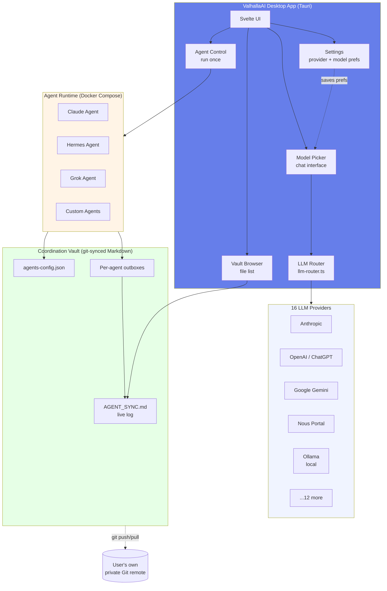
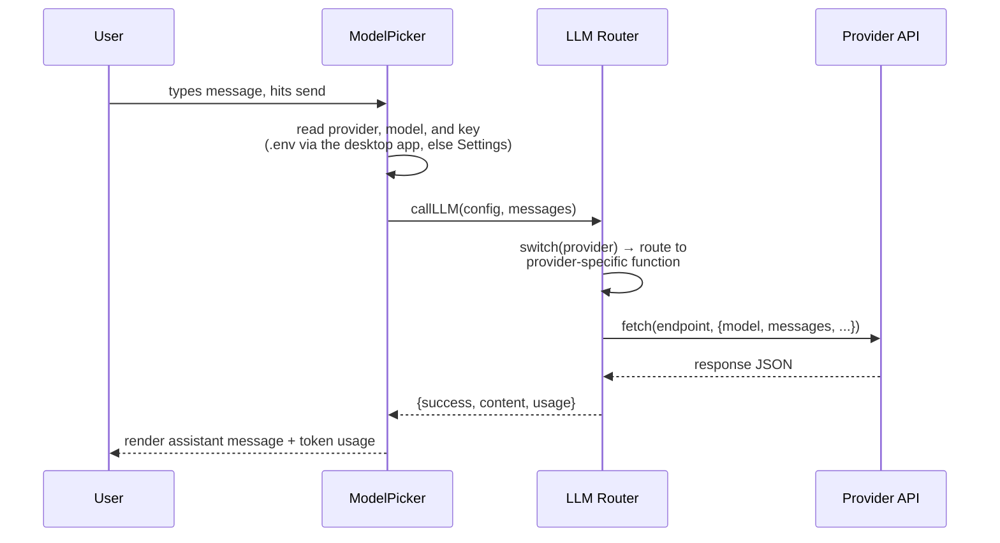
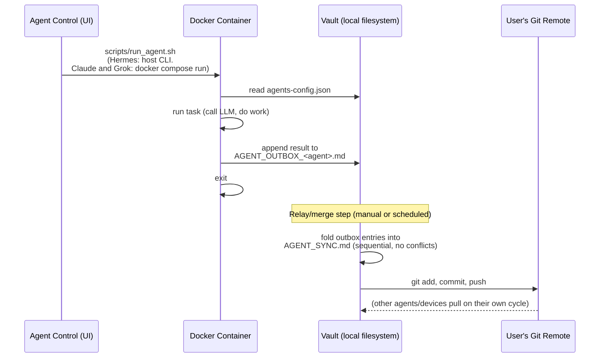
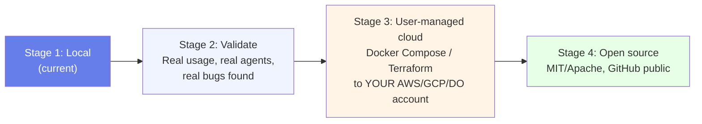
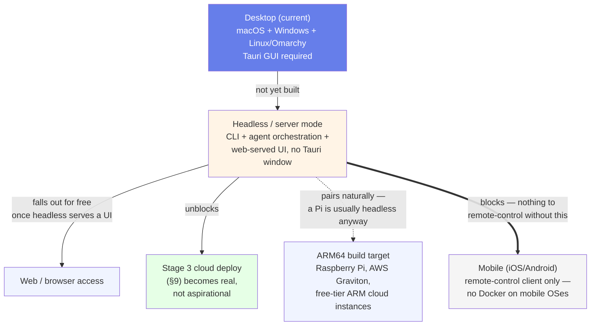

# ValhallaAI — Architecture

**Status:** Local development. This document is the design of record — update it whenever the system changes shape, not after the fact.

## 1. What ValhallaAI is

ValhallaAI is a **desktop-first, multi-provider AI orchestration platform**. One app, three jobs:

1. **Talk to any model** — 16 providers behind one router, one chat UI. In the desktop app, Anthropic, OpenAI, OpenRouter, Google, and xAI keys are read from the project `.env`. Nous Portal goes through the local Hermes proxy and does not take a pasted key.
2. **Run agents** — Agent Control calls `scripts/run_agent.sh`. Hermes is the host CLI. Claude and Grok are one-shot Docker containers. See §4.4 and §4.6.
3. **Coordinate them** — a git-synced markdown vault is the shared memory/log, not a database. Agents append gitignored outboxes. `scripts/vault_relay.sh` can fold those into `AGENT_SYNC.md` and commit; that path was run on a throwaway repo. It has not pushed this repo. Vault Browser lists files and git status. It does not pull or push. See [CONTRIBUTING.md's gate criteria](./CONTRIBUTING.md#why-local-first).

It is built to be **self-hosted and user-owned**: you run it on your Mac today, and later deploy the same stack to your own cloud account. Nobody else's server ever holds your keys or your coordination log by default.

## 2. System map



## 3. Design principles

| Principle | What it means here |
|---|---|
| **Local-first** | Everything runs on your machine before it runs anywhere else. Cloud deploy is an option you choose later, not a requirement. |
| **User-owned data** | The vault is plain markdown + JSON in a folder you control. No proprietary format, no vendor database. |
| **Provider-agnostic** | The router is the only place that knows about provider APIs. UI and agents never hardcode a provider. |
| **Coordination ≠ storage** | The vault is for logs, config, and hand-offs between agents — not a database. If you need fast queries, that's a separate concern (see §7). |
| **Transparent security** | Credentials live in `.env`/local storage, never in the git-tracked vault. Every write to the vault is a plain-text, human-readable diff. |
| **Cross-platform (macOS + Windows + Linux)** | Every design and dependency choice is checked against all three target OS families from the start — not retrofitted after a macOS-only implementation ships. See §3.1. |

### 3.1 Cross-platform constraint

ValhallaAI targets **macOS, Windows, and Linux** (including Arch-based distros such as **Omarchy**) as first-class platforms. This is a standing constraint on every change, not a future nice-to-have — it shapes decisions now, while the architecture is still easy to adjust.

**Why Tauri fits this well:** it cross-compiles the same Svelte frontend + Rust backend into a native app on each OS — `.dmg`/`.app` on macOS, `.msi`/`.exe` on Windows, and on Linux both distro-specific packages (`.deb`, `.rpm`) *and* a distro-agnostic **AppImage**, which is what actually matters for Omarchy: it's Arch-based (pacman, not apt/dnf), so the `.deb`/`.rpm` bundles are useless there but the AppImage runs on any Linux with no packaging step. `tauri.conf.json`'s `bundle.targets: "all"` already builds every target valid for the host OS — no per-OS fork of the bundle config needed. `tauri init` generated `icon.icns` (macOS), `icon.ico` (Windows), and PNG icons (Linux) up front.

**Linux/Omarchy build prerequisites** (not yet installed or verified on an actual Omarchy machine): Tauri's Linux build needs system libraries that aren't part of a minimal Arch/Omarchy install. On Arch-based systems:

```bash
sudo pacman -S --needed webkit2gtk-4.1 base-devel curl wget file openssl \
  appmenu-gtk-module gtk3 libappindicator-gtk3 librsvg
```

**Where cross-platform assumptions actually bite** (checklist for new code):

| Area | Unix-only / single-OS trap | What to do instead |
|---|---|---|
| Docker volumes | `~/.hermes:/root/.hermes` — `~` isn't reliably expanded by Docker Compose, and not at all on Windows | Use `${HOST_HERMES_DIR}` from `.env` (see `env.example`), an absolute path set per-machine. On Linux/Omarchy this is a normal `/home/<user>/.hermes` path — same fix already covers it |
| Shell scripts run on the **host** | A `.sh` script invoked directly by the desktop app | Won't run on Windows without WSL/Git Bash. Agent scripts that run *inside* a Docker container are fine on all three OSes — the container is always Linux regardless of host — but anything Tauri shells out to directly on the host must be cross-platform (Node/Rust) or ship OS-specific equivalents |
| Path separators | Hardcoded `/` in any path string | Use `path.join()` (Node side) or Rust's `PathBuf` (Tauri side), never string concatenation |
| Home directory | `~` or `$HOME` assumed | `$HOME` doesn't exist on Windows by default (`%USERPROFILE%` does; Linux has `$HOME` same as macOS) — resolve via Tauri's path APIs, not shell env vars |
| Linux packaging | Assuming a `.deb`/`.rpm` reaches every Linux user | Arch-based distros (Omarchy included) use pacman/AUR, not apt/dnf — the AppImage target is the one guaranteed to run without a distro-specific package |
| Line endings | Assuming `\n` in generated files | Vault markdown files are read by git, which normalizes this — but any file written on one OS and read on another should be tested |

**Not yet verified — flagged, not assumed:**
- Windows: the agent Docker containers (`agents/claude`, `agents/hermes`, `agents/grok`) haven't been run end-to-end. Docker Desktop on Windows runs Linux containers via WSL2, so they *should* behave identically — that's a claim to test, not trust.
- Linux/Omarchy: nothing in this stack (Tauri build, Docker agent runtime, or the app itself) has been run on an actual Omarchy machine yet. The user already runs Hermes itself on an Omarchy VM in a separate context, which is a good sign for the Hermes agent container specifically, but that hasn't been confirmed to extend to ValhallaAI's own build.

Both tracked in [CONTRIBUTING.md](./CONTRIBUTING.md#known-open-issues) until actually done.

## 4. Component responsibilities

### 4.1 LLM Router (`src/lib/llm-router.ts`)
Single abstraction (`callLLM(config, messages)`) that fans out to 16 provider-specific functions. The provider *catalog* (names, display names, model lists) lives separately in `src/lib/providers.ts` — the single source of truth `Settings.svelte` and `ModelPicker.svelte` both import from, so the count can't drift between files the way it did before that extraction (see [CONTRIBUTING.md](./CONTRIBUTING.md#known-open-issues)). Adding a provider means adding one function + one switch case in `llm-router.ts`, and one entry in `providers.ts` — nothing else in the app should need to change.

### 4.2 Settings (`src/routes/Settings.svelte`)
User picks a **default provider + model**, saved to `localStorage`. Nothing is hardcoded as "the" default — every user configures their own, mirroring how Hermes's own provider/account settings work. Provider API keys come from the project `.env` when that file has one (`provider_keys` in the desktop app: Anthropic, OpenAI, OpenRouter, Google, xAI). A key saved in Settings is used only for a provider the file does not cover. Nous Portal does not use a pasted key.

### 4.2b Profile (`src/routes/Profile.svelte`)
Split out of Settings.svelte on 2026-09-22 — identity (who is signed in) and
app configuration (which provider/model/keys) were sharing one page for no
reason but history. Reached from the sidebar's profile chip, not from the
`sections` array or the Settings gear.

Owns profile management (create, rename, delete, switch — the mechanics live
in `src/lib/profiles.ts`, see [CONTRIBUTING.md](./CONTRIBUTING.md#profiles-and-per-profile-storage))
and Google sign-in (see [CONTRIBUTING.md](./CONTRIBUTING.md#sign-in-with-google)).
Also owns the per-profile `ignoreEnvKeys` toggle, since that is a property of
the profile, not of any one provider.

Deliberately does not import anything from Settings.svelte or vice versa —
the only shared dependency is the `profiles` store itself. A profile knowing
nothing about *which* provider you picked, and Settings knowing nothing about
*who* you are, is what makes the split real rather than cosmetic.

### 4.3 Model Picker (`src/routes/ModelPicker.svelte`)
Loads the saved default on mount, lets the user override per-conversation, sends through the router, renders responses with token usage.

### 4.4 Agent Control (`src/routes/AgentControl.svelte`)
Run starts one agent and waits for it to exit. The button calls the Tauri command `run_agent`, which runs `scripts/run_agent.sh` with an allowlisted name (`claude-agent`, `hermes-agent`, `grok-agent`). Hermes is the host CLI (`hermes chat --oneshot`). Claude and Grok are `docker compose run --rm` one-shot containers. The same script is what you run from a terminal. The cards read real state via `agent_status`: enabled flags come from `vault/agents-config.json`, and last-run time plus OK/ERROR are recovered from each `AGENT_OUTBOX_<agent>.md`. Nothing about run history lives in component state, which is why it survives a relaunch.

### 4.5 Vault Browser (`src/routes/VaultBrowser.svelte`)
Refresh calls the Tauri command `vault_status`. It lists the files under `vault/`, runs `git status --short -- vault`, and reports the last commit touching `AGENT_SYNC.md`. It does not pull or push.

Clicking a file calls `vault_file`, which returns its text. **This command does take a path from the frontend**, so it is untrusted input to a filesystem read. `resolve_vault_path()` canonicalizes the candidate — which resolves `..` *and* symlinks — and refuses anything landing outside `vault/`, anything that is not a file, and anything over 2 MB. The guard is a separate function specifically so it can be unit-tested; four tests cover it, including a symlink pointing out of the vault.

### 4.5b Agent tasks (`vault/agent-tasks.json`)
What each agent *does*, kept separate from `agents-config.json`, which says how
it *runs* (model, provider, enabled). The two change on different schedules.

An entry has an `instruction`, a `context` list of vault-relative files to
include, and `maxContextChars`. Editing it changes an agent's work on the next
run with no rebuild. With no entry, agents fall back to a self-description ping,
so Agent Control stays usable as a plain connectivity check.

`agents/_shared/task.cjs` builds the prompt and is shared by all three agents —
copied into the two container images (their build context is `./agents` for
this reason) and invoked as a CLI by the host-side hermes runner. Context paths
are resolved and refused if they leave `vault/`, via `realpath`, so both `..`
and a symlink pointing out are blocked. That guard matters most for
hermes-agent, which runs on the host where `../.env` would be a real secret;
the containers only mount `/vault`. It is `.cjs` because the root
`package.json` sets `"type": "module"`, which would otherwise make `require`
throw on the host.

**Agent output is evidence, not fact.** The first real run correctly read the
config and log, and also asserted that `grok-4.7` on provider `nous` was a
mismatch — it is not; Nous Portal is an aggregator and serves `x-ai/grok-4.7`.
Treat outbox entries as a lead to verify, the same as any other model output.

### 4.6 Agent Runtime (`agents/*`, `scripts/run_agent.sh`)
Each agent is one-shot:
1. Reads its config from `vault/agents-config.json` (Claude and Grok; Hermes uses the CLI's own login)
2. Does its work
3. Appends a result to `vault/AGENT_OUTBOX_<agent>.md` (gitignored; the relay folds it)
4. Exits

Hermes runs on the host because the installed CLI is a macOS virtualenv under `~/.hermes`. A Linux container cannot execute that binary, and installing a second Hermes that shares the same home would race the proxy that is already running. Claude and Grok stay as Docker containers. Claude exits with an error if `ANTHROPIC_API_KEY` is unset, instead of calling the API and then exiting 0. Grok calls `api.x.ai` directly. It exits with an error when `agents-config.json` has `"enabled": false` or when `XAI_API_KEY` is unset. It does not use the Hermes proxy. Grok models in chat go through Nous Portal (`x-ai/grok-4.7` and the other `x-ai/*` ids), which is a different path and does not need that key.

## 5. Data flow: sending a chat message



## 6. Data flow: agent run → vault coordination



**Why outbox-per-agent instead of concurrent writes to one file:** git merge conflicts on a single shared log are the failure mode we design out from day one. Each agent only ever appends to its *own* file; a single relay step folds everything into the shared log sequentially. This is the same pattern already proven with Hermes's `AGENT_SYNC.md` bridge (`HERMES_OUTBOX.md` → relay → shared log).

**Current reality vs. this diagram:** Agent Control does start the run (`run_agent` → `scripts/run_agent.sh`). Hermes is not the Docker service in that path. Claude and Grok are. Each writes `vault/AGENT_OUTBOX_<agent>.md`, which is gitignored. The relay script folds outboxes, commits, and can push. Fold and commit were run on a throwaway repo. Push, and a fold of this repo's own outboxes, have not been run. `VAULT_REPO` empty means the relay does not push.

## 7. What the vault is — and isn't

**Is:**
- Coordination log between agents (who did what, when, why)
- Agent configuration (`agents-config.json`)
- Human-readable audit trail (every entry is a git commit)

**Isn't:**
- A database. Hundreds of entries: fine. Tens of thousands: shard by date/agent, or add a real datastore alongside it.
- A secrets store. API keys never get written into vault files — they live in `.env` / `localStorage` / a proper secrets manager.
- A queue. If two agents need to hand off a task in real time, that's a job queue's problem, not the vault's.

## 8. Provider catalog

16 providers today (`Object.keys(PROVIDERS).length` in `src/lib/providers.ts` — check there directly rather than trusting this number by hand), alphabetical, router-abstracted so the list can grow without touching the UI logic:

Anthropic (API key) · ChatGPT/Codex · Claude Subscription DirectSDK · Fireworks AI · Google Gemini · Groq · Hugging Face Inference API · MiniMax · Nous Portal · **Ollama** (sole local runtime — broadest local model catalog) · OpenRouter (aggregator) · Perplexity · Qwen Code · Replicate (non-LLM models: image/audio/video) · Together AI · xAI Grok

Nous Portal does not take a pasted API key. `callNous()` posts to the local Hermes subscription proxy at `http://127.0.0.1:8645/v1` (`hermes portal` once, then `hermes proxy start`), which attaches the Portal credential.

See [POSITIONING.md](./POSITIONING.md) for why this list is deliberately this shape.

## 9. Deployment path (future)



Each stage is a deliberate gate, not a deadline. We do not skip Stage 2 — see [Development Notes](./CONTRIBUTING.md#why-local-first).

## 9.1 Platform roadmap (beyond macOS/Windows/Linux desktop)

macOS, Windows, and Linux/Omarchy (§3.1) are all **desktop** targets — ValhallaAI currently requires a GUI to run at all, since it's Tauri desktop-only. The platforms below aren't a flat list of "OSes to also support" — they have a real dependency order, and building them out of order means building something with nothing to connect to.



| Platform | What it actually is | Priority | Why |
|---|---|---|---|
| **Headless/server mode** | A second build target of the *same app* — CLI + agent orchestration + web-served UI, no Tauri window | **High** | Already implicitly required by Stage 3 (§9) — "deploy to your own cloud VPS" isn't possible today, since a headless box has no display for a Tauri window to open on. This is the one genuine gap, not a nice-to-have. |
| **ARM64 build target** | Not a new OS — verifying the existing Docker/Rust stack builds and runs on ARM Linux (Raspberry Pi, Graviton, free-tier ARM cloud) | Medium | Apple Silicon is already covered (that's what runs the Mac build). ARM *Linux* is untested. Pairs naturally with headless mode — a 24/7 self-hosted box is usually a Pi, and a Pi is usually headless. |
| **Web/browser access** | Not a separate build — falls out for free once headless mode serves a UI over HTTP | Low, but automatic | Don't build a separate web client. Any browser hitting the headless server's UI already works once that exists. |
| **Mobile (iOS/Android)** | A remote-control client for an already-running headless instance — Docker doesn't run on iOS/Android, so mobile can't run agent containers itself | Low, **blocked on headless mode** | Building this before headless mode exists means building a client with nothing real to connect to. Sequencing matters here more than for any other item. |
| **BSD, ChromeOS** | Real self-hosting audiences, high effort relative to reach | Not planned | Revisit only if something concrete forces the question — not worth doc space as a standing commitment. |

## 10. Related documents

- [POSITIONING.md](./POSITIONING.md) — how ValhallaAI differs from Hermes, LangChain, Open WebUI, AnythingLLM, and the rest of the field
- [CONTRIBUTING.md](./CONTRIBUTING.md) — how to work on this project (even solo, even before it's public)
- [README.md](./README.md) — quick start
