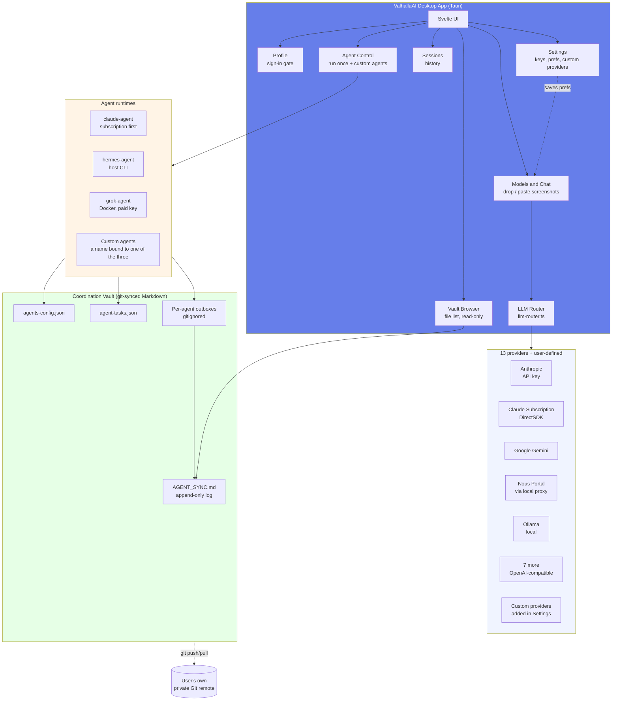
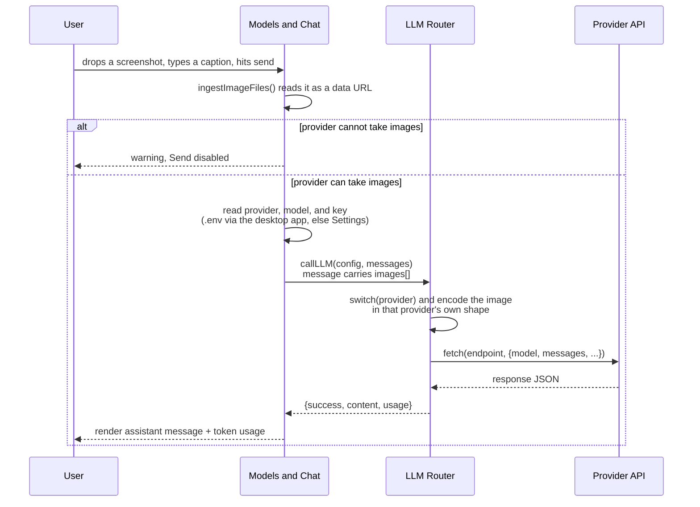
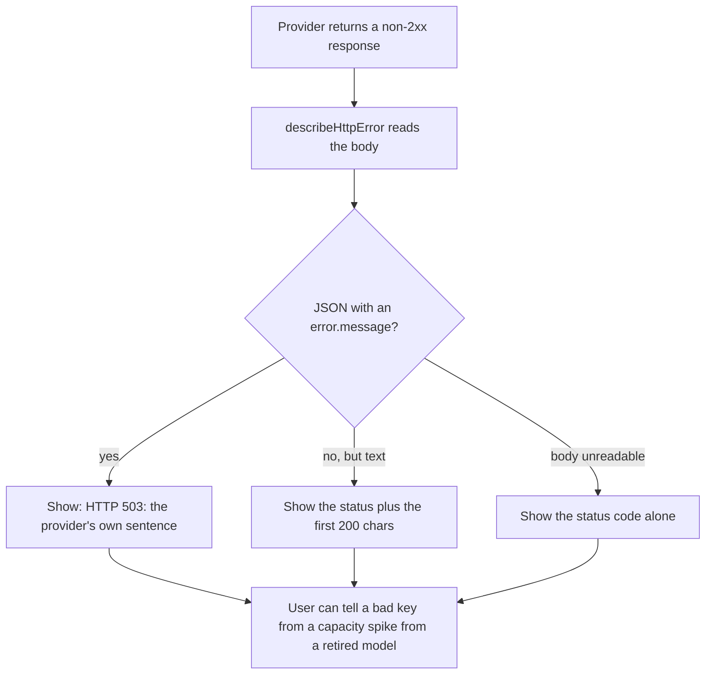
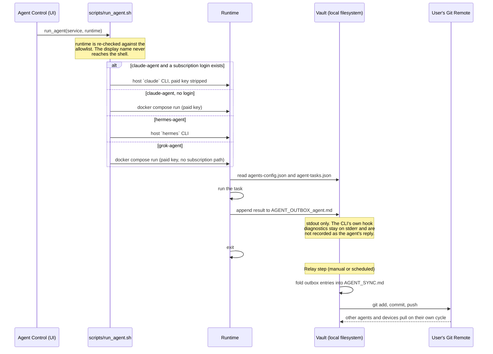
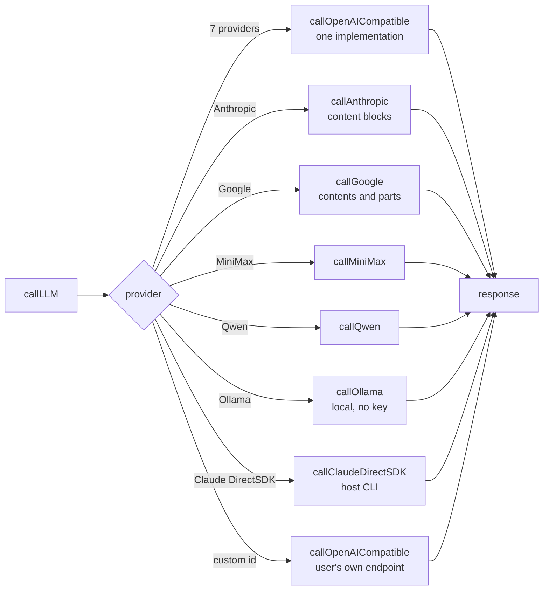
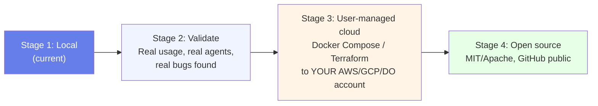
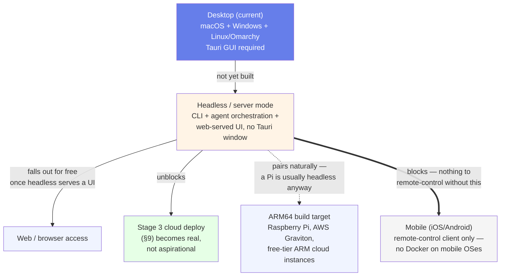

# ValhallaAI — Architecture

**Status:** Local development. This document is the design of record — update it whenever the system changes shape, not after the fact.

## 1. What ValhallaAI is

ValhallaAI is a **desktop-first, multi-provider AI orchestration platform**. One app, three jobs:

1. **Talk to any model** — 13 providers behind one router, one chat UI. In the desktop app, Anthropic, OpenAI, OpenRouter, Google, and xAI keys are read from the project `.env`. Nous Portal goes through the local Hermes proxy and does not take a pasted key.
2. **Run agents** — Agent Control calls `scripts/run_agent.sh`. Hermes is the host CLI. Claude and Grok are one-shot Docker containers. See §4.4 and §4.6.
3. **Coordinate them** — a git-synced markdown vault is the shared memory/log, not a database. Agents append gitignored outboxes. `scripts/vault_relay.sh` can fold those into `AGENT_SYNC.md` and commit; that path was run on a throwaway repo. It has not pushed this repo. Vault Browser lists files and git status. It does not pull or push. See [CONTRIBUTING.md's gate criteria](./CONTRIBUTING.md#why-local-first).

It is built to be **self-hosted and user-owned**: you run it on your Mac today, and later deploy the same stack to your own cloud account. Nobody else's server ever holds your keys or your coordination log by default.

## 2. System map



## 3. Design principles

| Principle | What it means here |
|---|---|
| **Local-first** | Everything runs on your machine before it runs anywhere else. Cloud deploy is an option you choose later, not a requirement. |
| **User-owned data** | The vault is plain markdown + JSON in a folder you control. No proprietary format, no vendor database. |
| **Provider-agnostic** | The router is the only place that knows about provider APIs. UI and agents never hardcode a provider. |
| **Coordination ≠ storage** | The vault is for logs, config, and hand-offs between agents — not a database. If you need fast queries, that's a separate concern (see §7). |
| **Transparent security** | Credentials live in `.env`/local storage, never in the git-tracked vault. Every write to the vault is a plain-text, human-readable diff. |
| **Cross-platform (macOS + Windows + Linux)** | Every design and dependency choice is checked against all three target OS families from the start — not retrofitted after a macOS-only implementation ships. See §3.1. |

### 3.1 Cross-platform constraint

ValhallaAI targets **macOS, Windows, and Linux** (including Arch-based distros such as **Omarchy**) as first-class platforms. This is a standing constraint on every change, not a future nice-to-have — it shapes decisions now, while the architecture is still easy to adjust.

**Why Tauri fits this well:** it cross-compiles the same Svelte frontend + Rust backend into a native app on each OS — `.dmg`/`.app` on macOS, `.msi`/`.exe` on Windows, and on Linux both distro-specific packages (`.deb`, `.rpm`) *and* a distro-agnostic **AppImage**, which is what actually matters for Omarchy: it's Arch-based (pacman, not apt/dnf), so the `.deb`/`.rpm` bundles are useless there but the AppImage runs on any Linux with no packaging step. `tauri.conf.json`'s `bundle.targets: "all"` already builds every target valid for the host OS — no per-OS fork of the bundle config needed. `tauri init` generated `icon.icns` (macOS), `icon.ico` (Windows), and PNG icons (Linux) up front.

**Linux/Omarchy build prerequisites** (not yet installed or verified on an actual Omarchy machine): Tauri's Linux build needs system libraries that aren't part of a minimal Arch/Omarchy install. On Arch-based systems:

```bash
sudo pacman -S --needed webkit2gtk-4.1 base-devel curl wget file openssl \
  appmenu-gtk-module gtk3 libappindicator-gtk3 librsvg
```

**Where cross-platform assumptions actually bite** (checklist for new code):

| Area | Unix-only / single-OS trap | What to do instead |
|---|---|---|
| Docker volumes | `~/.hermes:/root/.hermes` — `~` isn't reliably expanded by Docker Compose, and not at all on Windows | Use `${HOST_HERMES_DIR}` from `.env` (see `env.example`), an absolute path set per-machine. On Linux/Omarchy this is a normal `/home/<user>/.hermes` path — same fix already covers it |
| Shell scripts run on the **host** | A `.sh` script invoked directly by the desktop app | Won't run on Windows without WSL/Git Bash. Agent scripts that run *inside* a Docker container are fine on all three OSes — the container is always Linux regardless of host — but anything Tauri shells out to directly on the host must be cross-platform (Node/Rust) or ship OS-specific equivalents |
| Path separators | Hardcoded `/` in any path string | Use `path.join()` (Node side) or Rust's `PathBuf` (Tauri side), never string concatenation |
| Home directory | `~` or `$HOME` assumed | `$HOME` doesn't exist on Windows by default (`%USERPROFILE%` does; Linux has `$HOME` same as macOS) — resolve via Tauri's path APIs, not shell env vars |
| Linux packaging | Assuming a `.deb`/`.rpm` reaches every Linux user | Arch-based distros (Omarchy included) use pacman/AUR, not apt/dnf — the AppImage target is the one guaranteed to run without a distro-specific package |
| Line endings | Assuming `\n` in generated files | Vault markdown files are read by git, which normalizes this — but any file written on one OS and read on another should be tested |

**Not yet verified — flagged, not assumed:**
- Windows: the agent Docker containers (`agents/claude`, `agents/hermes`, `agents/grok`) haven't been run end-to-end. Docker Desktop on Windows runs Linux containers via WSL2, so they *should* behave identically — that's a claim to test, not trust.
- Linux/Omarchy: nothing in this stack (Tauri build, Docker agent runtime, or the app itself) has been run on an actual Omarchy machine yet. The user already runs Hermes itself on an Omarchy VM in a separate context, which is a good sign for the Hermes agent container specifically, but that hasn't been confirmed to extend to ValhallaAI's own build.

Both tracked in [CONTRIBUTING.md](./CONTRIBUTING.md#known-open-issues) until actually done.

## 4. Component responsibilities

### 4.1 LLM Router (`src/lib/llm-router.ts`)
Single abstraction (`callLLM(config, messages)`) that fans out to one function per built-in provider. The provider *catalog* (names, display names, model lists) lives separately in `src/lib/providers.ts` — the single source of truth `Settings.svelte` and `ModelPicker.svelte` both import from, so the count can't drift between files the way it did before that extraction (see [CONTRIBUTING.md](./CONTRIBUTING.md#known-open-issues)). Adding a built-in provider means adding one function + one switch case in `llm-router.ts`, and one entry in `providers.ts` — nothing else in the app should need to change.

A user-defined provider needs none of that. Its id is `custom:<slug>` and it is matched in `callLLM()`'s `default` branch against a registry (`registerCustomProviders`), then sent through the same `callOpenAICompatible()` helper the built-in OpenAI-dialect providers use. `LLMProvider` stays a closed union of the built-in ids; a provider id in flight is a plain string, because a custom id is created at runtime and widening the union would cost type safety at every reference site.

### 4.2 Settings (`src/routes/Settings.svelte`)
User picks a **default provider + model**, saved to `localStorage`. Nothing is hardcoded as "the" default — every user configures their own, mirroring how Hermes's own provider/account settings work. Provider API keys come from the project `.env` when that file has one (`provider_keys` in the desktop app: Anthropic, OpenAI, OpenRouter, Google, xAI). A key saved in Settings is used only for a provider the file does not cover. Nous Portal does not use a pasted key.

### 4.2b Profile (`src/routes/Profile.svelte`)
Split out of Settings.svelte on 2026-09-22 — identity (who is signed in) and
app configuration (which provider/model/keys) were sharing one page for no
reason but history. Reached from the **profile card at the top of the
sidebar** (above the nav — see §4.7 for the full layout), not from the
`sections` array or the Settings gear.

Owns profile management (create, rename, delete, switch — the mechanics live
in `src/lib/profiles.ts`, see [CONTRIBUTING.md](./CONTRIBUTING.md#profiles-and-per-profile-storage))
and Google sign-in (see [CONTRIBUTING.md](./CONTRIBUTING.md#sign-in-with-google)).
Also owns the per-profile `ignoreEnvKeys` toggle, since that is a property of
the profile, not of any one provider. Shows a **Verified**/**Unverified**
badge next to the email, sourced from the id_token's `email_verified` claim
captured at sign-in (`Profile.emailVerified` in `profiles.ts`) — not
re-checked afterward, since no token is retained to re-check against.

Deliberately does not import anything from Settings.svelte or vice versa —
the only shared dependency is the `profiles` store itself. A profile knowing
nothing about *which* provider you picked, and Settings knowing nothing about
*who* you are, is what makes the split real rather than cosmetic. The actual
Google OAuth call lives in `profiles.ts` (`signInProfileWithGoogle`), not in
this file, because `Onboarding.svelte` (§4.2c) needs the identical call and
duplicating it was the same mistake the provider catalog already made once.

### 4.2d Custom providers (`src/lib/custom-providers.ts`, Settings → "Custom Providers")

A provider that is not in the catalog can be added from Settings with no source change: a display name, a chat-completions URL, and a model list (one id per line). It is stored in `localStorage` under `valhallaai-custom-providers` and registered with the router at app start (`initCustomProviders()` in `App.svelte`), so a provider saved in a previous session is routable before Settings is ever opened.

The constraints are deliberate:

- **OpenAI dialect only.** The one implementation that speaks it is `callOpenAICompatible()`, and reusing it is what makes a free-text endpoint safe to expose. A provider with a genuinely different request/response shape (Anthropic Messages, Gemini, MiniMax) still needs a real implementation and stays a source change.
- **No arbitrary code, no headers editor.** The one header set is the bearer token, and it is omitted entirely when no key is configured — a localhost gateway (LiteLLM, vLLM, llama.cpp's server, LM Studio) usually has no auth, and refusing keyless sends client-side would make the main use case unusable. An endpoint that does need a key returns its own 401, which names the real problem.
- **The id is namespaced `custom:`** so a user-defined provider can never shadow a built-in one. The API key is stored through the same per-profile scoped key as the built-ins (`valhallaai-apikey-<id>`), not inside the provider record.

Together AI was removed from the catalog on 2026-09-22; this is the path for bringing it — or anything else OpenAI-compatible — back without a fork.

### 4.2c Onboarding (`src/routes/Onboarding.svelte`)
A sign-in gate, mounted unconditionally at the top of `App.svelte`. `visible`
is derived from `!isSignedIn(activeProfile)`, so there is no local open/close
state to fall out of sync with the profile store, and no backdrop-click or
Escape handler — the only way through is a Google sign-in.

**Mandatory as of 2026-09-22.** Jacob reversed the earlier "identity on a
profile, not a lock" decision and asked for the dialog to require a profile
with a verified email. The only verification this app can perform is
Google's — there is no server to send a confirmation mail from — so the gate
is "signed in with Google and carrying an email." A typed name cannot satisfy
that, so there is no local path. `isSignedIn()` requires both `authProvider`
and `email`, which means a profile that is already signed in passes straight
through and never sees the dialog.

The `onboarded` flag and its backfill still exist but no longer control this
screen. Keying the gate off that flag would hide it from every profile that
predates it, which is the opposite of what was asked.

### 4.3 Model Picker (`src/routes/ModelPicker.svelte`)
Loads the saved default on mount, lets the user override per-conversation, sends through the router, renders responses with token usage.

The model bar (bottom strip) carries three pickers — Provider, Model, Project — plus **+ New session**. The Project picker files the active conversation; when there is no session yet it holds the choice in `pendingProject` and applies it to the session that the first message creates. Without that, picking a project and then typing would silently drop the choice, since sessions are created lazily.

### 4.3b Recent and Projects (`src/routes/Recent.svelte`, `src/routes/Projects.svelte`)
Both read the same `sessions` store and differ only in filter, which is why neither needs its own storage:

| View | Shows | Filter |
|---|---|---|
| Recent | where a chat lands, newest first | `project === undefined` |
| Projects | filed chats, grouped | grouped by `project` |
| Sessions | everything, newest first | none |

`projectNames()` in `sessions.ts` returns the union of explicitly created projects and any name a session references. Deriving it rather than trusting the stored list means a session restored from a backup can never name a project the UI refuses to list — it would be invisible with no way to recover it. Filing happens two ways: the dropdown on each row in Recent, and the Project picker in the model bar. Removing a project (`deleteProject()`) clears the label and leaves the sessions, after a confirmation that says so in words.

### 4.4 Agent Control (`src/routes/AgentControl.svelte`)
Run starts one agent and waits for it to exit. The button calls the Tauri command `run_agent`, which runs `scripts/run_agent.sh` with an allowlisted name (`claude-agent`, `hermes-agent`, `grok-agent`). Hermes is the host CLI (`hermes chat --oneshot`). Claude prefers the host `claude` CLI on the `claude auth login` subscription and falls back to the Docker container on the paid key only when there is no login — the container is the fallback, not the default. Grok is a `docker compose run --rm` one-shot container and has no subscription path. The same script is what you run from a terminal. A user-defined agent is a display name bound to one of those three runtimes; the name never reaches the shell (see §4.4b). The cards read real state via `agent_status`: enabled flags come from `vault/agents-config.json`, and last-run time plus OK/ERROR are recovered from each `AGENT_OUTBOX_<agent>.md`. Nothing about run history lives in component state, which is why it survives a relaunch.

### 4.4b Custom agents (`src/lib/custom-agents.ts`, Agent Control → "Add an agent")

A display name bound to one of the three runtimes above, added from Agent Control and stored in `localStorage` under `valhallaai-custom-agents`. `run_agent` takes an optional `runtime`; the Rust side re-checks it against the same allowlist and passes the allowlisted value to the script, never the display name. A custom agent therefore cannot run anything the three built-in agents cannot already run.

That is also its limit, stated on the card: it runs the same prompt and writes the same outbox as the runtime it is bound to. It is a second entry point, not an agent with its own behaviour. Behaviour that differs per agent lives in `vault/agent-tasks.json`, keyed by the runtime name, which is shared.

### 4.5 Vault Browser (`src/routes/VaultBrowser.svelte`)
Refresh calls the Tauri command `vault_status`. It lists the files under `vault/`, runs `git status --short -- vault`, and reports the last commit touching `AGENT_SYNC.md`. It does not pull or push.

Clicking a file calls `vault_file`, which returns its text. **This command does take a path from the frontend**, so it is untrusted input to a filesystem read. `resolve_vault_path()` canonicalizes the candidate — which resolves `..` *and* symlinks — and refuses anything landing outside `vault/`, anything that is not a file, and anything over 2 MB. The guard is a separate function specifically so it can be unit-tested; four tests cover it, including a symlink pointing out of the vault.

### 4.5b Agent tasks (`vault/agent-tasks.json`)
What each agent *does*, kept separate from `agents-config.json`, which says how
it *runs* (model, provider, enabled). The two change on different schedules.

An entry has an `instruction`, a `context` list of vault-relative files to
include, and `maxContextChars`. Editing it changes an agent's work on the next
run with no rebuild. With no entry, agents fall back to a self-description ping,
so Agent Control stays usable as a plain connectivity check.

`agents/_shared/task.cjs` builds the prompt and is shared by all three agents —
copied into the two container images (their build context is `./agents` for
this reason) and invoked as a CLI by the host-side hermes runner. Context paths
are resolved and refused if they leave `vault/`, via `realpath`, so both `..`
and a symlink pointing out are blocked. That guard matters most for
hermes-agent, which runs on the host where `../.env` would be a real secret;
the containers only mount `/vault`. It is `.cjs` because the root
`package.json` sets `"type": "module"`, which would otherwise make `require`
throw on the host.

**Agent output is evidence, not fact.** The first real run correctly read the
config and log, and also asserted that `grok-4.7` on provider `nous` was a
mismatch — it is not; Nous Portal is an aggregator and serves `x-ai/grok-4.7`.
Treat outbox entries as a lead to verify, the same as any other model output.

### 4.6 Agent Runtime (`agents/*`, `scripts/run_agent.sh`)
Each agent is one-shot:
1. Reads its config from `vault/agents-config.json` (Claude and Grok; Hermes uses the CLI's own login)
2. Does its work
3. Appends a result to `vault/AGENT_OUTBOX_<agent>.md` (gitignored; the relay folds it)
4. Exits

Hermes runs on the host because the installed CLI is a macOS virtualenv under `~/.hermes`. A Linux container cannot execute that binary, and installing a second Hermes that shares the same home would race the proxy that is already running. Claude and Grok stay as Docker containers. Claude exits with an error if `ANTHROPIC_API_KEY` is unset, instead of calling the API and then exiting 0. Grok calls `api.x.ai` directly. It exits with an error when `agents-config.json` has `"enabled": false` or when `XAI_API_KEY` is unset. It does not use the Hermes proxy. Grok models in chat go through Nous Portal (`x-ai/grok-4.7` and the other `x-ai/*` ids), which is a different path and does not need that key.

### 4.7 App shell and sidebar (`src/App.svelte`)
Top to bottom, as of 2026-09-22:

1. **Profile card** — avatar, name, email (or "Sign in" if no identity is
   attached). Clicking it opens Profile (§4.2b). At the very top of the
   column, above the nav — identity is the first thing you see, mirroring
   Settings' gear being the last.
2. **Profile switcher** — a `<select>`, only rendered when `$profiles.length
   > 1`. Switching calls `switchProfile()`, which reloads the window (see
   that function's comment in `profiles.ts` for why).
3. **Conversation views** — Recent, Projects and Sessions. Three views over
   the same flat session store, each with a distinct job, so none duplicates
   another:
   - **Recent** (`Recent.svelte`) — previous chats with no project, newest
     first. This is where a conversation lands, and where it stays until it
     is filed.
   - **Projects** (`Projects.svelte`) — the filed ones, grouped by project.
   - **Sessions** (`Sessions.svelte`) — all of them, newest first, and the
     only view with delete.

   `project` is an optional string on `ChatSession`, not a container holding
   sessions. That is the load-bearing decision: deleting a project only
   clears the label, so it can never delete a conversation. It also means a
   session can never be orphaned inside a deleted group — the failure a
   nested store would invite.
4. **`sections` nav** — Models & Chat, Recent, Projects, Sessions, Vault
   Browser, Agent Control. `activeTab` is a plain string, not a router; each
   value maps to one component in a single `{#if}/{:else if}` chain in the
   template.

   There is no "New Session" entry. It used to be a sidebar button that
   called `createSession()` and then switched to Models & Chat — a second
   control for a tab that already existed, and redundant with the chat
   creating its session on the first message anyway. Starting a fresh
   conversation is now **+ New session** in the model bar (§4.3), inside the
   view where the conversation actually is.
5. **`sidebar-bottom`** (`margin-top: auto` pins it) — Settings only.
   Profile used to live here too, as a small chip; it moved to the top of the
   list in the same pass that gave it its own page (§4.2b), so identity and
   app-configuration now anchor opposite ends of the sidebar instead of
   sharing one corner.

`Onboarding.svelte` (§4.2c) is mounted once, unconditionally, above the
`.shell` div — it is `position: fixed`, so its place in the DOM does not
affect layout, only stacking order.

## 5. Data flow: sending a chat message

A message is text, images, or both. Images arrive three ways — the file picker, a drag onto the chat, and a clipboard paste — and all three call the same `ingestImageFiles()`. The diagram shows the drop path; the other two differ only in how the `File` arrives.



**Why the encoding step exists.** There is no single image format. A data URL is `data:image/png;base64,...`, and each provider wants those two halves in a different field:

| Family | Providers | Shape sent |
|---|---|---|
| OpenAI-compatible | OpenRouter, ChatGPT, Grok, Nous, Fireworks, Groq, Perplexity, MiniMax, Qwen | `[{type:"text"},{type:"image_url",image_url:{url}}]` — data URL kept whole |
| Google Gemini | Google | `{inlineData:{mimeType,data}}` — camelCase, prefix stripped |
| Anthropic | Anthropic (API key) | `{type:"image",source:{type:"base64",media_type,data}}` — prefix stripped |
| Ollama | Ollama | a raw-base64 `images` array alongside the text |

`parseDataUrl()` splits the URL once; each emitter below it only decides the field names. That split is the thing that is easy to get wrong per provider, so it lives in exactly one place.

**The one provider that cannot take an image is the default.** Claude Subscription DirectSDK builds a single text prompt and pipes it to the `claude` CLI, so there is no field an image can travel in. It is deliberately absent from `IMAGE_CAPABLE_PROVIDERS`: the UI warns and disables Send rather than attaching the image and quietly never sending it. Making that path work means writing images to temp files and letting the CLI read them, which changes what tools the CLI is permitted to use — a decision recorded in [CONTRIBUTING.md](./CONTRIBUTING.md), not taken silently.

**A screenshot with no caption is still a message.** `toAnthropicMessages()` used to drop any turn whose text was empty. A dropped screenshot often has no caption, so that filter would have discarded the image. A turn now survives if it has text *or* an image.

**Errors carry the provider's own explanation.** A failed response used to surface as `HTTP 503` and nothing else, which is what made a transient Google capacity spike look like a broken API key — Google's body said "this model is currently experiencing high demand" and the app threw it away. `describeHttpError()` reads the body, so the bubble now reads `HTTP 503: This model is currently experiencing high demand.`



## 6. Data flow: agent run → vault coordination



**Subscription first, token billing second.** `claude-agent` probes `claude auth status` and runs the host `claude` CLI on the Pro/Max login, stripping `ANTHROPIC_API_KEY` from that process so "subscription" cannot silently mean "paid key". The Docker container is the fallback, used only when there is no login. `hermes-agent` already ran this way through the Hermes portal login. `grok-agent` cannot: xAI has no subscription login, so it is token-billed by nature and currently unrunnable without `XAI_API_KEY`.

**A custom agent is a name, not a new runtime.** It is a display name bound to one of the three above, stored in `localStorage`, and the Rust side re-validates the runtime against the same allowlist before anything runs. The name never reaches the shell, which is what keeps "add your own agent" from becoming "run an arbitrary command". Per-agent behaviour still lives in `vault/agent-tasks.json`, keyed by the runtime, so a custom agent shares its runtime's task.

**Why outbox-per-agent instead of concurrent writes to one file:** git merge conflicts on a single shared log are the failure mode this is designed to avoid. Each agent only ever appends to its *own* file; a single relay step folds everything into the shared log sequentially. This is the same pattern Hermes already runs daily.

**Current reality vs. this diagram:** Agent Control does start the run (`run_agent` → `scripts/run_agent.sh`), and the subscription-first branch was verified by a real run that wrote `Status: OK (subscription)` to the outbox. Each agent writes `vault/AGENT_OUTBOX_<agent>.md`, which is gitignored. The relay script folds outboxes, commits, and can push. Fold and commit were run on a throwaway repo. Push, and a fold of this repo's own outboxes, have not been run. `VAULT_REPO` empty means the relay does not push.

## 7. What the vault is — and isn't

**Is:**
- Coordination log between agents (who did what, when, why)
- Agent configuration (`agents-config.json`)
- Human-readable audit trail (every entry is a git commit)

**Isn't:**
- A database. Hundreds of entries: fine. Tens of thousands: shard by date/agent, or add a real datastore alongside it.
- A secrets store. API keys never get written into vault files — they live in `.env` / `localStorage` / a proper secrets manager.
- A queue. If two agents need to hand off a task in real time, that's a job queue's problem, not the vault's.

## 8. Provider catalog

13 providers (`Object.keys(PROVIDERS).length` in `src/lib/providers.ts` — check there directly rather than trusting this number by hand), router-abstracted so the list can grow without touching the UI logic. A provider that is not here can be added from Settings without editing the source — see §4.2d.

| Provider | How it authenticates | How it is called | Reads images |
|---|---|---|---|
| Anthropic (API key) | `ANTHROPIC_API_KEY`, bills per token | own request shape, via the desktop process | yes |
| ChatGPT / Codex | `OPENAI_API_KEY` | OpenAI-compatible | yes |
| Claude Subscription DirectSDK | `claude auth login`, flat-rate, the default | host `claude` CLI, text prompt only | **no** |
| Fireworks AI | API key | OpenAI-compatible | yes |
| Google Gemini | `GOOGLE_API_KEY` | own request shape (`generateContent`) | yes |
| Groq | API key | OpenAI-compatible | yes |
| MiniMax | API key | own endpoint, accepts the OpenAI content array | yes |
| Nous Portal | Hermes portal login, no pasted key | local proxy at `127.0.0.1:8645` | yes |
| Ollama | none — runs on this machine | local `/api/chat` | yes |
| OpenRouter | API key | OpenAI-compatible | yes |
| Perplexity | API key | OpenAI-compatible | yes |
| Qwen Code | API key | own endpoint (DashScope), accepts the content array | yes |
| xAI Grok | `XAI_API_KEY` | OpenAI-compatible | yes |

"OpenAI-compatible" means the provider speaks `{model, messages, temperature, max_tokens}` and answers `{choices:[{message:{content}}]}`, so all of them share one implementation (`callOpenAICompatible`) instead of seven copies of it. The four that don't — Anthropic, Google, MiniMax, Qwen — each have a request or response shape different enough to need its own function. See [POSITIONING.md §3.2](./POSITIONING.md) for why that split is the design and not an accident.



**Two providers were removed on 2026-09-22, and the reason is worth keeping.** Replicate and Hugging Face were both in the catalog, and neither could be verified on this machine — no key, no public model list. Worse, both were text-to-output endpoints, so an attached image had nowhere to go and would have been silently dropped. Removing them made the catalog's promise match its behaviour. The three places that must agree were re-counted afterwards: 13 catalog keys, 13 `callLLM` switch cases, 13 members of the `LLMProvider` union.

**Nous Portal does not take a pasted API key.** `callNous()` posts to the local Hermes subscription proxy at `http://127.0.0.1:8645/v1` (`hermes portal` once, then `hermes proxy start`), which attaches the Portal credential. A direct call to `inference-api.nousresearch.com` 401s, because the portal login never produces a key you can paste.

**A model id in the catalog is not proof the model answers.** Gemini's `GET /v1beta/models` lists `gemini-2.5-flash` and reports `generateContent` support for it, and a real request returns 404 "no longer available to new users". The catalog is checked by sending a request, not by reading the list. `gemini-3.6-flash` is first in Google's list on purpose: the picker selects `models[0]` when the provider changes, so first place is the default, and the newest model is not always the one that answers.

**Billing preference, where a subscription exists.** Claude Subscription DirectSDK and Nous Portal run on a flat-rate login and never touch a per-token key. Anthropic (API key) and xAI Grok have no subscription path and bill per token. The chat defaults to Claude Subscription DirectSDK on Haiku for exactly this reason: the out-of-the-box path costs nothing per message.

## 9. Deployment path (future)



Each stage is a deliberate gate, not a deadline. We do not skip Stage 2 — see [Development Notes](./CONTRIBUTING.md#why-local-first).

## 9.1 Platform roadmap (beyond macOS/Windows/Linux desktop)

macOS, Windows, and Linux/Omarchy (§3.1) are all **desktop** targets — ValhallaAI currently requires a GUI to run at all, since it's Tauri desktop-only. The platforms below aren't a flat list of "OSes to also support" — they have a real dependency order, and building them out of order means building something with nothing to connect to.



| Platform | What it actually is | Priority | Why |
|---|---|---|---|
| **Headless/server mode** | A second build target of the *same app* — CLI + agent orchestration + web-served UI, no Tauri window | **High** | Already implicitly required by Stage 3 (§9) — "deploy to your own cloud VPS" isn't possible today, since a headless box has no display for a Tauri window to open on. This is the one genuine gap, not a nice-to-have. |
| **ARM64 build target** | Not a new OS — verifying the existing Docker/Rust stack builds and runs on ARM Linux (Raspberry Pi, Graviton, free-tier ARM cloud) | Medium | Apple Silicon is already covered (that's what runs the Mac build). ARM *Linux* is untested. Pairs naturally with headless mode — a 24/7 self-hosted box is usually a Pi, and a Pi is usually headless. |
| **Web/browser access** | Not a separate build — falls out for free once headless mode serves a UI over HTTP | Low, but automatic | Don't build a separate web client. Any browser hitting the headless server's UI already works once that exists. |
| **Mobile (iOS/Android)** | A remote-control client for an already-running headless instance — Docker doesn't run on iOS/Android, so mobile can't run agent containers itself | Low, **blocked on headless mode** | Building this before headless mode exists means building a client with nothing real to connect to. Sequencing matters here more than for any other item. |
| **BSD, ChromeOS** | Real self-hosting audiences, high effort relative to reach | Not planned | Revisit only if something concrete forces the question — not worth doc space as a standing commitment. |

## 10. Related documents

- [POSITIONING.md](./POSITIONING.md) — how ValhallaAI differs from Hermes, LangChain, Open WebUI, AnythingLLM, and the rest of the field
- [CONTRIBUTING.md](./CONTRIBUTING.md) — how to work on this project (even solo, even before it's public)
- [README.md](./README.md) — quick start
