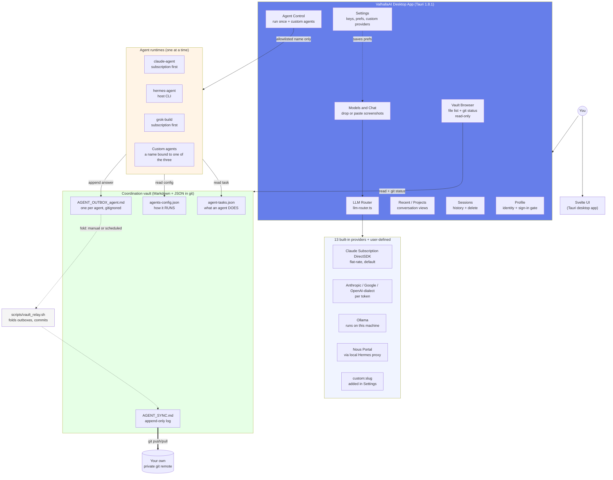
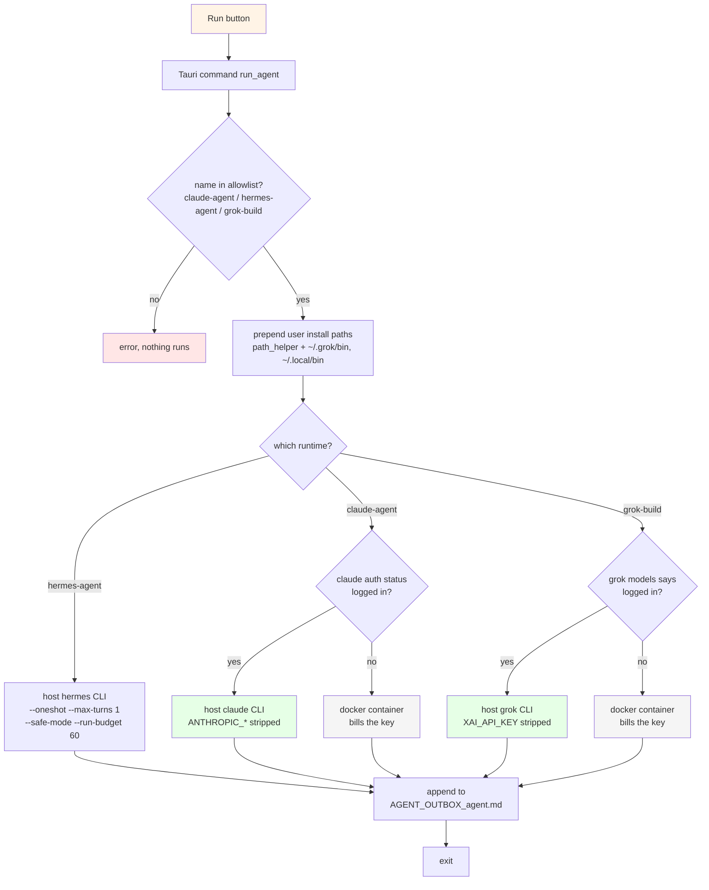
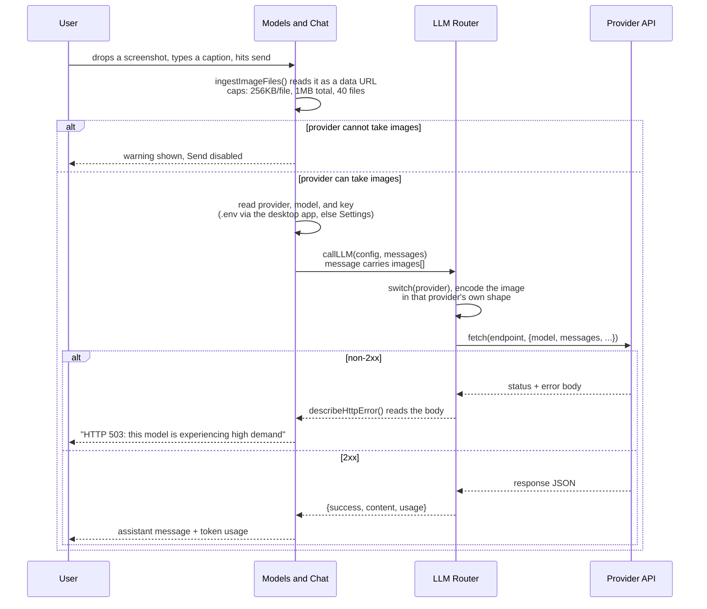
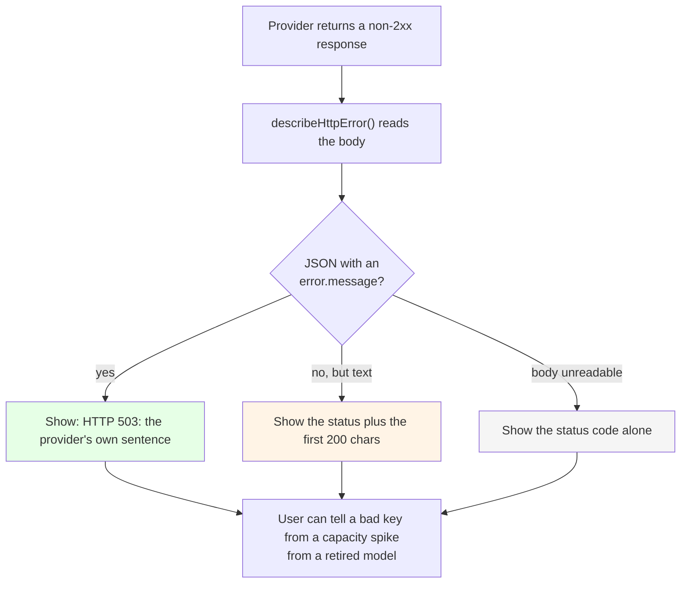
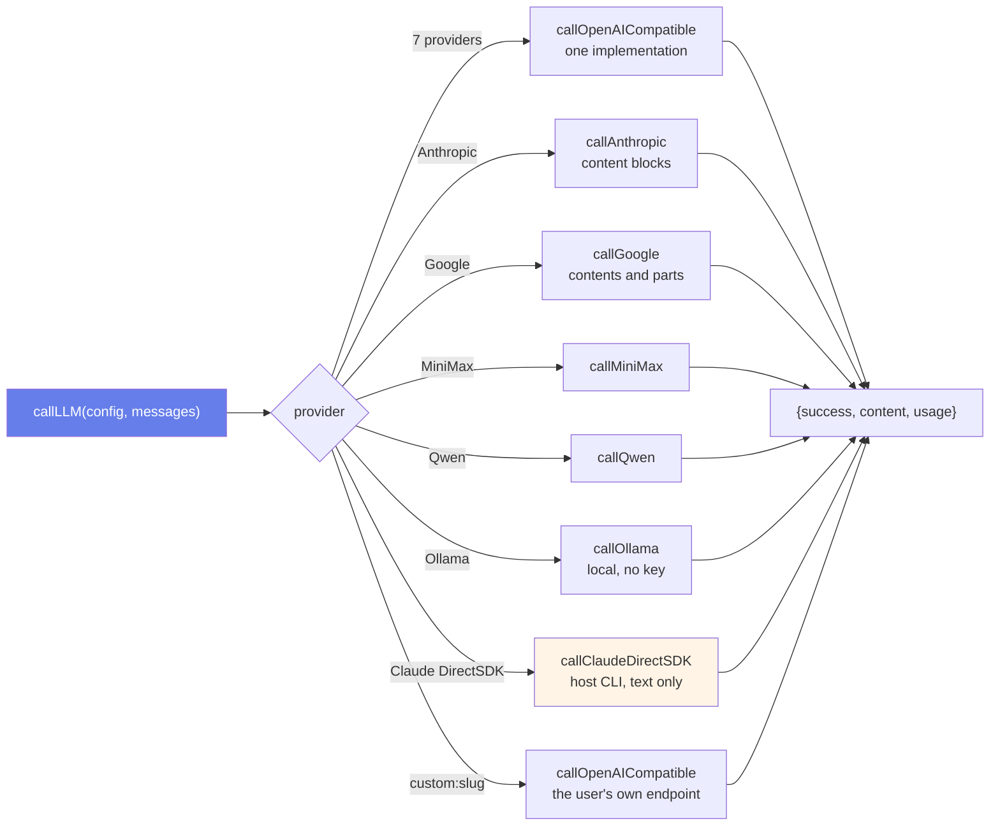
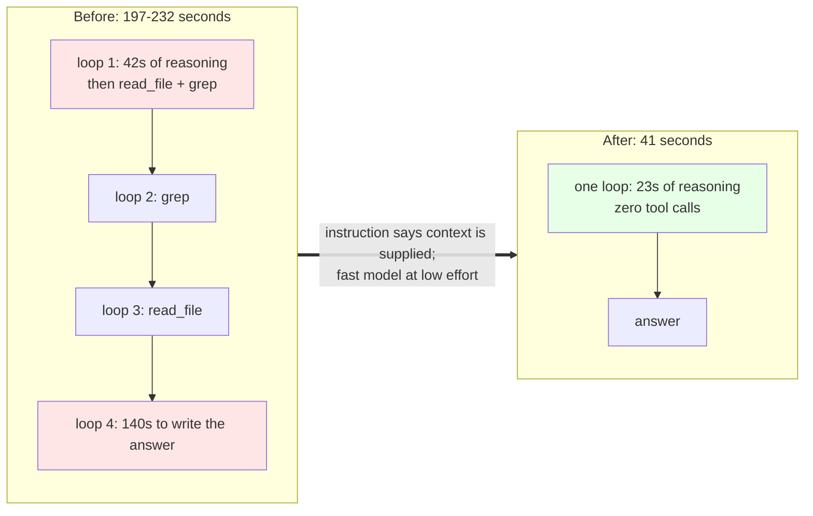
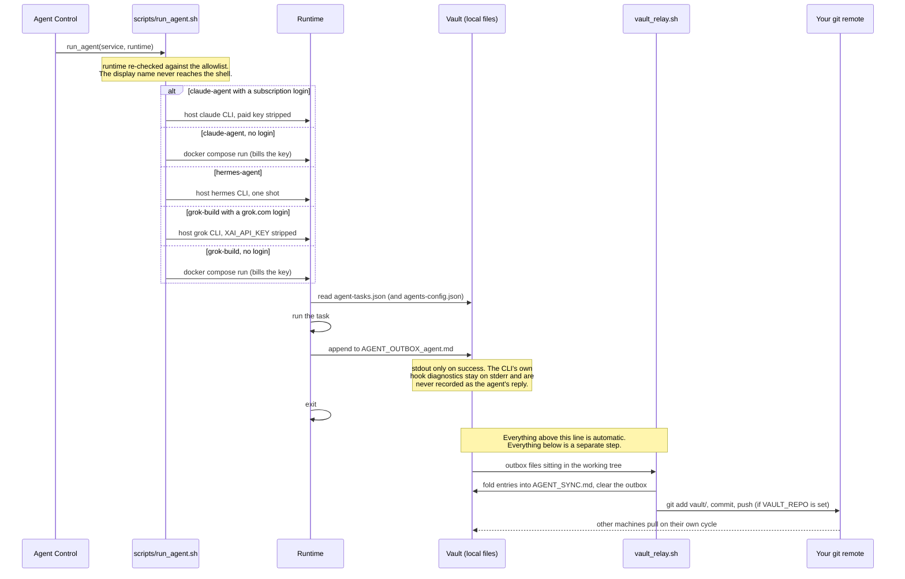
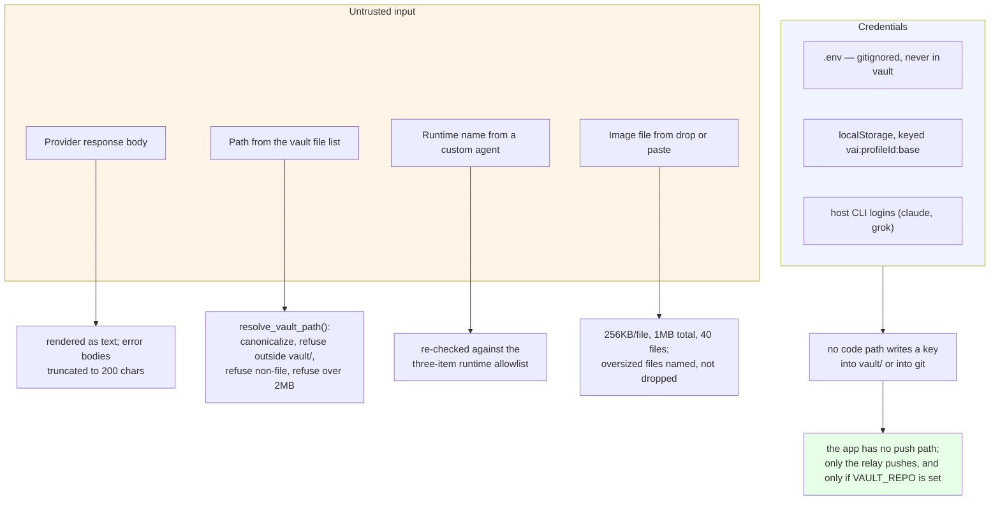
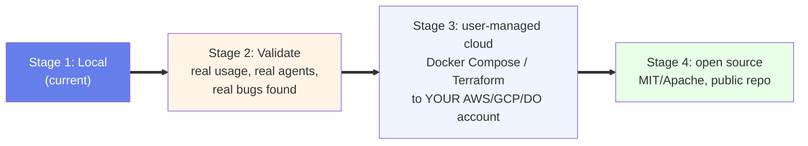
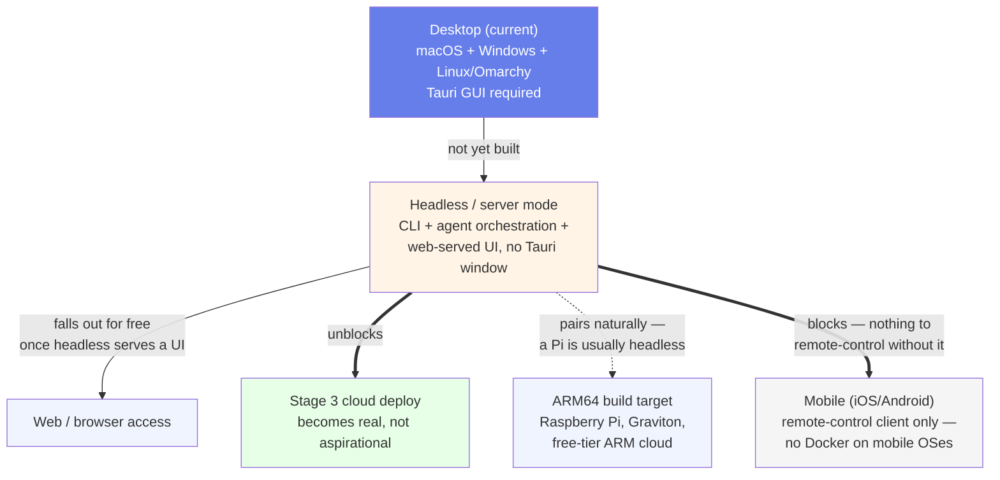

# ValhallaAI — Architecture

**Status:** Local development. This document is the design of record — update it whenever the system changes shape, not after the fact.

**Last rewritten: 2026-09-22**, after the agent-run performance work (a run went from 197s to 41s — §8), the async `run_agent` fix (§6.2), and the vault-relay reality check (§9.3).

**How to trust this document:** every claim about behaviour below was checked against the code or against a real run on the date in the header. Where something is designed but not built, or built but not run, the text says so in the sentence itself rather than in a footnote — see §14 for the list of what is currently proven versus merely built.

## 1. What ValhallaAI is

ValhallaAI is a **desktop-first, multi-provider AI orchestration platform**. One app, three jobs:

1. **Talk to any model** — 13 providers behind one router, one chat UI. In the desktop app, Anthropic, OpenAI, OpenRouter, Google, and xAI keys are read from the project `.env`. Nous Portal goes through the local Hermes proxy and does not take a pasted key. See §7.
2. **Run agents** — Agent Control calls `scripts/run_agent.sh`. Hermes is the host CLI. Claude and Grok prefer a host CLI on a subscription login and fall back to one-shot Docker containers. See §5.8 and §5.11.
3. **Coordinate them** — a git-synced markdown vault is the shared memory/log, not a database. Agents append gitignored outboxes; `scripts/vault_relay.sh` folds those into `AGENT_SYNC.md` and commits. See §9.3 for exactly how far that has and has not been proven.

It is built to be **self-hosted and user-owned**: you run it on your Mac today, and later deploy the same stack to your own cloud account. Nobody else's server ever holds your keys or your coordination log by default.

## 2. How to read the diagrams

Every diagram in this document and in the project's other docs uses one visual vocabulary. Learn it once and all of them read the same way. This is the same legend the Obsidian-vault agent platform uses, deliberately — the two projects share an operator, so they should not require two mental models.

| Element | Meaning |
|---|---|
| **Rounded rectangle** `("…")` | A moment in time, a session, or a role — not a thing on disk |
| **Rectangle** `[…]` | A concrete step, file, or component |
| **Cylinder** `[(…)]` | A repository or other durable store |
| **Diamond** `{…}` | A decision or gate that can reject what passes through it |
| **Double circle** `((…))` | A person |
| **Solid arrow** `-->` | An active, working path in use today |
| **Thick arrow** `==>` | A bulk transfer or a blocking relationship |
| **Dotted arrow** `-.->` | Not active: planned, unproven, or deliberately excluded |

| Colour | Used for |
|---|---|
| 🟦 Blue / indigo | The live target — the thing the design is aiming at |
| ⬜ Light blue | Machine-side, automated work |
| 🟨 Amber | A human step, or a step that needs care |
| 🟥 Rose / red | A gate that can block, or a stop condition |
| ⬜ Grey | Archived, or not-active-yet |

Every diagram carries `accTitle:` and `accDescr {}` so a screen reader (and a plain-text `cat`) conveys what the picture conveys, and each is followed by a short **Reading it** paragraph saying what to notice — the point of the diagram, not a restatement of its labels. All blocks are parsed against mermaid v11 before they are committed; a diagram that does not parse is not a diagram.

## 3. System map



**Reading it.** Three observations matter more than the boxes. First, **there are two arrows into the agent runtimes but only one path out of them** — an agent reads its task and its config, and its only write is to its own outbox. It never edits the shared log directly, which is the whole concurrency design (§9.3). Second, **the relay arrows are dotted**: folding and pushing is a separate step that a running relay performs, and it is not running by default (§9.3). Third, **the Vault Browser arrow is one-way** — the app can read the vault and report `git status`, and it has no push path at all. That is a deliberate property, not an unfinished feature: the app cannot publish your log to a remote on its own.

## 4. Design principles

| Principle | What it means here |
|---|---|
| **Local-first** | Everything runs on your machine before it runs anywhere else. Cloud deploy is an option you choose later, not a requirement. |
| **User-owned data** | The vault is plain markdown + JSON in a folder you control. No proprietary format, no vendor database. |
| **Provider-agnostic** | The router is the only place that knows about provider APIs. UI and agents never hardcode a provider. |
| **Coordination ≠ storage** | The vault is for logs, config, and hand-offs between agents — not a database. If you need fast queries, that's a separate concern (see §9.2). |
| **Transparent security** | Credentials live in `.env`/local storage, never in the git-tracked vault. Every write to the vault is a plain-text, human-readable diff. See §11. |
| **Subscription before token** | Where a flat-rate login exists, the app and all three agent runtimes use it before they touch a per-token key, and they record which one ran. See §8.4. |
| **Cheap runs are the default** | An agent run that costs four minutes of model time to answer a question it was already handed the answer to is a bug. §8 is that bug, measured. |
| **Cross-platform (macOS + Windows + Linux)** | Every design and dependency choice is checked against all three target OS families from the start — not retrofitted after a macOS-only implementation ships. See §4.1. |

### 4.1 Cross-platform constraint

ValhallaAI targets **macOS, Windows, and Linux** (including Arch-based distros such as **Omarchy**) as first-class platforms. This is a standing constraint on every change, not a future nice-to-have — it shapes decisions now, while the architecture is still easy to adjust.

**Why Tauri fits this well:** it cross-compiles the same Svelte frontend + Rust backend into a native app on each OS — `.dmg`/`.app` on macOS, `.msi`/`.exe` on Windows, and on Linux both distro-specific packages (`.deb`, `.rpm`) *and* a distro-agnostic **AppImage**, which is what actually matters for Omarchy: it's Arch-based (pacman, not apt/dnf), so the `.deb`/`.rpm` bundles are useless there but the AppImage runs on any Linux with no packaging step. `tauri.conf.json`'s `bundle.targets: "all"` already builds every target valid for the host OS — no per-OS fork of the bundle config needed. `tauri init` generated `icon.icns` (macOS), `icon.ico` (Windows), and PNG icons (Linux) up front.

**What is actually built today:** macOS only. `ValhallaAI.app` and `ValhallaAI_0.1.0_aarch64.dmg` are produced and run on Apple Silicon. No Windows or Linux bundle has ever been produced or executed on this project. The sections below describe what must be true for those builds; they are a checklist, not a record.

**Linux/Omarchy build prerequisites** (not yet installed or verified on an actual Omarchy machine): Tauri's Linux build needs system libraries that aren't part of a minimal Arch/Omarchy install. On Arch-based systems:

```bash
sudo pacman -S --needed webkit2gtk-4.1 base-devel curl wget file openssl \
  appmenu-gtk-module gtk3 libappindicator-gtk3 librsvg
```

**Where cross-platform assumptions actually bite** (checklist for new code):

| Area | Unix-only / single-OS trap | What to do instead |
|---|---|---|
| Docker volumes | `~/.hermes:/root/.hermes` — `~` isn't reliably expanded by Docker Compose, and not at all on Windows | Use `${HOST_HERMES_DIR}` from `.env` (see `env.example`), an absolute path set per-machine. On Linux/Omarchy this is a normal `/home/<user>/.hermes` path — same fix already covers it |
| Shell scripts run on the **host** | A `.sh` script invoked directly by the desktop app | Won't run on Windows without WSL/Git Bash. Agent scripts that run *inside* a Docker container are fine on all three OSes — the container is always Linux regardless of host — but anything Tauri shells out to directly on the host must be cross-platform (Node/Rust) or ship OS-specific equivalents |
| Path separators | Hardcoded `/` in any path string | Use `path.join()` (Node side) or Rust's `PathBuf` (Tauri side), never string concatenation |
| Home directory | `~` or `$HOME` assumed | `$HOME` doesn't exist on Windows by default (`%USERPROFILE%` does; Linux has `$HOME` same as macOS) — resolve via Tauri's path APIs, not shell env vars |
| Linux packaging | Assuming a `.deb`/`.rpm` reaches every Linux user | Arch-based distros (Omarchy included) use pacman/AUR, not apt/dnf — the AppImage target is the one guaranteed to run without a distro-specific package |
| Line endings | Assuming `\n` in generated files | Vault markdown files are read by git, which normalizes this — but any file written on one OS and read on another should be tested |
| Process spawning | `Command::new("bash")` for a host script (§6.2) | This is the one place the app already assumes a Unix host. Windows needs a PowerShell or Node equivalent of `scripts/run_agent.sh` before Agent Control can work there — tracked in CONTRIBUTING |

**Not yet verified — flagged, not assumed:**
- Windows: the agent Docker containers (`agents/claude`, `agents/grok`) haven't been run end-to-end. Docker Desktop on Windows runs Linux containers via WSL2, so they *should* behave identically — that's a claim to test, not trust. The host-CLI paths and `run_agent.sh` are additionally blocked by the `bash` dependency above.
- Linux/Omarchy: nothing in this stack (Tauri build, Docker agent runtime, or the app itself) has been run on an actual Omarchy machine yet.

Both tracked in [CONTRIBUTING.md](./CONTRIBUTING.md#known-open-issues) until actually done.

## 5. Component responsibilities

### 5.1 LLM Router (`src/lib/llm-router.ts`)
Single abstraction (`callLLM(config, messages)`) that fans out to one function per built-in provider. The provider *catalog* (names, display names, model lists) lives separately in `src/lib/providers.ts` — the single source of truth `Settings.svelte` and `ModelPicker.svelte` both import from, so the count can't drift between files the way it did before that extraction (see [CONTRIBUTING.md](./CONTRIBUTING.md#known-open-issues)). Adding a built-in provider means adding one function + one switch case in `llm-router.ts`, and one entry in `providers.ts` — nothing else in the app should need to change.

A user-defined provider needs none of that. Its id is `custom:<slug>` and it is matched in `callLLM()`'s `default` branch against a registry (`registerCustomProviders`), then sent through the same `callOpenAICompatible()` helper the built-in OpenAI-dialect providers use. `LLMProvider` stays a closed union of the built-in ids; a provider id in flight is a plain string, because a custom id is created at runtime and widening the union would cost type safety at every reference site.

Current counts, verified by counting rather than by reading a number in a doc: **13 catalog keys = 13 `callLLM` switch cases = 13 members of the `LLMProvider` union.** §7 has the table.

### 5.2 Settings (`src/routes/Settings.svelte`)
User picks a **default provider + model**, saved to `localStorage`. Nothing is hardcoded as "the" default — every user configures their own, mirroring how Hermes's own provider/account settings work. Provider API keys come from the project `.env` when that file has one (`provider_keys` in the desktop app: Anthropic, OpenAI, OpenRouter, Google, xAI). A key saved in Settings is used only for a provider the file does not cover. Nous Portal does not use a pasted key (§7.3).

Settings also owns the **Custom Providers** section (§5.5). It deliberately does not import Profile, and Profile does not import it.

### 5.3 Profile (`src/routes/Profile.svelte`)
Split out of Settings.svelte on 2026-09-22 — identity (who is signed in) and app configuration (which provider/model/keys) were sharing one page for no reason but history. Reached from the **profile card at the top of the sidebar** (above the nav — see §5.13 for the full layout), not from the `sections` array or the Settings gear.

Owns profile management (create, rename, delete, switch — the mechanics live in `src/lib/profiles.ts`, see [CONTRIBUTING.md](./CONTRIBUTING.md#profiles-and-per-profile-storage)) and sign-in with **Google or GitHub** (see [CONTRIBUTING.md](./CONTRIBUTING.md#sign-in-with-google-or-github)). Also owns the per-profile `ignoreEnvKeys` toggle, since that is a property of the profile, not of any one provider. Shows a **Verified**/**Unverified** badge next to the email (`Profile.emailVerified` in `profiles.ts`) — from whichever provider signed the profile in, and not re-checked afterward, since no token is retained to re-check against. The two providers supply that flag from different places: Google reads the `email_verified` claim out of the `id_token`, while GitHub has no id_token at all and takes the `verified` flag off the primary entry in `GET /user/emails`.

Which provider a profile used is recorded as `authProvider` (`"google" | "github" | "local"`), and the sign-out button reads it, so a GitHub profile says "Sign out of GitHub" while a local one says there is nothing to sign out of. Nothing else in the app branches on it for behaviour: `isSignedIn()` is provider-agnostic (it requires an `authProvider` and an `email`, whatever those came from), which is what let GitHub be added as a second path into the same gate rather than a second gate — and what lets the `"local"` provider open the gate (via `hasPassedGate()`, §5.4) while leaving `isSignedIn()` false.

Deliberately does not import anything from Settings.svelte or vice versa — the only shared dependency is the `profiles` store itself. A profile knowing nothing about *which* provider you picked, and Settings knowing nothing about *who* you are, is what makes the split real rather than cosmetic. The actual OAuth calls live in `profiles.ts` (`signInProfileWithGoogle`, `signInProfileWithGithub`), not in this file, because `Onboarding.svelte` (§5.4) needs the identical calls and duplicating them was the same mistake the provider catalog already made once.

**The two providers are asymmetric in one deliberate way.** Google's client id is read by the frontend (`VITE_GOOGLE_CLIENT_ID`, inlined into the bundle, public by design) and passed into the flow, while GitHub's is read **only** in Rust: `github_sign_in` reads both `GITHUB_CLIENT_ID` and `GITHUB_CLIENT_SECRET` itself, so neither has a `VITE_` prefix and neither reaches the JS bundle. The consequence for the UI is a round trip: it cannot see whether GitHub is configured, so a separate `github_client_configured()` command answers presence-only, and the button is disabled with a hint rather than failing on click.

**Per-profile storage.** Every persisted key is namespaced `vai:<profileId>:<base>`, resolved by `storageKey()` in `profiles.ts`. That is why two profiles can hold different API keys, different custom providers, and different chat history on one machine with no server. Changing the active profile reloads the window (`switchProfile()`), because stores read their key at module load.

### 5.4 Onboarding (`src/routes/Onboarding.svelte`)
A sign-in gate, mounted unconditionally at the top of `App.svelte`. `visible` is derived from `!hasPassedGate(activeProfile)`, so there is no local open/close state to fall out of sync with the profile store, and no backdrop-click or Escape handler — the ways through are a sign-in with **Google or GitHub**, or **Continue without an account**.

**Optional as of 2026-09-22 — ratified, with the provenance kept on the record.** The gate was skippable, then made mandatory *by Jacob explicitly*, then flipped back to optional the same day. That third flip began as an agent proposal: no user turn asked for it, the agent that caught the discrepancy marked the docs UNRATIFIED rather than let a proposal read as a decision (`cbe5449` was the revert target while it stood), and **Jacob was then asked directly and chose the local path** — in the same four-question decision pass that picked MIT for the licence. So the code now matches a decision, and the detour is recorded rather than tidied away, because "a decision attributed to Jacob that he never made" is a failure this repo has been burned by before. The argument for it is distribution rather than UX — sign-in credentials come from the *user's* `.env`, so requiring it means every new user registers a Google Cloud OAuth client and a GitHub OAuth app before the app will open — and the local path sets `authProvider: "local"`, which opens the gate without pretending to be an identity.

The split that keeps this honest is two predicates, not one: **`hasPassedGate()`** is what the gate asks (`isSignedIn(profile) || authProvider === "local"`), and **`isSignedIn()`** stays the identity test that the sidebar chip and Profile page ask. A local profile is *not* signed in, and a chip that claimed otherwise would be lying — verified in the running app: the gate clears, the profile page reads "Not signed in", and the sidebar chip still offers sign-in.

Each button carries its own disabled-state hint (`Set VITE_GOOGLE_CLIENT_ID in .env`, `Set GITHUB_CLIENT_ID and GITHUB_CLIENT_SECRET in .env`), and the two are gated by different mechanisms for the reason given in §5.3. The "neither provider is configured" hint is now informational rather than a dead end: the local button is always enabled, including in a plain browser tab where `inTauri()` is false and both OAuth buttons are disabled.

The `onboarded` flag and its backfill still exist but no longer control this screen. Keying the gate off that flag would hide it from every profile that predates it, which is the opposite of what was asked.

### 5.5 Custom providers (`src/lib/custom-providers.ts`, Settings → "Custom Providers")

A provider that is not in the catalog can be added from Settings with no source change: a display name, a chat-completions URL, and a model list (one id per line). It is stored in `localStorage` under `valhallaai-custom-providers` and registered with the router at app start (`initCustomProviders()` in `App.svelte`), so a provider saved in a previous session is routable before Settings is ever opened.

The constraints are deliberate:

- **OpenAI dialect only.** The one implementation that speaks it is `callOpenAICompatible()`, and reusing it is what makes a free-text endpoint safe to expose. A provider with a genuinely different request/response shape (Anthropic Messages, Gemini, MiniMax) still needs a real implementation and stays a source change.
- **No arbitrary code, no headers editor.** The one header set is the bearer token, and it is omitted entirely when no key is configured — a localhost gateway (LiteLLM, vLLM, llama.cpp's server, LM Studio) usually has no auth, and refusing keyless sends client-side would make the main use case unusable. An endpoint that does need a key returns its own 401, which names the real problem.
- **The id is namespaced `custom:`** so a user-defined provider can never shadow a built-in one. The API key is stored through the same per-profile scoped key as the built-ins (`valhallaai-apikey-<id>`), not inside the provider record.

Together AI was removed from the catalog on 2026-09-22; this is the path for bringing it — or anything else OpenAI-compatible — back without a fork.

### 5.6 Model Picker (`src/routes/ModelPicker.svelte`)
Loads the saved default on mount, lets the user override per-conversation, sends through the router, renders responses with token usage.

The model bar (bottom strip) carries three pickers — Provider, Model, Project — plus **+ New session**. The Project picker files the active conversation; when there is no session yet it holds the choice in `pendingProject` and applies it to the session that the first message creates. Without that, picking a project and then typing would silently drop the choice, since sessions are created lazily.

**Image ingestion, and its limits.** Attaching a file happens through one function, `ingestImageFiles(files, fallbackName)`, called by the file picker, the drag/drop handler, and the paste handler — three entry points, one code path. The caps are enforced there and reported to the user rather than silently applied:

| Limit | Value | Why |
|---|---|---|
| Per file | 256 KB | A screenshot is typically well under this; a photo is not |
| Per message | 1 MB total | Stays inside every provider's request-body budget |
| Count | 40 files | Beyond this the UI stops being usable, not the API |

Anything skipped is named in a visible list (`over the 40-file limit`, `too large`), because silently dropping a screenshot the user just dragged in is the failure mode this whole path exists to prevent. Drag/drop uses a depth counter on the overlay: `dragenter`/`dragleave` fire for every child element, so a naive boolean flickers the overlay off while the cursor is still over the chat.

### 5.7 Recent, Projects and Sessions (`src/routes/Recent.svelte`, `Projects.svelte`, `Sessions.svelte`)
All three read the same `sessions` store and differ only in filter, which is why none of them needs its own storage:

| View | Shows | Filter |
|---|---|---|
| Recent | where a chat lands, newest first | `project === undefined` |
| Projects | filed chats, grouped | grouped by `project` |
| Sessions | everything, newest first | none — and the only view with delete |

`projectNames()` in `sessions.ts` returns the union of explicitly created projects and any name a session references. Deriving it rather than trusting the stored list means a session restored from a backup can never name a project the UI refuses to list — it would be invisible with no way to recover it. Filing happens two ways: the dropdown on each row in Recent, and the Project picker in the model bar. Removing a project (`deleteProject()`) clears the label and leaves the sessions, after a confirmation that says so in words.

**`project` is a label on a session, not a container holding them.** That is the load-bearing decision behind this whole screen group: deleting a project can never delete a conversation, and a session can never be orphaned inside a group that no longer exists.

### 5.8 Agent Control (`src/routes/AgentControl.svelte`)
Run starts one agent and waits for it to exit. The button calls the Tauri command `run_agent`, which runs `scripts/run_agent.sh` with an allowlisted name (`claude-agent`, `hermes-agent`, `grok-build`). §6.2 covers how that call is dispatched and why it is asynchronous. §5.11 covers what each runtime does and how fast.

The cards read real state via `agent_status`: enabled flags come from `vault/agents-config.json`, and last-run time plus OK/ERROR are recovered from each `AGENT_OUTBOX_<agent>.md`. Nothing about run history lives in component state, which is why it survives a relaunch. Last-run uses the **timestamp written inside the entry**, not the file's mtime — the relay rewrites these files when it folds them, so mtime would report a relay run as an agent run.

A card's blurb is generated from the runtime it is bound to (`RUNTIME_BLURB` in `src/lib/custom-agents.ts`), so the description of what a runtime bills and where it runs has exactly one home. An earlier version hardcoded "One-shot Docker container … bills per token" into six places, which was wrong for two of the three runtimes after the subscription-first change.

### 5.9 Custom agents (`src/lib/custom-agents.ts`, Agent Control → "Add an agent")

A display name bound to one of the three runtimes above, added from Agent Control and stored in `localStorage` under `valhallaai-custom-agents`. `run_agent` takes an optional `runtime`; the Rust side re-checks it against the same allowlist and passes the allowlisted value to the script, never the display name. A custom agent therefore cannot run anything the three built-in agents cannot already run.

That is also its limit, stated on the card: it runs the same prompt and writes the same outbox as the runtime it is bound to. It is a second entry point, not an agent with its own behaviour. Behaviour that differs per agent lives in `vault/agent-tasks.json`, keyed by the runtime name, which is shared.

### 5.10 Agent tasks (`vault/agent-tasks.json`)
What each agent *does*, kept separate from `agents-config.json`, which says how it *runs* (model, provider, enabled). The two change on different schedules.

An entry has an `instruction`, a `context` list of vault-relative files to include, and `maxContextChars`. Editing it changes an agent's work on the next run with no rebuild. With no entry, agents fall back to a self-description ping, so Agent Control stays usable as a plain connectivity check.

`agents/_shared/task.cjs` builds the prompt and is shared by all three agents — copied into the two container images (their build context is `./agents` for this reason) and invoked as a CLI by the host-side hermes runner. Context paths are resolved and refused if they leave `vault/`, via `realpath`, so both `..` and a symlink pointing out are blocked. That guard matters most for `hermes-agent`, which runs on the host where `../.env` would be a real secret; the containers only mount `/vault`. It is `.cjs` because the root `package.json` sets `"type": "module"`, which would otherwise make `require` throw on the host.

**Every instruction must state that the context is already supplied and that the agent must not call tools.** This is a performance rule with a measured cost behind it (§8): a host CLI told to "read the coordination log" spends real minutes deciding to `cat` a file that `task.cjs` has already pasted into its prompt. The rule, and the numbers, are recorded in the file's own `_note` so the next person editing an instruction does not re-introduce the problem.

**Agent output is evidence, not fact.** The first real run correctly read the config and log, and also asserted that `grok-4.7` on provider `nous` was a mismatch — it is not; Nous Portal is an aggregator and serves `x-ai/grok-4.7`. Treat outbox entries as a lead to verify, the same as any other model output.

### 5.11 Agent Runtime (`agents/*`, `scripts/run_agent.sh`)



**Reading it.** The diamond on the right is the money decision: two of the three runtimes ask "is there a subscription login?" and only fall to the paid container when the answer is no. The two grey boxes are therefore the *unhappy* path — they exist so a machine with no login still works, not because they are expected. The allowlist diamond on the left is the security boundary: a custom agent's display name is re-validated here and never reaches the shell (§5.9).

Each agent is one-shot:
1. Reads its task from `vault/agent-tasks.json` (and, for the containers, its config from `vault/agents-config.json` — the host CLI paths use the CLI's own login as well)
2. Does its work
3. Appends a result to `vault/AGENT_OUTBOX_<agent>.md` (gitignored; the relay folds it)
4. Exits

**Hermes runs on the host** because the installed CLI is a macOS virtualenv under `~/.hermes`. A Linux container cannot execute that binary, and installing a second Hermes that shares the same home would race the proxy that is already running. It is invoked as `hermes chat -q <prompt> --oneshot --max-turns 1 --safe-mode -Q --run-budget 60` from a Python wrapper with a 90-second hard timeout, and it runs with `/tmp` as its working directory — it is answering a question, not editing a repo.

**Claude and Grok both prefer a host CLI on a subscription login**, and their Docker containers are the fallback for a machine with no login. Those containers are the paid path: Claude's calls the API and exits with an error if `ANTHROPIC_API_KEY` is unset rather than exiting 0, and Grok's calls `api.x.ai` directly and exits with an error when `agents-config.json` has `"enabled": false` or when `XAI_API_KEY` is unset. Neither uses the Hermes proxy. Grok models in chat go through Nous Portal (`x-ai/grok-4.7` and the other `x-ai/*` ids), which is a third path again and does not need that key.

**Why the script prepends install paths.** Tauri launches the runner with `bash script <agent>`, which is not a login shell, so it inherits the GUI's minimal `PATH` (`/usr/bin:/bin:/usr/sbin:/sbin`). Every CLI this depends on lives outside that. The failure this prevents is nasty and was observed on 2026-09-22: the Grok subscription probe uses `command -v grok`, so a missing `grok` reads as *"no subscription"*, and the runner silently fell through to a paid Docker path that then failed with `docker: command not found`. A subscription that existed looked like a billing failure. The fix is `path_helper` plus an explicit prepend of `~/.grok/bin`, `~/.local/bin`, `~/.hermes/bin`, and `~/.orbstack/bin`, so a user-level install wins over a stale system one.

**Records are one line, and say how they were billed.** Each outbox entry is `## [timestamp] agent`, then `Status:` (`OK (subscription)`, `OK (paid-key)`, or `ERROR`), then the answer flattened to a single line, capped at 2000 characters. On failure the stderr text is kept — losing it would record a failure with no reason — but on success stderr is dropped, because the CLIs emit their own hook diagnostics there and recording those as the agent's answer was a real bug (a node `MODULE_NOT_FOUND` stack trace appeared in the outbox as if the agent had said it).

### 5.12 Vault Browser (`src/routes/VaultBrowser.svelte`)
Refresh calls the Tauri command `vault_status`. It lists the files under `vault/`, runs `git status --short -- vault`, and reports the last commit touching `AGENT_SYNC.md`. It does not pull or push — the app has no push path anywhere in the codebase, by design.

Clicking a file calls `vault_file`, which returns its text. **This command does take a path from the frontend**, so it is untrusted input to a filesystem read. `resolve_vault_path()` canonicalizes the candidate — which resolves `..` *and* symlinks — and refuses anything landing outside `vault/`, anything that is not a file, and anything over 2 MB. Four unit tests cover it directly, including a symlink pointing out of the vault (§11).

### 5.13 App shell and sidebar (`src/App.svelte`)
Top to bottom, as of 2026-09-22:

1. **Profile card** — avatar, name, email (or "Sign in" if no identity is attached). Clicking it opens Profile (§5.3). At the very top of the column, above the nav — identity is the first thing you see, mirroring Settings' gear being the last.
2. **Profile switcher** — a `<select>`, only rendered when `$profiles.length > 1`. Switching calls `switchProfile()`, which reloads the window (see that function's comment in `profiles.ts` for why).
3. **Conversation views** — Recent, Projects and Sessions. Three views over the same flat session store, each with a distinct job, so none duplicates another:
   - **Recent** — previous chats with no project, newest first. This is where a conversation lands, and where it stays until it is filed.
   - **Projects** — the filed ones, grouped by project.
   - **Sessions** — all of them, newest first, and the only view with delete.

   `project` is an optional string on `ChatSession`, not a container holding sessions (§5.7).
4. **`sections` nav** — Models & Chat, Recent, Projects, Sessions, Vault Browser, Agent Control. `activeTab` is a plain string, not a router; each value maps to one component in a single `{#if}/{:else if}` chain in the template.

   There is no "New Session" entry. It used to be a sidebar button that called `createSession()` and then switched to Models & Chat — a second control for a tab that already existed, and redundant with the chat creating its session on the first message anyway. Starting a fresh conversation is now **+ New session** in the model bar (§5.6), inside the view where the conversation actually is.
5. **`sidebar-bottom`** (`margin-top: auto` pins it) — Settings only. Profile used to live here too, as a small chip; it moved to the top of the list in the same pass that gave it its own page (§5.3), so identity and app-configuration now anchor opposite ends of the sidebar instead of sharing one corner.

`Onboarding.svelte` (§5.4) is mounted once, unconditionally, above the `.shell` div — it is `position: fixed`, so its place in the DOM does not affect layout, only stacking order.

## 6. Data flow

### 6.1 Sending a chat message

A message is text, images, or both. Images arrive three ways — the file picker, a drag onto the chat, and a clipboard paste — and all three call the same `ingestImageFiles()`. The diagram shows the drop path; the other two differ only in how the `File` arrives.



**Reading it.** The `alt` block at the top is the honesty rule in diagram form: when a provider cannot carry an image the app says so and prevents the send, instead of attaching it and quietly not sending it. The nested `alt` at the bottom is the second honesty rule — a failure that names the provider's own reason, not a bare status code.

**Why the encoding step exists.** There is no single image format. A data URL is `data:image/png;base64,...`, and each provider wants those two halves in a different field:

| Family | Providers | Shape sent |
|---|---|---|
| OpenAI-compatible | OpenRouter, ChatGPT, Grok, Nous, Fireworks, Groq, MiniMax, Qwen | `[{type:"text"},{type:"image_url",image_url:{url}}]` — data URL kept whole |
| Google Gemini | Google | `{inlineData:{mimeType,data}}` — camelCase, prefix stripped |
| Anthropic | Anthropic (API key) | `{type:"image",source:{type:"base64",media_type,data}}` — prefix stripped |
| Ollama | Ollama | a raw-base64 `images` array alongside the text |

`parseDataUrl()` splits the URL once; each emitter below it only decides the field names. That split is the thing that is easy to get wrong per provider, so it lives in exactly one place.

**The one provider that cannot take an image is the default.** Claude Subscription DirectSDK builds a single text prompt and pipes it to the `claude` CLI, so there is no field an image can travel in. It is deliberately absent from `IMAGE_CAPABLE_PROVIDERS`: the UI warns and disables Send rather than attaching the image and quietly never sending it. Making that path work means writing images to temp files and letting the CLI read them, which changes what tools the CLI is permitted to use — a decision recorded in [CONTRIBUTING.md](./CONTRIBUTING.md), not taken silently. **If your work is screenshot-heavy, switch the default to Google or Nous Portal.**

**A screenshot with no caption is still a message.** `toAnthropicMessages()` used to drop any turn whose text was empty. A dropped screenshot often has no caption, so that filter would have discarded the image. A turn now survives if it has text *or* an image.



**Reading it.** This diagram exists because of a real misdiagnosis: a transient Google capacity spike surfaced as `HTTP 503` with no body, which read like a broken API key. Green is the good outcome, amber is partial information, grey is the last resort. Every branch still ends with the user holding *something* actionable — the failure worth avoiding is the one that says nothing at all.

### 6.2 What a Run click actually does (and why it is asynchronous)

`run_agent` in `src-tauri/src/main.rs` is an `async fn` **on purpose**, and the reason is a bug that made the app unusable rather than merely slow. Tauri runs a *synchronous* command on the main thread, so the runner's `Command::new("bash").output()` blocked the webview event loop for the entire duration of an agent run — measured at 3.5 minutes for one real `grok-build` task, during which the window could not paint and could only be force-quit. Async commands are dispatched off the main thread, so the UI keeps painting, the card can show `running`, and the rest of the app stays usable while an agent works.

Two smaller facts follow from the same incident:

- **A host CLI run has a hard time limit.** `run_with_timeout` in `scripts/run_agent.sh` implements what macOS's missing `timeout(1)` would do — SIGTERM, then SIGKILL five seconds later — defaulting to `AGENT_TIMEOUT_SECS=900` and overridable. Without it, a CLI waiting on something that will never arrive (an approval prompt with no TTY, a stalled socket) leaves a Run click spinning with no end. A killed run exits 143 or 137, and the outbox records `Timed out after Ns (SIGTERM)` rather than letting a time limit masquerade as an ordinary failure.
- **The recorded output is filtered.** `redact()` strips known noise — `python-dotenv` parse warnings, bash's `Terminated: 15` job-control line — and masks anything key-shaped. A killed run should read as "this was killed deliberately", not as a wall of shell noise.

## 7. Provider catalog

13 providers (`Object.keys(PROVIDERS).length` in `src/lib/providers.ts` — check there directly rather than trusting this number by hand), router-abstracted so the list can grow without touching the UI logic. A provider that is not here can be added from Settings without editing the source — see §5.5.

| Provider | How it authenticates | How it is called | Reads images |
|---|---|---|---|
| Anthropic (API key) | `ANTHROPIC_API_KEY`, bills per token | own request shape, via the desktop process | yes |
| ChatGPT / Codex | `OPENAI_API_KEY` | OpenAI-compatible | yes |
| Claude Subscription DirectSDK | `claude auth login`, flat-rate, the default | host `claude` CLI, text prompt only | **no** |
| Fireworks AI | API key | OpenAI-compatible | yes |
| Google Gemini | `GOOGLE_API_KEY` | own request shape (`generateContent`) | yes |
| Groq | API key | OpenAI-compatible | yes |
| MiniMax | API key | own endpoint, accepts the OpenAI content array | yes |
| Nous Portal | Hermes portal login, no pasted key | local proxy at `127.0.0.1:8645` | yes |
| Ollama | none — runs on this machine | local `/api/chat` | yes |
| OpenRouter | API key | OpenAI-compatible | yes |
| Perplexity | API key | **Agent API** — `preset`, not a model id; rewritten 2026-09-22, **unverified** (§7.4) | **no** |
| Qwen Code | API key | own endpoint (DashScope), accepts the content array | yes |
| xAI Grok | `XAI_API_KEY` | OpenAI-compatible | yes |

**12 of 13 read images.** The count is not decoration: it is the set `IMAGE_CAPABLE_PROVIDERS` in `llm-router.ts`, and the UI reads it to decide whether to warn before a send.



**Reading it.** The `Switch` diamond is the whole router: everything above the response box is one of eight paths, and the response box is the contract they all satisfy. Note that the largest branch is deliberately the *shared* one — seven providers, one implementation — because copying an identical dialect seven times would be seven copies of the same bug waiting to diverge. The bespoke branches are the four APIs that are genuinely not that dialect.

### 7.1 "OpenAI-compatible" means one implementation, not a shortcut

It means the provider speaks `{model, messages, temperature, max_tokens}` and answers `{choices:[{message:{content}}]}`, so they share `callOpenAICompatible` instead of seven copies of it. The four that do not — Anthropic, Google, MiniMax, Qwen — each have a request or response shape different enough to need its own function. [POSITIONING.md §3.2](./POSITIONING.md) explains why that split is the design and not an accident.

**Two providers were removed on 2026-09-22, and the reason is worth keeping.** Replicate and Hugging Face were both in the catalog, and neither could be verified on this machine — no key, no public model list. Worse, both were text-to-output endpoints, so an attached image had nowhere to go and would have been silently dropped. Removing them made the catalog's promise match its behaviour. The three places that must agree were re-counted afterwards: 13 catalog keys, 13 `callLLM` switch cases, 13 members of the `LLMProvider` union.

### 7.2 A model id in the catalog is not proof the model answers
Gemini's `GET /v1beta/models` lists `gemini-2.5-flash` and reports `generateContent` support for it, and a real request returns 404 "no longer available to new users". The catalog is checked by sending a request, not by reading the list. `gemini-3.6-flash` is first in Google's list on purpose: the picker selects `models[0]` when the provider changes, so first place is the default, and the newest model is not always the one that answers.

### 7.3 Nous Portal does not take a pasted API key
`callNous()` posts to the local Hermes subscription proxy at `http://127.0.0.1:8645/v1` (`hermes portal` once, then `hermes proxy start`), which attaches the Portal credential. A direct call to `inference-api.nousresearch.com` 401s, because the portal login never produces a key you can paste. **Unverified by this project:** the proxy answered a real completion on 2026-09-22 (a live `x-ai/grok-4.7` response came back through `127.0.0.1:8645`), but that is the Hermes side of the contract; ValhallaAI's own `callNous` path has not been exercised against it since the provider-count changes.

### 7.4 Known third-party deadline
Perplexity's Sonar Chat Completions endpoint is supported **only until 2026-09-27**, so on 2026-09-22 the catalog's `perplexity` entry was rewritten onto Perplexity's **Agent API** (`POST /v1/agent`) rather than left to break. It is no longer an OpenAI-dialect provider: the request sends a **`preset`** (`low` | `fast` | `medium`) instead of a model id and an `input` string instead of `messages`, and the reply arrives as a typed `output` array (`{type: "message"}` → `content[].type === "output_text"`) rather than `choices[0].message.content`. Three things follow, and all three are recorded rather than smoothed over: **it has never been run** (no Perplexity key exists on this machine), the model dropdown therefore shows a raw preset name, and it was **removed from `IMAGE_CAPABLE_PROVIDERS`** because the new path sends text only — leaving it listed would have let the composer accept an attachment the provider silently drops, which is the exact failure that set exists to prevent.

### 7.5 Billing preference, where a subscription exists
Claude Subscription DirectSDK and Nous Portal run on a flat-rate login and never touch a per-token key. Anthropic (API key) and xAI Grok have no subscription path and bill per token. The chat defaults to Claude Subscription DirectSDK on Haiku for exactly this reason: the out-of-the-box path costs nothing per message. §8.4 lists the cost, honestly, of choosing it.

**One implementation note that is really a whole class of bug.** This path shells out to the `claude` CLI, and the app is GUI-launched — so its `PATH` is `/usr/bin:/bin:/usr/sbin:/sbin`, which does not contain the native installer's `~/.local/bin`. A bare `Command::new("claude")` therefore failed with ENOENT on a machine where the CLI was installed and working in Terminal, and the app reported "not installed" and advised an `npm install` that would have created a second, unmanaged copy. The fix resolves the binary from a list of known absolute locations and prepends those directories to the child's `PATH`; the search order is unit-tested, and the same trap is documented as a rule in [CONTRIBUTING.md](./CONTRIBUTING.md#the-gui-path-trap-resolve-host-tools-by-absolute-path-never-trust-path), because `scripts/run_agent.sh` had already hit it once for agent runs.

## 8. Agent run performance

This section exists because a Run click took **197 seconds** to answer a question whose answer was already inside the prompt, and that is a bug worth documenting rather than quietly fixing.

### 8.1 Where the time went

Measured from the Grok CLI's own session event log on 2026-09-22, two runs of the same configuration:

| | Run A (started outside this session) | Run B (from `scripts/run_agent.sh`) |
|---|---|---|
| Wall time | 232 s | 197 s |
| Model loops | 5 | 4 |
| Tool calls | 4 (`run_terminal_command`, `grep`×2, `read_file`) | 5 (`read_file`, `grep`×3, `read_file`) |
| Tool execution time | 2–86 ms | 0–17 ms |
| Spent *before* the first tool call | 30 s | 42 s |
| The final answer alone | 101 s | 140 s |

**The tools were free. The deciding was the entire cost.** And in both runs, the file being fetched by hand was a log that `agents/_shared/task.cjs` had already pasted into the prompt. The instruction said *"Read the coordination log"* — which is, literally, an invitation to go and read it.



**Reading it.** The thick arrow is the whole change: not a faster machine, not a smaller prompt — one instruction that stops the model looking for something it already has, plus a model/effort pair suited to the job. Each red loop is a full round-trip that re-sends the entire tool schema set.

### 8.2 The ladder, and what each step bought

Same prompt, same log, measured one change at a time:

| Configuration | Time |
|---|---|
| CLI defaults — `grok-4.7`, default effort, tools available | 197 s / 232 s |
| instruction forbids tools; tools still available | 133 s |
| `-m grok-4.7-build-fast` | 72 s |
| `--reasoning-effort low` | 58 s |
| both, plus `--no-plan --no-subagents --disable-web-search --max-turns 3` | **23 s** |
| the same, end-to-end through `scripts/run_agent.sh grok-build` | **41 s** |

The 23-second answer was checked against the log and cites the same entries as the 197-second one, including the entry describing the fix itself. **Speed here is not quality traded away** — but the check was necessary, not assumed, because the two levers (`build-fast`, `low` effort) are exactly the ones that could degrade an answer.

### 8.3 Three things that do *not* work

Recorded so they are not tried again:

- **`--max-turns 1` is the wrong lever.** The CLI exits 1 with `Max turns reached` and records **no answer at all**. `3` is a ceiling, not a target: it stops a wandering run while still allowing one tool call plus the answer.
- **`--disallowed-tools` alone does not stop the wandering.** With all 28 built-in tools denied, the model still reached for `run_terminal_command` and spent 28 seconds deciding to.
- **Valid effort levels are `xhigh`, `high`, `medium`, `low`.** `minimal` is rejected outright. Effort is set in seconds of model time, not in tokens — the same task moved from 197 s to 58 s on that flag alone.

**Honest limit:** `claude-agent` measured **9 s with the old instruction and 9 s with the new one**, so its wording change is consistency, not a speedup. The roaming bug only bit `grok-build`. `hermes-agent` runs with `--max-turns 1` already, so it could not roam either.

### 8.4 The cost of the default, stated plainly

Claude Subscription DirectSDK is free at the margin and **cannot read images**, and the Claude Code plugin that provides it is metered against the subscription's Agent SDK allowance at a premium over interactive CLI use (per that plugin's own documentation, not measured by this project). Both facts are design constraints here, not footnotes: an agent defaulted to it is cheap per run and blind to a screenshot, and a heavy automation loop on it spends subscription allowance faster than an interactive session would.

## 9. The vault: what it is, and how coordination actually runs

### 9.1 What it is — and isn't

**Is:**
- Coordination log between agents (who did what, when, why)
- Agent configuration (`agents-config.json`) and agent tasks (`agent-tasks.json`)
- Human-readable audit trail (every entry is a git commit)

**Isn't:**
- A database. Hundreds of entries: fine. Tens of thousands: shard by date/agent, or add a real datastore alongside it.
- A secrets store. API keys never get written into vault files — they live in `.env` / `localStorage` / a proper secrets manager.
- A queue. If two agents need to hand off a task in real time, that's a job queue's problem, not the vault's.

### 9.2 The full agent-and-vault picture



**Reading it.** The horizontal line through the middle is the most important mark in this document. Everything above it happens when you click Run. Everything below it — the fold, the commit, the push — is a **separate process you start** (`valhallaai relay`, or a container), and it is not running by default. An agent's answer therefore stops in its outbox until the relay runs.

### 9.3 The honest state of the relay

| Property | Status |
|---|---|
| Folds outboxes into `AGENT_SYNC.md` | Written. Verified on a throwaway repo on 2026-09-21 |
| Commits the fold, scoped to `vault/` | Written. Same throwaway verification |
| Pushes to your remote | Written, but **never run against this repo**. Requires `VAULT_REPO` to be set; empty means no push |
| Running by default | **No.** `docker ps` on 2026-09-22 showed only an unrelated `n8n` container — no `valhallaai-relay`. The outbox entries from that day's runs are still sitting unfolded in the working tree |
| Writes `AGENTS.md` | Nothing does. There is no reference to it anywhere in `scripts/`, `agents/`, `src/`, or `src-tauri/src/` |

**Consequence worth stating plainly:** the app's own log for this project is currently written by hand and by agents appending entries directly. The relay is the piece that would make the loop automatic, and it is the largest gap between the design and the daily reality. It is gate item 1 in [CONTRIBUTING.md](./CONTRIBUTING.md#why-local-first).

**Why outbox-per-agent instead of concurrent writes to one file:** git merge conflicts on a single shared log are the failure mode this is designed to avoid. Each agent only ever appends to its *own* file; a single relay step folds everything into the shared log sequentially. This is the same pattern Hermes already runs daily.

**A custom agent is a name, not a new runtime.** It is a display name bound to one of the three above, stored in `localStorage`, and the Rust side re-validates the runtime against the same allowlist before anything runs (§5.9).

### 9.4 Subscription first, token billing second
All three runtimes prefer a subscription login and fall back to a paid key only when there is none. `claude-agent` probes `claude auth status` and runs the host `claude` CLI on the Pro/Max login, stripping `ANTHROPIC_API_KEY` from that process so "subscription" cannot silently mean "paid key". `hermes-agent` runs the host Hermes CLI on the Portal login. `grok-build` probes `grok models` for a grok.com login and runs the host Grok Build CLI (`grok -p`), stripping `XAI_API_KEY` for the same reason; its Docker container is the fallback. The outbox records which path ran (`OK (subscription)` or `OK (paid-key)`), so the cost is visible afterwards rather than implied. Verified 2026-09-22: with no `XAI_API_KEY` set anywhere, a real `grok-build` run wrote `OK (subscription)`.

An earlier version of this section said xAI had no subscription login and that Grok was "token-billed by nature". That was true of the raw `api.x.ai` endpoint the container calls, and false of the Grok Build CLI, which signs in against `auth.x.ai`. The claim was wrong; the code above is the correction.

## 10. Security model



**Reading it.** Four arrows come in from untrusted input and each hits a named guard before touching anything — that shape is the point: no untrusted value reaches a filesystem, a shell, or a render without one. The lower half separates *where secrets live* from *what could publish them*, and the answer to the last box is "only a process you start, and only when you have configured a remote".

| Guard | Where | What it refuses |
|---|---|---|
| Runtime allowlist | `main.rs` `run_agent` | Any runtime name that is not `claude-agent`, `hermes-agent`, or `grok-build`. A custom agent's display name never reaches the shell |
| Vault path guard | `resolve_vault_path()` | `..` traversal, symlinks escaping `vault/`, directories, files over 2 MB. Four unit tests |
| Context file guard | `agents/_shared/task.cjs` | Any `context` path in `agent-tasks.json` resolving outside `vault/` — matters most for the host runner, where `../.env` would be a real read |
| Image caps | `ingestImageFiles()` | Files over 256 KB, totals over 1 MB, more than 40 files — each named in the UI rather than silently skipped |
| Secrets location | `.env`, `localStorage`, CLI logins | Keys are never written into vault files or git. `.env` is gitignored; the repo's own history was scanned for secret-shaped strings on 2026-09-21 |
| OAuth scope and token retention | `github_sign_in` / `google_sign_in` | GitHub is asked for `read:user user:email` and nothing else — no `repo`, no write, no admin. Identity is read and the access token is **discarded**, never stored: GitHub's token is used for two REST calls and dropped, and Google's flow keeps nothing but the three display fields out of the `id_token` |
| Listener lifetime | both sign-in flows | The loopback socket binds `127.0.0.1:0`, accepts exactly one callback, checks `state`, and closes. Nothing is left listening after a sign-in |
| Publish path | `scripts/vault_relay.sh` only | The app cannot push. The relay pushes only when `VAULT_REPO` is set |

**What is deliberately *not* claimed.** There is no sandbox around a host CLI run: `claude`, `grok` and `hermes` run as your user with your filesystem, and `grok`'s own config uses `permission_mode = "always-approve"`. The containment for an agent run is *the prompt and the allowlist*, not a container — which is exactly why the task file's context paths are guarded and why the container paths exist as an option. Anyone treating Agent Control as a security boundary should treat it as a convenience boundary instead.

## 11. Deployment path (future)



**Reading it.** Thick arrows, because each stage is a gate rather than a milestone — you cannot reach stage three without having actually run stage two, and stage two's exit criteria are the four unchecked boxes in CONTRIBUTING. Stage 3 is also **blocked by a technical gap, not just by policy**: a headless cloud box has no display for a Tauri window, which is why headless mode is the high-priority item in §11.1.

### 11.1 Platform roadmap (beyond macOS/Windows/Linux desktop)

macOS, Windows, and Linux/Omarchy (§4.1) are all **desktop** targets — ValhallaAI currently requires a GUI to run at all, since it's Tauri desktop-only. The platforms below aren't a flat list of "OSes to also support" — they have a real dependency order, and building them out of order means building something with nothing to connect to.



**Reading it.** Follow the thick arrows from `Headless`: two of them are blocking relationships (cloud, mobile) and one is a free consequence (web). That is why headless mode is ranked high while mobile is ranked low — not because mobile is unimportant, but because building it now produces a client with nothing real to talk to.

| Platform | What it actually is | Priority | Why |
|---|---|---|---|
| **Headless/server mode** | A second build target of the *same app* — CLI + agent orchestration + web-served UI, no Tauri window | **High** | Already implicitly required by Stage 3 (§11) — "deploy to your own cloud VPS" isn't possible today, since a headless box has no display for a Tauri window to open on. This is the one genuine gap, not a nice-to-have. |
| **ARM64 build target** | Not a new OS — verifying the existing Docker/Rust stack builds and runs on ARM Linux (Raspberry Pi, Graviton, free-tier ARM cloud) | Medium | Apple Silicon is already covered (that's what runs the Mac build). ARM *Linux* is untested. Pairs naturally with headless mode — a 24/7 self-hosted box is usually a Pi, and a Pi is usually headless. |
| **Web/browser access** | Not a separate build — falls out for free once headless mode serves a UI over HTTP | Low, but automatic | Don't build a separate web client. Any browser hitting the headless server's UI already works once that exists. |
| **Mobile (iOS/Android)** | A remote-control client for an already-running headless instance — Docker doesn't run on iOS/Android, so mobile can't run agent containers itself | Low, **blocked on headless mode** | Building this before headless mode exists means building a client with nothing real to connect to. Sequencing matters here more than for any other item. |
| **BSD, ChromeOS** | Real self-hosting audiences, high effort relative to reach | Not planned | Revisit only if something concrete forces the question — not worth doc space as a standing commitment. |

## 12. Verification: what is proven, and what is merely built

Kept as a table rather than scattered caveats, because this document's failure mode is optimism drift (see [POSITIONING.md §5](./POSITIONING.md)).

| Claim | Status | Evidence |
|---|---|---|
| 13 providers, counted three ways | ✅ proven | Counted in `providers.ts` and `llm-router.ts` on 2026-09-22 |
| 12 of 13 read images | ✅ proven | `IMAGE_CAPABLE_PROVIDERS`; a real Google request with a dropped image returned the right answer |
| A Run click no longer freezes the app | ✅ proven | `run_agent` is `async`; the built `.app` postdates the change |
| `grok-build` runs on the subscription | ✅ proven | `OK (subscription)` written to the outbox with no `XAI_API_KEY` set |
| An agent run can be ~5× faster | ✅ proven | 197 s → 41 s, both measured, same prompt and log (§8) |
| `claude-agent`'s instruction change speeds it up | ❌ disproven | 9 s before, 9 s after — it was never slow (§8.3) |
| The relay folds and commits | ⚠️ proven elsewhere | Verified on a throwaway repo, 2026-09-21 |
| The relay pushes this repo | ❌ never run | Requires `VAULT_REPO`; not set |
| Multi-agent coordination as a daily loop here | ❌ not yet | One agent at a time, fold is manual (§9.3) |
| Windows / Linux builds | ❌ not built | macOS only so far (§4.1) |
| `callNous` against the live proxy | ⚠️ unverified | The proxy itself answered; this client path has not been exercised since |
| Perplexity Agent API rewrite | ⚠️ unverified | **Never run** — no Perplexity key exists on this machine. Shape taken from Perplexity's own quickstart and Sonar→Agent migration guide; a 400 naming `input` or `preset` on first use means a documented field moved |
| Sign-in (Google and GitHub) | ✅ proven | Both providers round-trip end to end against live consent screens; GitHub confirmed by a real sign-in on 2026-09-22 |
| The gate opens without an account | ✅ proven | Clicked through against the running dev server (`localhost:5173`) — the stricter environment, since `inTauri()` is false there and both OAuth buttons are disabled by design: the gate clears, it survives a full reload, the profile page reads "Not signed in" while the sidebar chip still offers sign-in, and a fresh profile with no provider configured still gets the gate. Not re-run inside the packaged desktop app; the local path makes no Tauri call, so nothing it touches is environment-specific. |
| DirectSDK CLI resolution | ✅ proven | Reproduced the ENOENT under the GUI `PATH`, then confirmed the resolved path runs `claude auth status` and reports `loggedIn: true`; 8 `cargo test` cases cover the search order, the executable-bit check, and the override |
| Rust unit tests | ✅ proven | `cargo test` → 22 passed, 0 failed |
| Secret scanner catches a planted key | ✅ proven | Controls, not inspection. **Positive:** a planted `sk-ant-…` in a tracked file → refused, redacted. **True-negative:** a doc that merely names `sk-ant-` and `GOCSPX-` → clean. **History:** a key committed and deleted in a later commit → tree scan clean (the trap) while `--history` caught it in a probe clone. The first version of this scanner passed the planted key — `grep -o` drops the filename for a single-file operand, so every hit was parsed into the wrong field and discarded |
| `.github/workflows/ci.yml` | ⚠️ **never run** | The repo had no CI before this. Both Node-side jobs were also run locally by hand; the `rust` job's apt list is the documented Tauri v1 Linux recipe and has not been executed. A red first run is the expected outcome of writing CI blind, not a broken repo |

## 13. Related documents

- [POSITIONING.md](./POSITIONING.md) — how ValhallaAI differs from Hermes, LangChain, Open WebUI, AnythingLLM, and the rest of the field
- [CONTRIBUTING.md](./CONTRIBUTING.md) — how to work on this project (even solo, even before it's public)
- [README.md](./README.md) — quick start
