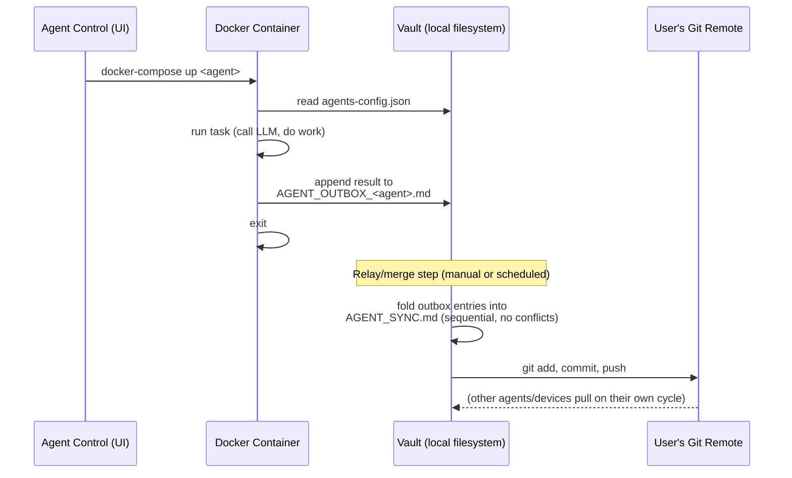
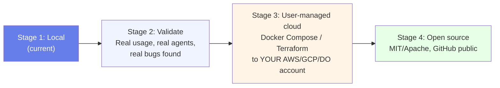
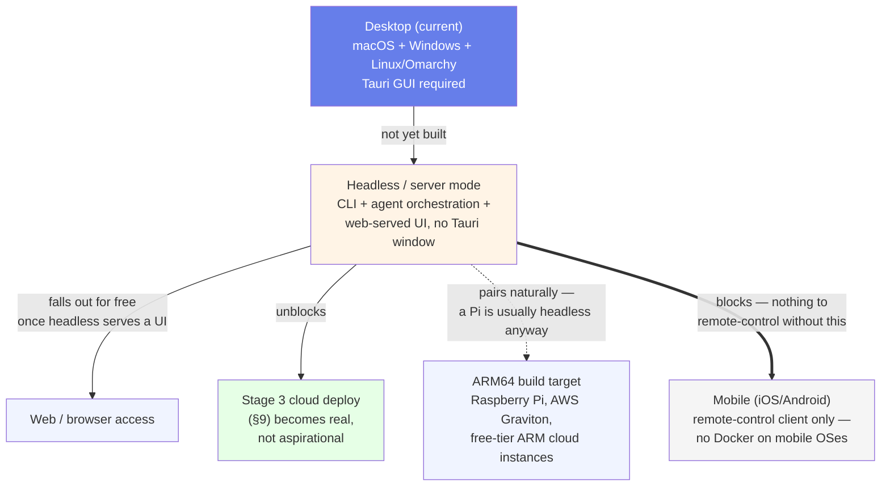

# Vahalla — Architecture

**Status:** Local development. This document is the design of record — update it whenever the system changes shape, not after the fact.

## 1. What Vahalla is

Vahalla is a **desktop-first, multi-provider AI orchestration platform**. One app, three jobs:

1. **Talk to any model** — 17 providers behind one router, one chat UI
2. **Run agents** — Docker-based agent runtimes (Claude, Hermes, Grok, custom) that do work autonomously
3. **Coordinate them** — a git-synced markdown vault is the shared memory/log, not a database

It is built to be **self-hosted and user-owned**: you run it on your Mac today, and later deploy the same stack to your own cloud account. Nobody else's server ever holds your keys or your coordination log by default.

## 2. System map


## 3. Design principles

| Principle | What it means here |
|---|---|
| **Local-first** | Everything runs on your machine before it runs anywhere else. Cloud deploy is an option you choose later, not a requirement. |
| **User-owned data** | The vault is plain markdown + JSON in a folder you control. No proprietary format, no vendor database. |
| **Provider-agnostic** | The router is the only place that knows about provider APIs. UI and agents never hardcode a provider. |
| **Coordination ≠ storage** | The vault is for logs, config, and hand-offs between agents — not a database. If you need fast queries, that's a separate concern (see §7). |
| **Transparent security** | Credentials live in `.env`/local storage, never in the git-tracked vault. Every write to the vault is a plain-text, human-readable diff. |
| **Cross-platform (macOS + Windows + Linux)** | Every design and dependency choice is checked against all three target OS families from the start — not retrofitted after a macOS-only implementation ships. See §3.1. |

### 3.1 Cross-platform constraint

Vahalla targets **macOS, Windows, and Linux** (including Arch-based distros such as **Omarchy**) as first-class platforms. This is a standing constraint on every change, not a future nice-to-have — it shapes decisions now, while the architecture is still easy to adjust.

**Why Tauri fits this well:** it cross-compiles the same Svelte frontend + Rust backend into a native app on each OS — `.dmg`/`.app` on macOS, `.msi`/`.exe` on Windows, and on Linux both distro-specific packages (`.deb`, `.rpm`) *and* a distro-agnostic **AppImage**, which is what actually matters for Omarchy: it's Arch-based (pacman, not apt/dnf), so the `.deb`/`.rpm` bundles are useless there but the AppImage runs on any Linux with no packaging step. `tauri.conf.json`'s `bundle.targets: "all"` already builds every target valid for the host OS — no per-OS fork of the bundle config needed. `tauri init` generated `icon.icns` (macOS), `icon.ico` (Windows), and PNG icons (Linux) up front.

**Linux/Omarchy build prerequisites** (not yet installed or verified on an actual Omarchy machine): Tauri's Linux build needs system libraries that aren't part of a minimal Arch/Omarchy install. On Arch-based systems:

```bash
sudo pacman -S --needed webkit2gtk-4.1 base-devel curl wget file openssl \
  appmenu-gtk-module gtk3 libappindicator-gtk3 librsvg
```

**Where cross-platform assumptions actually bite** (checklist for new code):

| Area | Unix-only / single-OS trap | What to do instead |
|---|---|---|
| Docker volumes | `~/.hermes:/root/.hermes` — `~` isn't reliably expanded by Docker Compose, and not at all on Windows | Use `${HOST_HERMES_DIR}` from `.env` (see `env.example`), an absolute path set per-machine. On Linux/Omarchy this is a normal `/home/<user>/.hermes` path — same fix already covers it |
| Shell scripts run on the **host** | A `.sh` script invoked directly by the desktop app | Won't run on Windows without WSL/Git Bash. Agent scripts that run *inside* a Docker container are fine on all three OSes — the container is always Linux regardless of host — but anything Tauri shells out to directly on the host must be cross-platform (Node/Rust) or ship OS-specific equivalents |
| Path separators | Hardcoded `/` in any path string | Use `path.join()` (Node side) or Rust's `PathBuf` (Tauri side), never string concatenation |
| Home directory | `~` or `$HOME` assumed | `$HOME` doesn't exist on Windows by default (`%USERPROFILE%` does; Linux has `$HOME` same as macOS) — resolve via Tauri's path APIs, not shell env vars |
| Linux packaging | Assuming a `.deb`/`.rpm` reaches every Linux user | Arch-based distros (Omarchy included) use pacman/AUR, not apt/dnf — the AppImage target is the one guaranteed to run without a distro-specific package |
| Line endings | Assuming `\n` in generated files | Vault markdown files are read by git, which normalizes this — but any file written on one OS and read on another should be tested |

**Not yet verified — flagged, not assumed:**
- Windows: the agent Docker containers (`agents/claude`, `agents/hermes`, `agents/grok`) haven't been run end-to-end. Docker Desktop on Windows runs Linux containers via WSL2, so they *should* behave identically — that's a claim to test, not trust.
- Linux/Omarchy: nothing in this stack (Tauri build, Docker agent runtime, or the app itself) has been run on an actual Omarchy machine yet. The user already runs Hermes itself on an Omarchy VM in a separate context, which is a good sign for the Hermes agent container specifically, but that hasn't been confirmed to extend to Vahalla's own build.

Both tracked in [CONTRIBUTING.md](./CONTRIBUTING.md#known-open-issues) until actually done.

## 4. Component responsibilities

### 4.1 LLM Router (`src/lib/llm-router.ts`)
Single abstraction (`callLLM(config, messages)`) that fans out to 17 provider-specific functions. Adding a provider means adding one function and one switch case — nothing else in the app should need to change.

### 4.2 Settings (`src/routes/Settings.svelte`)
User picks a **default provider + model**, saved to `localStorage`. Nothing is hardcoded as "the" default — every user configures their own, mirroring how Hermes's own provider/account settings work.

### 4.3 Model Picker (`src/routes/ModelPicker.svelte`)
Loads the saved default on mount, lets the user override per-conversation, sends through the router, renders responses with token usage.

### 4.4 Agent Control (`src/routes/AgentControl.svelte`)
Start/stop Docker-based agent containers, see last-run status. Each agent is a small, disposable process — not a long-lived service the UI depends on.

### 4.5 Vault Browser (`src/routes/VaultBrowser.svelte`)
Read-only-for-now view into the coordination vault: sync status, last pull, recent entries.

### 4.6 Agent Runtime (`agents/*`)
Each agent is a Docker container that:
1. Reads its config from `vault/agents-config.json`
2. Does its work (call an LLM, run a task)
3. Appends a result to its own outbox file in the vault
4. Exits (agents are one-shot by default, not daemons)

## 5. Data flow: sending a chat message


## 6. Data flow: agent run → vault coordination



**Why outbox-per-agent instead of concurrent writes to one file:** git merge conflicts on a single shared log are the failure mode we design out from day one. Each agent only ever appends to its *own* file; a single relay step folds everything into the shared log sequentially. This is the same pattern already proven with Hermes's `AGENT_SYNC.md` bridge (`HERMES_OUTBOX.md` → relay → shared log).

## 7. What the vault is — and isn't

**Is:**
- Coordination log between agents (who did what, when, why)
- Agent configuration (`agents-config.json`)
- Human-readable audit trail (every entry is a git commit)

**Isn't:**
- A database. Hundreds of entries: fine. Tens of thousands: shard by date/agent, or add a real datastore alongside it.
- A secrets store. API keys never get written into vault files — they live in `.env` / `localStorage` / a proper secrets manager.
- A queue. If two agents need to hand off a task in real time, that's a job queue's problem, not the vault's.

## 8. Provider catalog

17 providers today, alphabetical, router-abstracted so the list can grow without touching the UI logic:

Anthropic (API key) · Anthropic (OAuth) · ChatGPT/Codex · Claude Subscription DirectSDK · Fireworks AI · Google Gemini · Groq · Hugging Face Inference API · MiniMax · Nous Portal · **Ollama** (sole local runtime — broadest local model catalog) · OpenClaw · OpenRouter (aggregator) · Perplexity · Qwen Code · Replicate (non-LLM models: image/audio/video) · Together AI · xAI Grok

See [POSITIONING.md](./POSITIONING.md) for why this list is deliberately this shape.

## 9. Deployment path (future)



Each stage is a deliberate gate, not a deadline. We do not skip Stage 2 — see [Development Notes](./CONTRIBUTING.md#why-local-first).

## 9.1 Platform roadmap (beyond macOS/Windows/Linux desktop)

macOS, Windows, and Linux/Omarchy (§3.1) are all **desktop** targets — Vahalla currently requires a GUI to run at all, since it's Tauri desktop-only. The platforms below aren't a flat list of "OSes to also support" — they have a real dependency order, and building them out of order means building something with nothing to connect to.



| Platform | What it actually is | Priority | Why |
|---|---|---|---|
| **Headless/server mode** | A second build target of the *same app* — CLI + agent orchestration + web-served UI, no Tauri window | **High** | Already implicitly required by Stage 3 (§9) — "deploy to your own cloud VPS" isn't possible today, since a headless box has no display for a Tauri window to open on. This is the one genuine gap, not a nice-to-have. |
| **ARM64 build target** | Not a new OS — verifying the existing Docker/Rust stack builds and runs on ARM Linux (Raspberry Pi, Graviton, free-tier ARM cloud) | Medium | Apple Silicon is already covered (that's what runs the Mac build). ARM *Linux* is untested. Pairs naturally with headless mode — a 24/7 self-hosted box is usually a Pi, and a Pi is usually headless. |
| **Web/browser access** | Not a separate build — falls out for free once headless mode serves a UI over HTTP | Low, but automatic | Don't build a separate web client. Any browser hitting the headless server's UI already works once that exists. |
| **Mobile (iOS/Android)** | A remote-control client for an already-running headless instance — Docker doesn't run on iOS/Android, so mobile can't run agent containers itself | Low, **blocked on headless mode** | Building this before headless mode exists means building a client with nothing real to connect to. Sequencing matters here more than for any other item. |
| **BSD, ChromeOS** | Real self-hosting audiences, high effort relative to reach | Not planned | Revisit only if something concrete forces the question — not worth doc space as a standing commitment. |

## 10. Related documents

- [POSITIONING.md](./POSITIONING.md) — how Vahalla differs from Hermes, LangChain, Open WebUI, AnythingLLM, and the rest of the field
- [CONTRIBUTING.md](./CONTRIBUTING.md) — how to work on this project (even solo, even before it's public)
- [README.md](./README.md) — quick start
