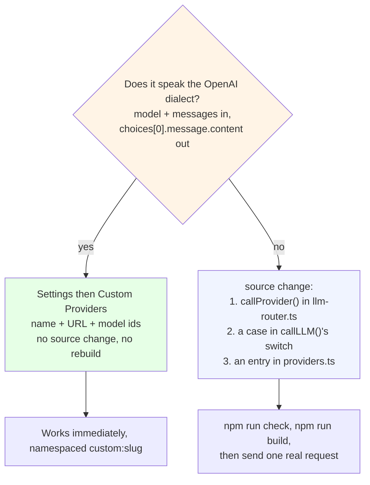
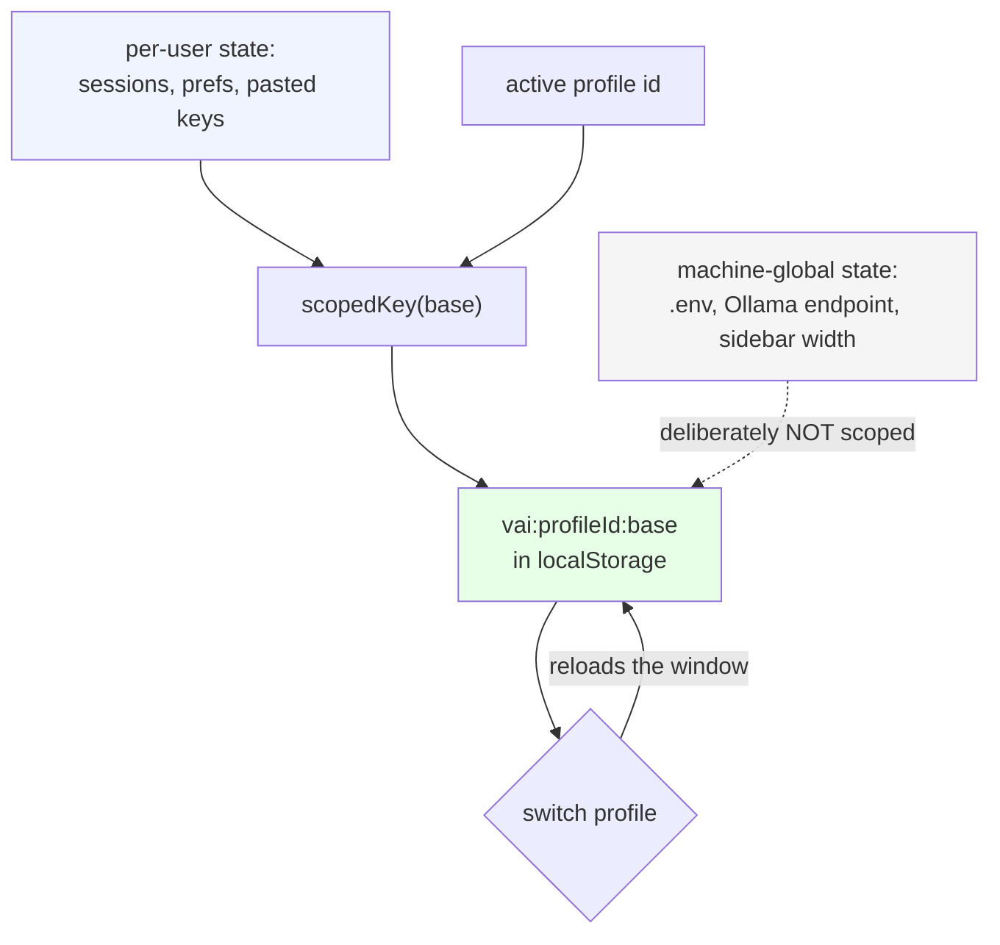
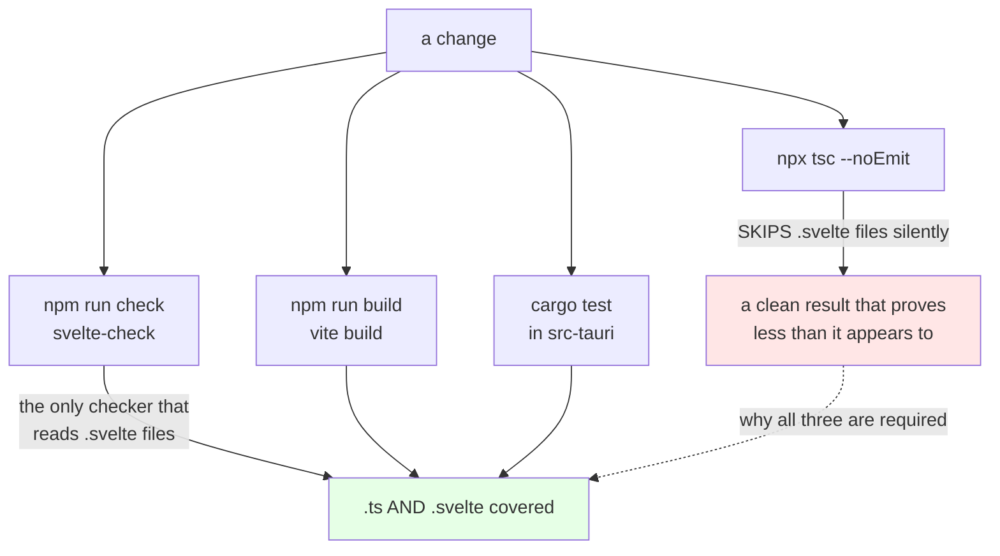

# Contributing to ValhallaAI

Right now this is a solo, local-only project (see [Why local-first](#why-local-first)). This document is the guideline set for right now — a future public version will add PR process, code of conduct, etc. once the project actually has outside contributors.

**Current as of 2026-09-22.** The changelog under [Known open issues](#known-open-issues) is history; that section's opening paragraph is the state to trust.

## Why local-first

Build it for one real user (you) before building it for hypothetical ones.

- **You'll find real bugs, not imagined ones.** A 2026-09-21 verification pass (two independent agents, both cross-checking docs against actual code) found the app did not compile at all — a missing `</script>` tag and a missing Vite entry point, neither of which surfaced until someone actually tried to build it. Daily use surfaces exactly this kind of gap between what is documented and what is built.
- **You avoid premature API stability promises.** Nobody is depending on this yet, so the router, the vault schema, and the agent config format can all change shape without a deprecation cycle.
- **Docs written against real usage are more honest.** [ARCHITECTURE.md](./ARCHITECTURE.md) and [POSITIONING.md](./POSITIONING.md) describe what the system actually does, not what it aspires to do — that same pass found both docs had drifted into describing unbuilt features as shipped.

**Gate to open source** (see [ARCHITECTURE.md §11](./ARCHITECTURE.md#11-deployment-path-future)). None of these are met yet — this is a checklist of what is required, not a record of what is done:

- [ ] 3+ agents coordinating via the vault in real, non-demo usage
- [ ] Agent runtime deployed to a cloud VPS and stable for a month
- [ ] UX pain points found and fixed through actual daily friction, not guesswork
- [ ] A deploy procedure that has been run more than once

*(A previous version of this list used ✅ next to each item, which read as "met" despite the surrounding text saying the opposite — the doc contradicted itself. Fixed to unchecked boxes.)*

Until then: no public repo, no "please star this", no premature audience.

**Unblocking item 1 in practice:** the piece that would make coordination real here is the relay actually folding and pushing on a schedule. It is written, its fold-and-commit path is verified on a throwaway repo, and it has never been run against this repo's remote ([ARCHITECTURE.md §9.3](./ARCHITECTURE.md#93-the-honest-state-of-the-relay)). Until that runs, item 1 cannot be honestly ticked, no matter how many runs happen.

## Project structure

```
ValhallaAI/
├─ ARCHITECTURE.md         — system design, diagrams (read this first)
├─ POSITIONING.md          — how this differs from everything else
├─ CONTRIBUTING.md         — this file
├─ README.md               — quick start
├─ env.example             — .env template. Copy to .env. Never commit .env
├─ index.html              — Vite entry point
├─ vite.config.js          — Vite + Svelte plugin config
├─ svelte.config.js        — Svelte preprocessor config
├─ src/
│  ├─ main.js              — mounts App.svelte into index.html's #app
│  ├─ App.svelte           — shell: profile card, nav, Onboarding gate
│  ├─ routes/              — Models & Chat, Recent, Projects, Sessions,
│  │                         VaultBrowser, AgentControl, Profile, Settings,
│  │                         Onboarding
│  └─ lib/
│     ├─ llm-router.ts     — the ONLY place that talks to provider APIs
│     ├─ providers.ts      — the ONLY provider catalog
│     ├─ provider-keys.ts  — loads the allowlisted .env keys through Tauri
│     ├─ sessions.ts       — chat sessions in localStorage; project is a label, not a container
│     ├─ profiles.ts       — profiles, per-profile storage, Google + GitHub sign-in
│     ├─ custom-providers.ts — user-defined providers, registered at startup
│     └─ custom-agents.ts  — user-defined agents, bound to an allowlisted runtime
├─ src-tauri/src/main.rs   — run_agent, agent_status, provider_keys, vault_status,
│                            vault_file, google_sign_in, github_sign_in,
│                            github_client_configured, project_root
├─ src-tauri/src/envfile.rs — the allowlisted .env key reader
├─ agents/                 — claude + grok images, _shared/task.cjs. Hermes runs on the host
├─ scripts/run_agent.sh    — one-shot runner shared by the UI and the terminal
├─ scripts/vault_relay.sh  — folds outboxes into AGENT_SYNC.md, commits, can push
├─ scripts/vault_relay.Dockerfile
├─ vault/                  — agent-tasks.json, agents-config.json, AGENT_SYNC.md,
│                            AGENT_OUTBOX_*.md (gitignored)
└─ docker-compose.local.yml
```

## Conventions

### Adding a new LLM provider



**Reading it.** The diamond is the only decision that matters, and it is about the *API's shape*, not about how much work it is: if the dialect matches, adding a provider is a Settings action, not a code change. The green path is deliberately not a shortcut around the blue one — a provider with a genuinely different shape (Anthropic Messages, Gemini, MiniMax, DashScope) still needs a real implementation, because pretending it is OpenAI-compatible produces a silent empty response, not a clean error.

Source-change steps:

1. Add one `call<Provider>()` function to `src/lib/llm-router.ts`, and add its case to the `switch` in `callLLM()`.
2. Add the provider name + model list to `src/lib/providers.ts` — this is the **single** source of truth; `Settings.svelte` and `ModelPicker.svelte` both import from it, so there is nothing else to update in either file.
3. Providers list alphabetically; models within a provider are ordered newest/most-capable → oldest/cheapest. `ModelPicker` selects `models[0]` when the provider changes, so first place is the default — and the newest model is not always the one that answers (Gemini's list advertises ids that 404).
4. Provider *counts* in docs (README, ARCHITECTURE §7, POSITIONING) are written as "N providers" where N is `Object.keys(PROVIDERS).length` — check it against `providers.ts` directly rather than incrementing a remembered number by hand. A hand-maintained count is exactly how the catalog drifted to 19 router cases / 18 catalog entries / "17" in prose before the `providers.ts` extraction.

### Agent runtimes

- Each agent run is **one-shot**, not a daemon — `restart: "no"` in `docker-compose.local.yml`, not `unless-stopped`. This was gotten wrong once already: `unless-stopped` on a container that calls a paid API and exits 0 is an unbounded billing loop.
- **All three runtimes prefer a subscription login and fall back to a paid container.** Claude and Hermes run on the host CLI; Grok runs the host Grok Build CLI when `grok models` reports a login, with its container as fallback. Each strips the paid key from the child environment (`ANTHROPIC_API_KEY`, `XAI_API_KEY`) so "subscription" cannot silently mean "paid key", and the outbox records which path ran.
- The Hermes image still has no `hermes` binary and that is intentional: `scripts/run_agent.sh hermes-agent` calls the host CLI, because the installed Hermes is a macOS virtualenv and a second install sharing the same home would race the proxy already running.
- Claude and Grok read `vault/agents-config.json`. All three runners append `vault/AGENT_OUTBOX_<name>.md` (gitignored). **They do not write `AGENT_SYNC.md` directly.** The relay does that ([ARCHITECTURE.md §9.2](./ARCHITECTURE.md#92-the-full-agent-and-vault-picture)).
- **The runtime name is an allowlist, and it stays one.** `run_agent` re-checks the runtime against `claude-agent` / `hermes-agent` / `grok-build` in Rust and passes only the allowlisted value to the shell. A custom agent is a display name *bound* to one of those three. Do not accept a free-form runtime string from the frontend to save a case statement — that single change converts a convenience boundary into an arbitrary-command boundary.
- Before wiring up a new agent's Dockerfile, actually run `docker-compose build <service>` — `agents/grok/agent.js` did not exist for a full day while its Dockerfile's `COPY agent.js ./` referenced it, because nobody had tried building it.

### Agent run configuration (`scripts/run_agent.sh`)

The Grok path was tuned against measurements, not intuition. **If you touch these flags, do not re-tune blind — the ladder is recorded in a comment above `run_grok`, and the full table is [ARCHITECTURE.md §8](./ARCHITECTURE.md#8-agent-run-performance).**

| Lever | Value in use | Why |
|---|---|---|
| Model | `grok-4.7-build-fast` | The full variant spent minutes reasoning about a prompt that needs a read-and-summarise |
| Reasoning effort | `low` | Valid values are `xhigh`, `high`, `medium`, `low` — **`minimal` is rejected** |
| Turns | `--max-turns 3` | A *ceiling*, not a target. `--max-turns 1` exits 1 with `Max turns reached` and records **no answer at all** |
| Plan / subagents / web search | all disabled | None of them can help a task whose context is already supplied |
| Overrides | `GROK_AGENT_MODEL`, `GROK_AGENT_EFFORT` | So a re-tune is an env var, not an edit |
| Timeout | `AGENT_TIMEOUT_SECS=900` | macOS has no `timeout(1)`; the script implements SIGTERM→SIGKILL itself. A killed run exits 143/137 and the outbox says `Timed out after Ns (SIGTERM)` |

Two hard-won negatives that belong in this file so nobody spends the time again: **`--disallowed-tools` does not stop a model reaching for a tool** (with all 28 built-in schemas denied, it still tried `run_terminal_command` and spent 28 s doing it), and **effort is the lever with the biggest single effect** (197 s → 58 s on its own).

### Agent instructions: say that the context is already supplied

Every instruction in `vault/agent-tasks.json` must state that the needed files are already included in the prompt and that the agent should **not** call tools. This is not style guidance — it is a measured cost. The old instruction said "Read the coordination log", and `agents/_shared/task.cjs` had *already pasted that log into the prompt*: the model's first turn went to fetching a file it was holding, and the run took 197 seconds instead of 41.

The rule, with its numbers, is also recorded in the file's own `_note` so an edit that removes it is an edit that contradicts the file it sits in. **Honest limit:** this fixed `grok-build` only. `claude-agent` measured 9 s before and 9 s after; `hermes-agent` was already capped at one turn. Do not claim an "agents are faster" improvement from the Grok number.

### Never make `run_agent` synchronous again

`run_agent` is an `async fn` in `main.rs` for a reason that has nothing to do with concurrency taste: **a synchronous Tauri command runs on the main thread and blocks the webview's event loop for its whole duration.** With a 3.5-minute agent run, that meant a window that could not paint and could only be force-quit. Async commands are dispatched off the main thread. If a future refactor makes this call synchronous — for a "simpler" error path, say — the freeze comes back, and it comes back as a hang with no error message, which is the worst possible failure shape.

### The GUI PATH trap: resolve host tools by absolute path, never trust PATH

This bit the project **twice**, in two different languages, and the second time produced an error message that sent the user to install software they already had. Any new spawn of a host tool must assume the app's PATH is wrong.

**Why the PATH is wrong.** Tauri is launched by the GUI. `launchctl getenv PATH` is empty on this machine, so a GUI-launched process inherits only `/usr/bin:/bin:/usr/sbin:/sbin`. A login shell's PATH is *not* inherited, and everything a developer installs lives outside those four directories — Claude Code's native installer in `~/.local/bin`, the Grok CLI in `~/.grok/bin`, cargo in `~/.cargo/bin`.

| Where | Symptom when it was wrong | Fix |
|---|---|---|
| `scripts/run_agent.sh` (agent runs) | A subscription that existed read as *absent* — `command -v grok` failed — and the runner fell through to a paid Docker path that then failed with `docker: command not found`. Two wrong conclusions from one bad PATH | Runs `path_helper`, then prepends `~/.grok/bin`, `~/.local/bin`, `~/.hermes/bin`, `~/.orbstack/bin` |
| `claude_subscription()` in `main.rs` (chat) | *"Claude CLI is not installed"* for a CLI that was installed and working in Terminal — and it advised `npm install -g`, which would have created a **second** copy that Claude Code's own updater does not manage | `resolve_claude()` searches known absolute locations, and `subscription_env()` prepends them to the child's PATH |
| `scripts/valhallaai` (launcher) | The launcher itself needs cargo, which lives in `~/.cargo/bin` | Prepends `$HOME/.cargo/bin` before calling npm |

**The rule:** a bare command name is a PATH lookup and therefore a guess. Resolve to an absolute path from a list of known locations, and prepend that list to the child's environment so the subprocesses *it* spawns also work. Test it by running with `PATH=/usr/bin:/bin:/usr/sbin:/sbin` — that is the app's real environment, and a fix that only works in your interactive shell is not a fix.

**And when the lookup does fail, say what was tried.** The old message named a cause it had not checked ("not installed") and prescribed a fix for a different machine's install method. The current one lists the exact paths searched, states that a GUI PATH is the reason, and offers both the install route and the override variable. That distinction matters more than the fix: a wrong-but-confident error message costs the user the same hour whether or not the code underneath is correct.

### Recording agent output

- One outbox entry is one **line** of flattened text (capped at 2000 chars), headed `## [timestamp] <agent>`, then `Status:` (`OK (subscription)`, `OK (paid-key)`, or `ERROR`).
- **Keep stdout and stderr separate.** On success, only stdout is recorded. The CLIs emit their own hook diagnostics on stderr, and capturing those as the answer produced a real bug: a node `MODULE_NOT_FOUND` stack trace appeared in the outbox as if the agent had said it. On failure, stderr *is* kept — a failure recorded with no reason is worse than noise.
- `redact()` in `run_agent.sh` strips known noise (`python-dotenv` warnings, bash's `Terminated: 15` job-control line) and masks key-shaped strings. **If a new hook starts emitting noise, add its pattern there** — do not filter it by hand in the outbox afterwards, because the next run will put it straight back.
- Agent output is a **lead, not a fact**: a run once asserted that `grok-4.7` on provider `nous` was a mismatch, which is false (Nous Portal is an aggregator and serves `x-ai/grok-4.7`). Verify before repeating an outbox claim in a document.

### Vault

- Never commit secrets, API keys, or credentials to `vault/` — it is the one folder expected to eventually sync to a git remote.
- The vault is coordination + config, not a database. If you are tempted to query it, that is a sign you need a different datastore ([ARCHITECTURE.md §9.1](./ARCHITECTURE.md#9-the-vault-what-it-is-and-how-coordination-actually-runs)).
- `vault/agents-config.json` is deliberately **left uncommitted** in the working tree. When you read it to describe the system, say that its state is not what source control holds.
- Context paths in `agent-tasks.json` are resolved and refused if they leave `vault/` (via `realpath`, so `..` **and** escaping symlinks are both blocked). This matters most for the host runner, where `../.env` would be a real secret.

### Frontend credentials
`src/lib/llm-router.ts` reads API keys **only** from `config.apiKey` — never from `process.env`. The desktop app fills `config.apiKey` from the project `.env` for Anthropic, OpenAI, OpenRouter, Google, and xAI, and from Settings for everyone else. This code runs in the browser (inside the Tauri webview via Vite), where `process` does not exist unless polyfilled. Do not reintroduce `process.env`.

### Profiles and per-profile storage



**Reading it.** The green box is the whole mechanism: one prefix, applied at module-evaluation time. The dotted arrow is the deliberate exception — `.env` stays machine-global because `scripts/run_agent.sh` and `docker-compose.local.yml` read the same file from a terminal that has no notion of an active profile. The reload on switch is not laziness; re-reading in place means every module needs a profile-changed subscriber, and one that misses it leaks one profile's chat history into another.

A profile is a **namespace over `localStorage`**, not an account. There is no server, so there is nothing to log in to and nothing syncs anywhere.

The UI for this — identity, sign-in, rename/create/delete, the `ignoreEnvKeys` toggle — is `src/routes/Profile.svelte`, reached from the sidebar's profile card and deliberately separate from `Settings.svelte` (provider defaults, API keys, Ollama). Split 2026-09-22: they were one page sharing nothing but a section heading. See [ARCHITECTURE.md §5.3](./ARCHITECTURE.md#53-profile-srcroutesprofilesvelte).

`src/lib/profiles.ts` is the single source of truth. Anything per-user goes through `scopedKey(base)`, which prefixes with `vai:<profileId>:`.

| Scoped per profile | Global per machine |
|---|---|
| chat sessions, active session | sidebar open/closed |
| default provider + model prefs | Ollama endpoint |
| API keys pasted into Settings | `.env` |
| custom providers and custom agents | the project checkout itself |

**`.env` stays global on purpose.** `scripts/run_agent.sh` and `docker-compose.local.yml` read the same file, and agents run from a terminal with no app open and no notion of an active profile — a per-profile `.env` would break them. A profile wanting full isolation sets `ignoreEnvKeys`, which makes `envKeyFor()` return empty so it falls through to its own pasted keys.

Two ordering rules that are easy to break:

1. `initProfiles()` runs at **module-evaluation time**, not in `onMount`. `sessions.ts` calls `scopedKey()` at import time, so a deferred init would build `vai::valhallaai-sessions` and silently show an empty history. Same reasoning as `loadSessions()` — see the comment there.
2. `switchProfile()` **reloads the window**. Re-reading stores in place would mean every module growing a "profile changed" subscriber, and any module that missed one would serve the previous profile's data — that class of bug leaks one profile's chat history into another. A reload cannot.

Adding a new piece of per-user state means routing it through `scopedKey()` **and** adding it to `LEGACY_SCOPED_KEYS` if installs already have it flat, or existing users silently lose it.

### Sign in with Google or GitHub

**Both working end to end as of 2026-09-22** — a real round trip against the `valhallaai` Google project, and a real round trip against a GitHub OAuth App (the GitHub one confirmed by an actual click-through of a live consent screen, not merely by compiling).

Identity only, for either provider. A sign-in attaches a name, email, and avatar to a local profile and **nothing else** — there is no backend, so there is nothing to authorize against and nothing syncs. The only network traffic is the handshake.

**The shared shape.** `google_sign_in` and `github_sign_in` are the same flow under the hood, and both live in `main.rs`:

- **OAuth 2.0 + PKCE with a loopback redirect** (RFC 8252 §7.3): bind `127.0.0.1:0`, open the system browser, accept **exactly one** callback, close the socket. Nothing is left listening after a sign-in. The `code_challenge` uses `S256`.
- **The `state` check is not optional.** Without it the loopback callback is forgeable by anything that can reach localhost.
- **No token is stored.** Identity is read and the token is discarded — no access token, no refresh token, for either provider. Holding one would be holding a credential for no reason, since nothing here calls a provider API afterwards.
- **Why Rust and not the webview:** the flow needs a real listening socket, which the webview cannot open. The allowlist stays `{"all": false}` — no `http` or `shell` entries were added for this.
- Signing in overwrites the profile name only when it is still an app-assigned default (`Local`, `New profile`). A profile the user deliberately renamed keeps its name. Signing out clears the identity fields only — sessions, keys, and prefs belong to the machine, not the account.

**One field, two meanings.** `Profile.emailVerified` is surfaced, not enforced (§[First-launch onboarding](#first-launch-onboarding-and-email-verification)), and each provider fills it from a different place: Google from the `email_verified` claim inside the `id_token`, GitHub from the `verified` flag on the primary entry returned by `GET /user/emails`.

#### Google specifics
- **Two variables, and the prefix difference is load-bearing.** `VITE_GOOGLE_CLIENT_ID` is read by the frontend, so it needs the `VITE_` prefix and is inlined into the bundle — public by design, since it ships inside the binary anyway. `GOOGLE_CLIENT_SECRET` has **no** prefix on purpose: it is read by the Rust process via `envfile::value()`, and a `VITE_` prefix would inline it into the JS bundle for no reason.
- **The secret is required**, contrary to what a plain reading of RFC 8252 suggests. Google's "Desktop app" client type still demands `client_secret` at the token endpoint even with PKCE, and answers `400 invalid_request: client_secret is missing` without it. Google treats it as a low-value secret (it ships in every installed copy); PKCE is the actual protection.
- **The `id_token` signature is not verified locally**, deliberately: it arrives straight from Google's token endpoint over TLS, which is the case Google's docs exempt. If that token ever starts arriving from anywhere else — a redirect fragment, a cache, another process — that reasoning stops holding and the signature must be checked.
- **Testing mode gotcha:** while the consent screen is in Testing, only accounts listed under **Audience → Test users** can sign in. Everyone else gets `access_denied`, which the command translates into a message naming that exact cause, because it is the failure people lose an hour to.

#### GitHub specifics

GitHub is **not OpenID Connect**, which is the source of every real difference below. Each was confirmed against GitHub's own docs before the code was written, not discovered by trial and error afterwards:

- **No `id_token`, so identity costs two more calls.** The token endpoint returns only an `access_token`. Identity then comes from `GET /user` (name + avatar) and `GET /user/emails` (address + verified flag), after which the token is discarded. Nothing is stored.
- **The registered callback is the bare path `http://127.0.0.1/callback` — no port.** GitHub matches the registered *path* and accepts whatever port the app happens to bind at request time, so a single registration covers every run. A `redirect_uri_mismatch` almost always means the registered value has a port in it or a different path; the command's error text says so.
- **`client_secret` is required at the token endpoint despite PKCE** — the same situation as Google's Desktop client type. Bare PKCE is not accepted by either provider.
- **`Accept: application/json` is required on the token exchange.** Without it GitHub answers in `access_token=...&scope=...` form-encoded style, which is not what the code parses.
- **Every `api.github.com` request needs a `User-Agent`.** Missing → the request is rejected outright; invalid → a `403` with no clear explanation. That is why it is a named constant (`GITHUB_USER_AGENT`) rather than a string sprinkled on the one call that happened to be tested first.
- **Scope is `read:user user:email`, nothing else** — no `repo`, no write, no admin. An empty email comes back as an error naming the scope, rather than a profile with a blank identity.
- **`name` is nullable; `login` is not.** The display name falls back to the username, so a GitHub account with no display name set still produces a named profile instead of an empty one.
- **Both variables are Rust-only.** `GITHUB_CLIENT_ID` and `GITHUB_CLIENT_SECRET` are read by `github_sign_in` via `envfile::value()`, so neither gets a `VITE_` prefix and neither is inlined into the JS bundle (contrast `VITE_GOOGLE_CLIENT_ID`, which is public by design). **Consequence: changing them needs an app restart — a Vite hot reload will not pick up `.env`.**
- **`github_client_configured()` reports presence only, never the value.** Because the frontend cannot see the client id at all, the button needs a round trip to know whether to disable itself with the hint `Set GITHUB_CLIENT_ID and GITHUB_CLIENT_SECRET in .env`.
- **GitHub Enterprise is not supported.** `api.github.com` is hardcoded; a GHE host would need its own base URL plumbed through both REST calls and the two OAuth endpoints. Tracked in [Known open issues](#known-open-issues).

| Dimension | Google | GitHub |
|---|---|---|
| Protocol | OpenID Connect — an `id_token` carries the identity claims | plain OAuth 2.0 — an `access_token` only, so identity needs two follow-up REST calls |
| Client id visibility | frontend, via `VITE_GOOGLE_CLIENT_ID` (public by design, inlined into the bundle) | Rust only, never in the bundle (hence the extra presence-check command) |
| Client secret | required at the token endpoint despite PKCE | required too — same situation |
| Email + verification | `email_verified` claim in the `id_token` | `verified` flag on the primary entry from `GET /user/emails` |
| Registration gotcha | consent screen in Testing → `access_denied` for anyone not on the test-user list | the registered callback must be the bare path `http://127.0.0.1/callback`, no port |
| Silent-failure trap | the `id_token`'s signature is not checked locally (accepted: it arrives over TLS from Google's token endpoint) | a missing or invalid `User-Agent` on `api.github.com` → rejected, or a `403` with no explanation |
| Token response format | JSON | form-encoded **unless** `Accept: application/json` is sent |

### First-launch onboarding and email verification

Added 2026-09-22, alongside splitting Profile out of Settings (see [ARCHITECTURE.md §5.4](./ARCHITECTURE.md#54-onboarding-srcroutesonboardingsvelte) and [§5.3](./ARCHITECTURE.md#53-profile-srcroutesprofilesvelte)).

- **`Onboarding.svelte` is a gate, but you can walk through it without an account.** It was skippable, then made mandatory *by Jacob explicitly* on 2026-09-22 (`isSignedIn()`: a profile had to carry a verified email), then flipped back to optional later the same day. **The provenance is worth keeping, because it nearly went wrong:** that flip began as an agent proposal — no user turn asked for it — and the agent who noticed marked the docs UNRATIFIED and named `cbe5449` as the revert rather than presenting it as Jacob's decision. **He was then asked directly and chose the local path**, in the same decision pass that chose MIT for the licence. It is a ratified decision now; the detour stays documented so the next reader can see which claims were checked and which were assumed. The argument for it is distribution: sign-in credentials come from the *user's* own `.env`, so a mandatory gate means every developer who clones this repo must register a Google Cloud OAuth client AND a GitHub OAuth app before the app will open at all.
  - **The split between gate and identity is two predicates, not one.** `hasPassedGate()` is what the gate asks (`isSignedIn(profile) || authProvider === "local"`). `isSignedIn()` stays the identity test that the sidebar chip and Profile page ask. A local profile is *not* signed in — the chip still says "Sign in", and the Profile page says "Not signed in" with a note that nothing is withheld.
  - **"Continue without an account"** is always enabled, including in a plain browser tab where `inTauri()` is false and both OAuth buttons are disabled. It sets `authProvider: "local"` and `onboarded: true`, which opens the gate immediately and leaves `email` unset. Signing in later overwrites the provider and adds the identity.
  - **Both providers are offered side by side**, each with its own disabled-state hint. Google's readiness is knowable synchronously from `VITE_GOOGLE_CLIENT_ID`; GitHub's needs the `github_client_configured` round trip. Do not merge them.
  - **`Profile.emailVerified`** is captured once at sign-in and never re-checked. It is **surfaced, not enforced** — shown as a Verified/Unverified badge on the Profile page.
  - **`signInProfileWithGoogle()` / `signInProfileWithGithub()` / `signOutProfile()` / `continueWithoutAccount()` live in `profiles.ts`**, not in either route component.
  - **Existing profiles are grandfathered in.** `initProfiles()` backfills `onboarded: true` for any profile with no `onboarded` field at all, on first load after this shipped. Verified: a profile carrying a real sign-in and no `onboarded` field does not see the overlay once the backfill runs.

### Finding the project from a bundled app

Every backend command needs the checkout: `.env`, `vault/`, `scripts/`, and `docker-compose.local.yml` all live there. `project_root()` resolves it.

It used to be `env!("CARGO_MANIFEST_DIR")` with a silent fallback to `current_dir()`. Both halves break in a release build: the manifest dir is baked in at **compile** time, so it names whichever machine built the app, and a double-clicked `.app` has `/` as its working directory. The fallback then "succeeded" with a path containing none of those files, so every feature quietly found an empty world instead of saying it could not find the project.

The chain now validates every candidate against `docker-compose.local.yml` and returns an error when none match:

1. `VALHALLAAI_PROJECT_DIR` — explicit override, wins over everything.
2. The pointer file at `~/Library/Application Support/com.jacobcowan.valhallaai/project_dir`, rewritten by `scripts/valhallaai` on every run. This is what lets a relocated `.app` work: macOS `open` does not forward environment variables, so an export cannot reach it, but a file can.
3. Walking up from the working directory — covers `npm run tauri-dev`, whose cwd is `src-tauri`, and anything started inside the checkout.
4. `CARGO_MANIFEST_DIR` — still right for a dev build on the machine that compiled it, kept as a last resort rather than the first choice.

A stale pointer (moved or deleted checkout) fails the marker test and falls through rather than being trusted. Launch once via `valhallaai` after moving the project and the pointer corrects itself.

**This does not make the build distributable.** The `.app` is ad-hoc signed, arm64-only, and still expects a checkout to exist somewhere on the machine. Shipping it to someone else needs a Developer ID, notarization, and a decision about what the app should do when there is no checkout at all.

### The vault relay

`scripts/vault_relay.sh` in the `vault-relay` container folds each `AGENT_OUTBOX_<agent>.md` into `AGENT_SYNC.md`, clears the outbox, and commits. It is `profiles: optional`, so a plain `docker compose up` never starts it.

```bash
valhallaai relay                                                   # start it
valhallaai relay stop                                              # stop it
docker compose -f docker-compose.local.yml --profile optional up -d vault-relay
docker compose -f docker-compose.local.yml stop vault-relay
```

**Verified 2026-09-22** against a throwaway fixture repo: two outboxes folded into `AGENT_SYNC.md`, both cleared, one commit, and three idle cycles afterwards produced no further commits.

Things that were wrong and are worth not reintroducing:

- The container ran `image: alpine:latest`, which is busybox with **no git binary**, so every git call failed instantly. It now builds from `scripts/vault_relay.Dockerfile`.
- It mounted only `./vault`, which has no `.git`, so even with git installed there was no work tree. It now mounts the repo root at `/repo` and scopes `git add` to `vault/` so it cannot sweep up app-code changes.
- Entries arrived with **two stacked headers**: agents already write `## [<run time>] <agent>`, and the relay added its own carrying the fold time. The relay now appends verbatim under a `---` separator. When the fold happened is the commit's job.
- **`set -eu` around unguarded git commands crash-looped the container** on its first cycle. Every git step is now individually guarded so a failure degrades instead of killing the loop.

**Push does not work over the current remote.** `origin` is HTTPS and the container has no credential helper, so `git push` cannot authenticate — the mounted `HOST_SSH_DIR` only helps an `ssh://` remote. Push is gated behind `VAULT_REPO` being set and every git step is individually guarded, so the relay folds and commits locally without crash-looping. Switch `origin` to SSH or add a token helper before expecting push to work.

### Model lists rot, and silently

Model ids in `providers.ts` are hand-written and go stale without any signal: a retired id only fails when someone actually sends to it, and a provider nobody has used lately can sit broken for months.

**Audited 2026-09-22 against live endpoints.** Eight dead ids across three providers — Google's entire list was gone, so that provider 404'd on every send.

| Provider | How to check | Result |
|---|---|---|
| `google` | `GET generativelanguage.googleapis.com/v1beta/models?key=` | 3/3 dead, replaced |
| `openrouter` | `GET openrouter.ai/api/v1/models` (public, no key) | 4/19 dead, replaced |
| `anthropic` | `GET api.anthropic.com/v1/models` + `x-api-key` | 1/5 dead, removed |
| `nous` | `GET 127.0.0.1:8645/v1/models` (Hermes proxy) | 19/19 live |
| `claude_directsdk` | `claude -p --model <id>` | 4/4 valid |

**Not verifiable on this machine**, and stated rather than assumed: `chatgpt` and `xai_grok` (keys blank in `.env`); `fireworks`, `groq`, `perplexity`, `minimax`, `qwen` (no key at all, and none expose a public list); `ollama` (**not installed here** — the catalog offers 7 local models against a runtime that is absent).

**Dated decay, handled:** Perplexity's `sonar` / `sonar-pro` / `sonar-reasoning-pro` ids rode the Sonar **Chat Completions** endpoint, which Perplexity's own docs say stops working **2026-09-27**. On 2026-09-22 that provider was rewritten onto the **Agent API** — `POST https://api.perplexity.ai/v1/agent`, a `preset` instead of a model id, `input` instead of `messages`, and a typed `output` array instead of `choices`. **It has never been run: this machine has no Perplexity key**, so "rewritten" here means "matches the published contract", not "works". Verify it on the first run with a key — a 400 naming `input` or `preset` means a documented field moved. Two known consequences: the model dropdown shows the raw preset (`low`), because `ProviderEntry.models` is a plain string array with no label field; and the provider was **removed from `IMAGE_CAPABLE_PROVIDERS`**, since the rewrite sends the conversation as text and an attachment would be dropped without a word.

Distinguish a dead id from a quota error. `claude-fable-5-1` returns "You're out of usage credits" through the CLI — the id is valid, the subscription is exhausted. Removing it on that evidence would be wrong.

When adding or editing a provider's models, check against its endpoint rather than writing ids from memory. Gemini retires them fastest.

### Before claiming something works



**Reading it.** The red box is the trap, and it is not hypothetical: `npx tsc --noEmit` reported clean throughout an earlier fix pass on this project, and that was true — while missing **20 real type errors** across all 4 interactive components, because plain `tsc` does not process Svelte SFCs at all (`tsc --listFiles` shows zero `.svelte` files even though `tsconfig.json`'s `include` lists them). Found on 2026-09-22, by a third verification pass, after two earlier passes and a fix pass had all run `tsc` and called it clean.

Run all four, not just the ones that happen to pass:

```bash
npm run build              # vite build — does the frontend actually compile
npx tsc --noEmit           # .ts files only — see the caveat above
npm run check              # svelte-check — the .svelte files, which tsc alone SKIPS
cargo test --manifest-path src-tauri/Cargo.toml   # 14 tests: project root, outbox parsing, vault path guard
```

**Then run the thing.** A build that compiles is not a feature that works. The strongest evidence in this repo is a run with a timestamp and an outbox entry, and the honest secondary source is [ARCHITECTURE.md §12](./ARCHITECTURE.md#12-verification-what-is-proven-and-what-is-merely-built) — which is kept precisely so a claim does not have to be taken on trust.

### Cross-platform (macOS + Windows + Linux/Omarchy)
Standing constraint on every change — see [ARCHITECTURE.md §4.1](./ARCHITECTURE.md#41-cross-platform-constraint) for the full rationale and checklist. Before merging anything touching file paths, Docker volumes, or host shell-outs, check it against that table. When in doubt: no hardcoded `~`, no bare `/` path concatenation, no host-shell script that is not also runnable on Windows (containerized scripts are fine — the container is always Linux). Linux specifically means **Arch-based distros too** (Omarchy) — do not assume a `.deb`/`.rpm` reaches every Linux user; the AppImage bundle target is the one that does.

**One known violation, deliberately unresolved:** `run_agent` shells out to `sudo`-less `bash scripts/run_agent.sh <agent>`, so Agent Control cannot work on Windows as written. That is tracked under [Known open issues](#known-open-issues) with the two honest options (a PowerShell equivalent, or reimplement the runner in Node/Rust) rather than papered over.

### Commits
- Descriptive messages, present tense, explain *why* not just *what* when the reasoning is not obvious from the diff.
- One logical change per commit where reasonable.
- **Docs describe the system; this repo's commits are the record.** When you change a documented behaviour, update the doc in the same commit — the drift this project keeps finding is exactly a doc and a commit disagreeing.

## Known open issues

Tracked here until there is a formal issue tracker.

**Current as of 2026-09-22.** The changelog under this section is history. This paragraph is the state to trust:

- Desktop app: `npm run tauri-dev`, or `valhallaai build` then `valhallaai`. Chat keys for Anthropic, OpenAI, OpenRouter, Google, and xAI come from `.env` when that file has them. Other providers still use a key saved in Settings. Nous Portal uses the Hermes proxy at `http://127.0.0.1:8645` and does not read `NOUS_API_KEY`.
- `.env` must be `NAME=value` lines and `#` comments. A label on its own line makes Docker Compose reject the whole file.
- Agents: `scripts/run_agent.sh <claude-agent|hermes-agent|grok-build>`, or the Run button. Hermes is the host CLI. Claude and Grok Build both prefer their host CLI on a subscription login (`claude auth login`, `grok login`) and only need their paid key when there is no login. Do not use `docker compose up` to "start the agents".
- The agent tasks live in `vault/agent-tasks.json` and are read at run time, so instruction changes need no rebuild. The performance flags live in `run_grok` in `scripts/run_agent.sh` and are overridable by env var.
- Vault Browser lists `vault/` and `git status`. It does not pull or push. The relay can fold and commit — proven on a throwaway repo — and its push has never been run against this repo's remote.
- `anthropic` uses `callAnthropic()` and the paid API key. `claude_directsdk` runs the official `claude` CLI on its `claude auth login` session and strips `ANTHROPIC_API_KEY` from the child process, so it bills the subscription instead. Both are working as of 2026-09-22. `anthropic_oauth` was removed the same day — it claimed to be OAuth while `provider-keys.ts` copied the paid key into it (see the note at the top of `providers.ts`).
- `cargo test` → **14 passed, 0 failed** (project-root resolution ×5, outbox parsing ×4, vault path guard ×4, plus a fixture helper).

### Open now

- ~~**The repository has no `LICENSE` file.**~~ — **Resolved 2026-09-22: MIT**, chosen by Jacob. `LICENSE` now carries the standard MIT text with `Copyright (c) 2026 Jacob Cowan`. MIT over Apache-2.0 and AGPL-3.0 because the value here is adoption: a developer-facing tool that people should clone and run is served better by the most permissive, most recognised licence, and neither the patent grant nor the network-copyleft was wanted. Anyone going public still has to check one thing the licence does **not** cover: the Norse font below, which the app may embed but the repo may not redistribute.
- **The Perplexity Agent API rewrite is unverified.** The Sonar Chat Completions path retires 2026-09-27, so `callPerplexity` was rewritten on 2026-09-22 against `POST https://api.perplexity.ai/v1/agent` (`preset` + `input` in, typed `output` out). It matches Perplexity's published quickstart and migration guide, and **it has never been executed** — there is no `PERPLEXITY_API_KEY` in `.env`. Running it once with a key is the test. Known and deliberate: the preset names appear raw in the model dropdown, and the provider was dropped from `IMAGE_CAPABLE_PROVIDERS` because the new request body has no field for an image.
- **The relay's push path is untested and does not work over the current remote.** `origin` is HTTPS with no credential helper in the container, so `git push` cannot authenticate; `VAULT_REPO` is unset. Fold + scoped commit are execution-verified. Push is logic-reviewed only, and deliberately not tested against the live repo (a bad test would land a bad commit, not just a local mistake).
- **The agent loop is not automatic here.** One agent at a time, no scheduled relay, so outbox entries from a day's runs sit unfolded until someone runs the relay. This is gate item 1 for open-sourcing ([ARCHITECTURE.md §9.3](./ARCHITECTURE.md#93-the-honest-state-of-the-relay)).
- **No headless/server build.** ValhallaAI requires a GUI to run at all (Tauri desktop-only), which is what actually blocks Stage 3 cloud deployment — a headless box has no display for a Tauri window to open on. Ranked high in [ARCHITECTURE.md §11.1](./ARCHITECTURE.md#111-platform-roadmap-beyond-macoswindowslinux-desktop) for this reason.
- **Agent Control cannot run on Windows as written.** `run_agent` invokes `bash scripts/run_agent.sh`, and a GUI-launched Windows app has no Bash. Two honest fixes: a PowerShell equivalent of the runner, or reimplement it in Node/Rust (which would also fix the PATH problem the script's prepend block exists to solve). Not attempted.
- **Claude Subscription DirectSDK cannot take images, and it is the default provider.** That path builds a single text prompt for the `claude` CLI, so no field can carry an image; `AnthropicTurn::text()` drops any image blocks. It is deliberately excluded from `IMAGE_CAPABLE_PROVIDERS` so the UI warns instead of silently discarding the attachment. Making it work requires writing images to temp files and letting the CLI read them — i.e. permitting the `Read` tool on a path currently told "Do not use tools". That is a widening of what that CLI may touch, not a payload tweak, and it needs a deliberate decision.
- **Sessions (`src/lib/sessions.ts`) persist to `localStorage`, with no size cap or eviction policy.** Fine for normal use, but a very long-running install could eventually hit the per-origin quota (typically 5–10 MB depending on platform). `persist()`'s `try/catch` means a quota failure degrades to "this session's latest messages do not persist" rather than crashing, but there is no user-facing warning and no pruning or archiving of old sessions. A real fix would be IndexedDB (much higher quota) or an explicit "delete old sessions" affordance — neither attempted.
- **`src/assets/fonts/Norse.otf` and `Norse-Bold.otf` are licensed, not public-domain or npm-distributed.** Terms verified 2026-09-22 from the licence file that ships inside the font's own download (`freefont_license.txt`, *Joël Carrouché Free Font License* v1.2, February 2019) — **not** from the website, whose "100% free for personal and commercial use" describes *use* and reads as if redistribution were free too. It is not. **Granted:** use in personal or commercial projects, and *"You may embed the font file in pdf documents, applications, web pages"*. **Restricted:** no modifying the files, no selling the font, and *"You may not redistribute or share this font without written permission of Joël Carrouché. This means you cannot make the font available for download on your website without prior consent."*
  - **Shipping the built app is allowed.** The font is embedded inside the executable — verified: no loose `.otf` exists anywhere in `ValhallaAI.app`, the only trace is in the binary — which is squarely "embed … in applications". The **repository** is the problem: both files are tracked, so `git clone` hands anyone the raw files.
  - **Before the repo goes public, pick one:** (1) **ask for written permission** — the author invites contact (`contact@joelcarrouche.com`, *"If you use this font for something cool, let me know!"*), which is free and settles it permanently; (2) stop tracking the files and have the install guide tell developers to download Norse themselves and drop it into `src/assets/fonts/`; (3) rewrite history so the blobs are gone; or (4) swap for an SIL-OFL face.
  - **Jacob chose option 1 on 2026-09-22** — write to Joël Carrouché for permission. That is his action, not a code change, and until a reply arrives the state is: **the app is fine to ship (embedding is granted), the public repo is not.** Nothing in the repo needs to change if the answer is yes; if it is no, options 2–4 are the fallbacks and the history note below is the one that matters.
  - **Options 2–4 must account for the history, not just the working tree.** `git rm --cached` leaves every blob reachable in every clone; only a history rewrite removes them. Committed copies match upstream byte-for-byte (`Norse.otf` sha256 `43b985da…`, `Norse-Bold.otf` `ae5a7306…`), and the app renders them from the binary, so removing the tracked files does not affect the built app.
- **Only images, not arbitrary files.** The attach menu offers "Upload image" only — no PDF/document upload or text-extraction pipeline. That is a materially different feature (it needs its own ingestion/chunking story) and was not implied by what was asked.
- **A custom agent is a second entry point, not its own behaviour.** It runs the same prompt and writes the same outbox as the runtime it is bound to, and the card says so. Per-agent instructions live in `agent-tasks.json`, keyed by runtime name, and are shared. A custom agent with its own task file is unimplemented pending that design decision — it touches the same allowlist property described under [Agent runtimes](#agent-runtimes).
- **The Hermes Docker image still does not contain the Hermes CLI.** The agent runs via the host CLI instead. Putting a second Hermes install in a Linux container and mounting the same home would race the proxy already running on this Mac. The container's `run.sh` still exits 1 if someone starts that service directly.
- **Windows path untested end-to-end.** The `${HOST_HERMES_DIR}` / `${HOST_SSH_DIR}` fix (replacing `~` tilde mounts in `docker-compose.local.yml`) has only been verified on macOS.
- **Linux/Omarchy path untested end-to-end.** Nothing in the stack — Tauri build, Docker agent runtime, or the app itself — has actually run on an Omarchy machine. Tauri's `pacman` prerequisites (see [ARCHITECTURE.md §4.1](./ARCHITECTURE.md#41-cross-platform-constraint)) have not been verified there either.
- **`callNous()` has not been exercised against the live proxy** since the provider-count changes. The proxy itself answered a real completion on 2026-09-22 (`x-ai/grok-4.7`, with a usage payload); this client path is the unverified half.
- **GitHub Enterprise is not supported.** `api.github.com` is hardcoded in `github_sign_in`, and so are `github.com/login/oauth/authorize` and `/access_token`. A GHE instance would need its own base URL plumbed through all four call sites (two OAuth endpoints, two REST calls) plus its own env vars. Not attempted — there is exactly one GitHub host in play today.
- **Sign-in is identity only, and the gate is not an authorization boundary.** Nothing is authorized against either provider after sign-in: no token is retained, no API is called, and every profile on the machine holds its own `localStorage` namespace. `emailVerified` is surfaced on the Profile page but never enforced, for the reason given in [First-launch onboarding](#first-launch-onboarding-and-email-verification).
- **No secret-scanning tool in CI.** Multiple independent hand-written scanners across several verification passes have found nothing secret-shaped in the full commit history — genuinely clean — but all explicitly caveat that a hand-rolled scanner is best-effort, not tool-certified. Add gitleaks or trufflehog before this repo ever goes public.
- **No mermaid validation in CI.** Diagram blocks in these docs are parsed against mermaid v11 before being committed, but by hand. A `npm run docs:check`-style script would make that a gate instead of a habit.

### Fixed 2026-09-21

*(Found by two independent verification passes cross-checking docs against actual code, one of them mislabeled "Hermes" in the vault log despite running as Opus 5 in Claude Desktop's cowork — worth knowing for the record.)*

- ~~`src/App.svelte` had an opening `<script>` and no closing `</script>`~~ — hard Svelte compile error, broken in the committed version, not just a working-tree typo. **The app had never actually built until this fix.**
- ~~No Vite/Svelte scaffolding existed at all~~ — `vite.config.js`, `svelte.config.js`, `index.html`, `src/main.js`, `tsconfig.json` were all missing, so even with `App.svelte` fixed there was no entry point for anything to mount to. Added all five, plus `tsconfig.node.json` and `src/vite-env.d.ts` for the `.svelte`-import type declarations TypeScript needs. **Verified with a real `npx vite build` (succeeds, 39 modules) and `npx tsc --noEmit` (clean) — not just file existence.**
- ~~`restart: unless-stopped` on one-shot agents~~ — `claude-agent` and `hermes-agent` call a paid API and exit 0; `unless-stopped` restarted them in an unbounded loop, re-billing each cycle. This was the one finding with a real money cost. Changed to `restart: "no"`.
- ~~`process.env.*` referenced in browser code~~ — thrown at call time in a Vite-bundled webview, independent of whether the user supplied their own key. Removed entirely; every provider function now requires `config.apiKey` and returns a clear "no API key set" error instead of crashing.
- ~~`Settings.svelte` and `ModelPicker.svelte` each held their own copy of the provider catalog~~ — extracted to `src/lib/providers.ts`, both files import from it now. This also fixed the count mismatch at its root (removed the dead `local`/`callLocal` case, which duplicated `ollama`'s `localhost:11434` target under a second name) — router, Settings, and ModelPicker now all agree on one count, read from `Object.keys(PROVIDERS).length` rather than hand-maintained (it was 18 at the time of that fix and is **13** as of 2026-09-22 after the `anthropic_oauth`, `huggingface`, `replicate` and `together` removals) — not the old 19/18/18/"17".
- ~~`agents/grok/Dockerfile` `COPY`'d a nonexistent `agent.js`~~ — build target failed outright (mitigated by `grok-agent` being `enabled: false` by default, but still broken). Added a real implementation.
- ~~`vault-relay` only ran `git pull`, never committed or pushed~~ — contradicted ARCHITECTURE's coordination diagram outright. `scripts/vault_relay.sh` now folds each agent's outbox into `AGENT_SYNC.md`, commits, and pushes.
- ~~`AgentControl`/`VaultBrowser` looked functional but were mocks~~ — on 2026-09-21 `main.rs` registered no commands, and the fix that day was an honest "not wired" notice. **Superseded on 2026-09-22:** Agent Control runs `scripts/run_agent.sh`, and Vault Browser lists files and git status. Neither pulls nor pushes.
- ~~CONTRIBUTING's gate checkmarks read as "met"~~ — see above, now unchecked boxes.
- ~~`docker-compose.local.yml`'s Windows-path comment contained a literal `~` character~~ — harmless in effect (not inside an actual path), but made an earlier "no tilde in this file" claim literally false. Reworded.
- ~~Version drift~~ — `package.json` and `Settings.svelte` said `0.0.1`, `tauri.conf.json`/`Cargo.toml` said `0.1.0`. Aligned to `0.1.0` everywhere.
- ~~`.gitignore` excluded `package-lock.json` while the file existed locally~~ — a fresh clone got no lockfile, non-reproducible installs against README's own `npm install` instruction. Now tracked.
- ~~`tauri.conf.json`'s placeholder `com.tauri.dev` identifier~~ — set to `com.jacobcowan.valhallaai`.

### Fixed 2026-09-22

*(Found by a third verification pass, after the app-builds fix and the Vahalla → ValhallaAI rename.)*

- ~~`tsc --noEmit` was reported clean but never actually checked any `.svelte` file~~ — plain `tsc` silently skips Svelte SFCs even though `tsconfig.json` lists them in `include`. Installed `svelte-check` (`npm run check`), which found **20 real type errors** across all 4 interactive components — all implicit-`any` issues (untyped state, function params, and `Object.entries()` widening `LLMProvider` keys to `string`). Fixed by converting all 5 `.svelte` files to `<script lang="ts">` with real types, and adding a properly-typed `PROVIDER_ENTRIES` export to `providers.ts` so the `Object.entries()` widening has one fix instead of three casts. **Both `npx tsc --noEmit` and `npm run check` are now clean — verified by running both, along with a fresh `npx vite build`.**
- ~~The vault relay's logic was correct but could not run in its container~~ — `image: alpine:latest` had no git binary, `vault/` has no `.git` of its own (it is a tracked subfolder of this repo, not a separate git repo — despite `VAULT_REPO` implying otherwise), and `set -eu` around unguarded git commands meant the container would crash-loop on its first cycle. Rewrote as `scripts/vault_relay.Dockerfile` (installs git + openssh-client), changed the compose mount to the whole repo (`.:/repo`) instead of just `./vault:/vault`, and rewrote the script to set git identity explicitly and handle each git step's failure without crash-looping. **Verified the fold + scoped-commit logic end-to-end in a real git repo outside Docker** first, then —
- ~~Vault-relay container was logic-verified outside Docker but never actually run~~ — **now genuinely execution-verified** once OrbStack came up: `git --version` confirmed present in the built image, the fold correctly appended the outbox content into `AGENT_SYNC.md`, the outbox was cleared to 0 bytes, the commit landed with the correct scoped identity (`ValhallaAI Relay <valhallaai-relay@local>`), and `git status` was clean afterward. Re-ran with an empty outbox to confirm the idempotent no-op case: zero log output, container stayed healthy, no spurious empty commit. Tested against an isolated throwaway repo, not the live one — a bug in an untested container landing an unwanted commit in the real repo was the risk being avoided.
- ~~`vault/AGENT_SYNC.md`'s header still said "Vahalla" and `jacobcowanr/Vahalla`~~ after the rename — the header is the live preamble, not a dated log entry, so the rename's "do not rewrite history" rule did not apply to it and it got missed. Fixed, with a note explaining why it is exempt from the append-only rule.
- ~~`anthropic_oauth` aliased to `callAnthropic()` with the paid API key, and `claude_directsdk` was rejected with `missing field apiKey`~~ — both resolved. `claude_subscription` now takes its own `ClaudeSubscriptionRequest { model, messages }` instead of `AnthropicRequest`, whose required `api_key` was failing serde before the CLI ever spawned. `anthropic_oauth` was removed rather than fixed: Anthropic has no third-party OAuth API flow to implement, and the subscription login that does exist is the `claude` CLI one that DirectSDK already uses, so the entry was a duplicate that misreported its own billing.
- ~~Nous Portal direct calls 401'd~~ — `callNous()` now posts to the local Hermes subscription proxy at `http://127.0.0.1:8645/v1`, which is Nous's documented path for third-party apps. Checked against a running proxy: `GET /v1/models` returned 400 ids, 18 of the 19 curated slugs matched, and `qwen/qwen3-coder-480b-a35b` was replaced with the live id `qwen/qwen3-coder`. **Verified end to end:** `hermes portal info` reports `Auth: ✓ logged in`, the proxy answers on `127.0.0.1:8645`, and a real `POST /v1/chat/completions` on `x-ai/grok-4.7` returned a reply with a usage payload.
- ~~The other 8 providers did not support image attachments~~ — resolved for Anthropic, Google, MiniMax, Qwen, and Ollama, each in its own shape. **Verified live for Google**: a dropped screenshot was correctly described by the model. Claude Subscription DirectSDK remains the one exception (see *Open now*). `LLMMessage` gained an optional `images?: string[]` field (data URLs), `providerSupportsImages()` gates the UI, and three entry points (picker, drop, paste) all funnel through one `ingestImageFiles()`. `toAnthropicMessages()` no longer filters out empty-text turns that carry an image.
- ~~A statically-resolved `project_root()` broke in release builds~~ — see [Finding the project from a bundled app](#finding-the-project-from-a-bundled-app).
- ~~`huggingface` and `replicate` sat in the catalog unverifiable and image-incapable~~ — removed (15 → 13 providers), with the three agreement points re-counted. `envfile.rs`'s `PROVIDER_ENV` never listed either, so no key mapping was orphaned.
- ~~A `MODULE_NOT_FOUND` stack trace from the Claude CLI's SessionEnd hook was recorded in the outbox as if it were the agent's answer~~ — fixed by recording stdout only on success and adding `redact()` to `run_agent.sh` for known noise.
- ~~A Run click froze the window for the entire duration of an agent run~~ — `run_agent` is now an `async fn`, so the run happens off the main thread. See [Never make `run_agent` synchronous again](#never-make-run_agent-synchronous-again).
- ~~A host CLI run could hang forever on a prompt with no TTY~~ — `run_with_timeout` in `run_agent.sh` implements SIGTERM→SIGKILL with `AGENT_TIMEOUT_SECS` (default 900), because macOS has no `timeout(1)`. A killed run exits 143/137 and the outbox records `Timed out after Ns (SIGTERM)` rather than a bare failure.
- ~~An agent run took ~3 minutes to answer a question whose context was already in the prompt~~ — the instruction now says the context is supplied and not to call tools, and `run_grok` passes the fast model variant at low reasoning effort. Measured **197 s → 41 s end to end**, same answer, same cited log entries. Full ladder and the three levers that do *not* work: [ARCHITECTURE.md §8](./ARCHITECTURE.md#8-agent-run-performance).
- ~~A Grok subscription that existed was reported as absent, then failed with `docker: command not found`~~ — Tauri launches the runner with a GUI `PATH`, and `command -v grok` therefore failed, which read as "no subscription" and fell through to a paid Docker path that also had no `docker`. `run_agent.sh` now prepends `path_helper` plus `~/.grok/bin`, `~/.local/bin`, `~/.hermes/bin`, `~/.orbstack/bin`.
- ~~Sign-in was Google-only, so an account without Google could not get past the mandatory gate~~ — added GitHub as a second provider: `github_sign_in` + `github_client_configured` in `main.rs`, `signInProfileWithGithub()` in `profiles.ts`, and the second button in `Onboarding.svelte` and `Profile.svelte`. `isSignedIn()` was already provider-agnostic, so this was a second path into the existing gate rather than a second gate. **Confirmed by a real sign-in through a live GitHub consent screen**, not just by compiling.
- ~~`Onboarding.svelte`'s lede and body copy named Google specifically~~ ("Sign in with Google to use ValhallaAI", "Your Google account supplies…") while the dialog offered two providers — the gate's own text contradicted its own buttons. Reworded to name both. The `env.example` GitHub entries (`GITHUB_CLIENT_ID`, `GITHUB_CLIENT_SECRET`, with the no-port redirect note) were added in the same pass; without them a fresh setup had no way to discover the variable names.
- ~~A `cargo test` run failed intermittently on a temp-directory name collision between parallel test threads~~ — nanosecond timestamps are not unique enough under real concurrency. All three test-fixture helpers now use an atomic counter. This was a *flaky* test, not a flaky product: the code under test was fine, and the fix is in the fixtures.
- ~~Chat on Claude Subscription DirectSDK reported *"Claude CLI is not installed"* on a machine where the CLI was installed and working~~ — the same GUI-PATH trap as the agent runner, in a second place: `claude_bin()` returned a bare `"claude"` and the child inherited a PATH of `/usr/bin:/bin:/usr/sbin:/sbin`, so the **native installer's** `~/.local/bin/claude` was invisible. The message compounded it by recommending `npm install -g`, which would have installed a second copy. Now `resolve_claude()` searches known absolute locations (executable-bit checked, override-aware, unit-tested) and `subscription_env()` prepends those directories so the CLI's own subprocesses resolve too. See [The GUI PATH trap](#the-gui-path-trap-resolve-host-tools-by-absolute-path-never-trust-path).
