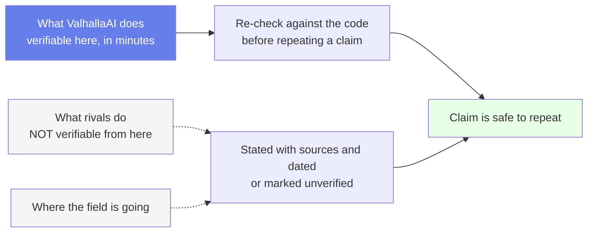
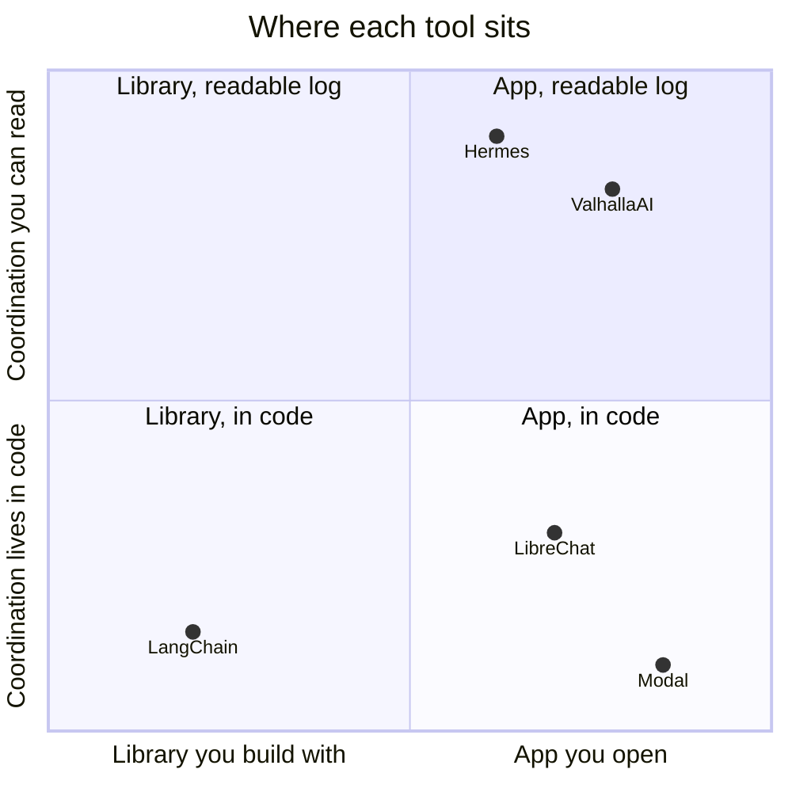
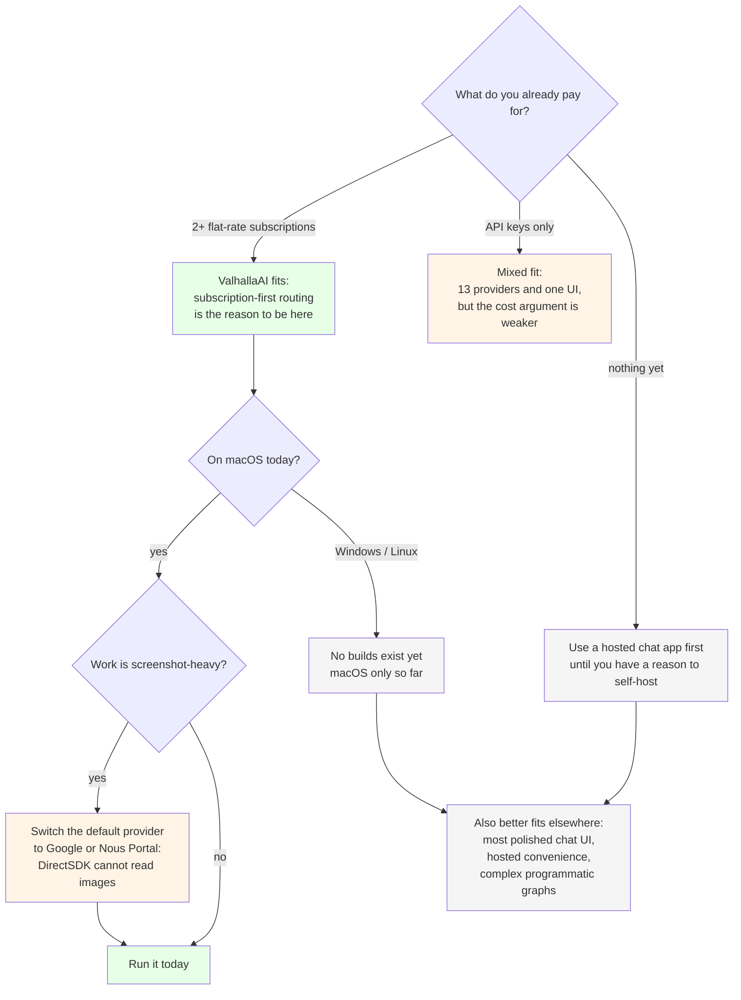

# Why ValhallaAI — Positioning & Differentiation

**Purpose of this document:** state plainly what problem ValhallaAI solves, who else is trying to solve it, and exactly where ValhallaAI is different. This gets rewritten as the field moves — it is not a marketing artifact to write once and forget.

**Last substantive rewrite: 2026-09-22**, after Agent Control, the vault screen, `.env` key loading, subscription-first routing, and the agent-run performance work (197 s → 41 s). Comparison claims decay fastest — re-verify against the code if it has been a while since that date.

**Reading it.** The two dotted arrows are the honest half: this project cannot check a competitor's feature list, only its own. Anything about Hermes, LibreChat, LangChain or Modal below is either sourced to that project's own documentation or explicitly marked as not verified here — it is never inferred from the fact that *this* project has a feature.

## 1. The problem

Someone who wants to run AI agents against multiple LLM providers, and have those agents coordinate with each other, is currently forced to choose between:

- **A chat UI** (Open WebUI, LibreChat, AnythingLLM) — talks to many models, and increasingly ships some agent tooling (LibreChat's Agents feature, Open WebUI's pipelines/functions), but that is bolted onto a chat product rather than built around cross-agent coordination as the core design.
- **A dev framework** (LangChain, LangGraph, CrewAI, AutoGen) — powerful, but it is a library you write code against, not an app you run.
- **A hosted agent platform** (Modal, E2B, Replit Agent) — easy to deploy, but you do not own the infrastructure and you are billed by the vendor. These three are not identical — E2B's core SDK is Apache-2.0 open source, for instance — so any generic claim about "hosted platforms" needs a per-vendor check, not a category fact.
- **A single-vendor agent tool** (Hermes Agent, Claude Code, OpenAI's own agent tools) — deep on one ecosystem. Worth being specific rather than lumping these together: Hermes Agent already runs a **proven, working version of the exact git+markdown coordination pattern ValhallaAI is attempting** — four agents (Claude Code, Grok Build, Hermes itself, and this project) coordinating through a shared `AGENT_SYNC.md`, in daily real use. Not single-user in the sense of "cannot coordinate" — single-operator, in the sense of one person's agents rather than a multi-tenant product.
- **A per-token bill you did not choose.** This one rarely appears in comparison tables and it is the most expensive in practice: a user who already pays for two or three flat-rate AI subscriptions still sends most of their work out on per-token keys, because the tool they are using has no notion of a subscription path at all.

Nobody occupies: **self-hosted, multi-provider, multi-agent, with a plain-text coordination layer you can read and audit yourself — and a bill that prefers the flat rate you already pay.** ValhallaAI is attempting to occupy it. As of this writing the coordination layer is built and runnable, subscription-first routing is verified for all three agent runtimes, and the multi-agent loop is *not* yet demonstrated at the scale Hermes's own pattern already runs at. §2 and §3 say so in specific places rather than in general.

## 2. Comparison

| | ValhallaAI | Hermes Agent | Open WebUI / LibreChat | LangChain / CrewAI | Modal / E2B |
|---|---|---|---|---|---|
| Multi-provider chat | ✅ 13 providers, three-way verified 2026-09-22 | ✅ (provider plugins) | ✅ | Depends on code | ❌ (compute, not models) |
| **Subscription before token** | ✅ verified — the chat default is flat-rate, and all three agent runtimes probe for a login and only fall back to a paid key. The outbox records which path ran (`OK (subscription)` / `OK (paid-key)`) | ✅ (Portal login for its own provider set) | ❌ BYO key, per token | ❌ you wire it | ❌ vendor-billed |
| **Cost/performance of a run, measured and published** | ✅ 197 s → 41 s, with the ladder and the three levers that *do not* work ([ARCHITECTURE.md §8](./ARCHITECTURE.md#8-agent-run-performance)) | not published here | not published here | n/a | n/a |
| Multi-**agent** coordination | **Partly exercised.** One agent per run writes an outbox. The relay can fold and commit — proven on a throwaway repo, not as a daily loop in this repo, and it has never pushed | ✅ **proven** — four agents, daily real use, this exact `AGENT_SYNC.md` pattern | Partial — LibreChat ships an Agents feature, Open WebUI has pipelines/functions; neither is vault-based cross-agent coordination | ✅ (in-code only, no shared human-readable log) | ❌ |
| Human-readable coordination log | ✅ git + markdown. Outboxes are gitignored until the relay folds them. This repo's log is still written by hand and by agents appending entries directly | ✅ proven (`AGENT_SYNC.md`, daily use) | ❌ | ❌ | ❌ |
| Desktop app (not just a library) | ✅ Tauri. Agent Control runs an agent; Vault Browser lists files and git status and never pulls or pushes; chat keys for five providers load from `.env` inside the desktop process. See [ARCHITECTURE.md §5](./ARCHITECTURE.md#5-component-responsibilities) | ✅ | ✅ (usually web) | ❌ (code only) | ❌ |
| Self-hosted, user-owned cloud | (planned) — not built; a headless build is the blocking prerequisite, see [ARCHITECTURE.md §11](./ARCHITECTURE.md#11-deployment-path-future) | Local-only | Self-hosted option | You build it | ❌ vendor-hosted |
| Local/offline model support | ✅ Ollama (offered; **Ollama is not installed on the dev machine**, so the entry is untested here) | ✅ | ✅ | Depends | ❌ |
| Open source | (planned) — see [CONTRIBUTING.md's gate](./CONTRIBUTING.md#why-local-first) | ✅ | ✅ | ✅ | E2B's core SDK: Apache-2.0. Modal: not open source. Do not collapse these into one cell — verify per-vendor. |
| Audit trail = git history | Partial — commits in this repo are real. The relay commits when it is run; that was tested on a throwaway repo. It has never pushed this repo, and the live log is not produced by that relay yet | ✅ proven | ❌ | ❌ | ❌ |

Read left to right and the pattern is the point: ValhallaAI's column is the only one with a check in *both* "desktop app" and "human-readable coordination log", and the only one that claims subscription-first billing as a routing property rather than a user setting. Everyone else has one or the other. The cells that say "partial", "planned" or "not published here" are there on purpose — a comparison that marked those as done would be this document arguing against its own evidence.

### 2.1 Two honest limits inside ValhallaAI's own checkmarks

- **`claude-agent` was never slow, and its instruction edit is not a speedup.** 9 s before, 9 s after. Only `grok-build` roamed. The measured gain belongs to the Grok path and to the instruction rule, not to "agents" in general.
- **Subscription-first is not the same as free.** The Claude Subscription DirectSDK path is metered against the subscription's Agent SDK allowance at a premium over interactive CLI use (per that plugin's documentation, not measured by this project), and it cannot read images. A heavy automation loop on it spends allowance faster than an interactive session would. The default is cheap at the margin, not free, and not universally right ([ARCHITECTURE.md §8.4](./ARCHITECTURE.md#84-the-cost-of-the-default-stated-plainly)).

**Reading it.** The top-right quadrant is nearly empty and that is the bet: two tools in it, and only one of them opens as a desktop app. Note that Hermes sits *higher* than ValhallaAI on the y-axis despite being lower on x — its coordination is proven daily and this project's is not, and the chart would be dishonest if the two were drawn level.

## 3. What's actually novel

Being honest about what is genuinely new versus what is merely "more of the same, packaged differently".

### 3.1 Genuinely novel: git/markdown as the multi-agent coordination substrate
Every other multi-agent framework reaches for a database, a message queue, or an in-memory graph. ValhallaAI (following the pattern already proven with Hermes's `AGENT_SYNC.md`) uses **plain markdown files in a git repo** as the shared state between agents.

This is not a limitation dressed up as a feature — it is a deliberate trade:

- **You lose:** real-time coordination, high write throughput, complex queries.
- **You gain:** a coordination log that is human-readable without tooling, diffable, mergeable with standard git conflict resolution, and portable to any git host — or to none, since it works with zero remote.

No mainstream agent framework treats "an ops engineer can `cat` the entire coordination history and understand it in five minutes" as a first-class design goal. ValhallaAI does.

**Caveat, stated plainly:** "novel" here describes the design goal and the mechanism. Hermes already runs this pattern every day. ValhallaAI's copy can run one agent and write an outbox. It is not yet the daily multi-agent loop Hermes already is — and the fold step that would make it one is not running by default ([ARCHITECTURE.md §9.3](./ARCHITECTURE.md#93-the-honest-state-of-the-relay)).

### 3.2 Genuinely novel (for this category): breadth of provider catalog behind one interface
An earlier version of this section claimed each of ValhallaAI's providers gets "its own request/response shape" as the differentiator, contrasted against rivals who supposedly take a "generic OpenAI-compatible shim" shortcut. That claim did not survive contact with the code: **7 of ValhallaAI's 13 providers (OpenRouter, ChatGPT, Grok, Nous, Fireworks, Groq, Perplexity) share exactly that kind of shim** — a single `callOpenAICompatible()` helper in `llm-router.ts` — because their APIs genuinely are OpenAI-compatible and reimplementing the same dialect seven times would be seven copies of the same bug waiting to diverge.

The honest differentiator is narrower and more defensible: **breadth of catalog, unified behind one interface, with bespoke implementations only where the API genuinely differs** — distinct functions for Anthropic, Google, MiniMax, and Qwen, whose request/response shapes are real enough to differ, plus the 7-provider shared dialect where that is the honest engineering choice rather than a shortcut. Most multi-provider tools cover 3–5 providers well; this router covers 13, and a user-defined provider can be added from Settings without touching the source.

Two provider *removals* on 2026-09-22 belong in this section, because they were made for honesty rather than tidiness:

- **Replicate and Hugging Face** were removed (catalog 15 → 13). Replicate was the one non-chat provider, never wired into the chat UI as a usable target, which made "you can chat with anything here" untrue for that entry; Hugging Face's inference API did not reliably answer for the model ids offered. Both were also the last two whose request bodies had no field an image could travel in.
- **Together AI** was removed earlier the same day for unverifiable model ids (commit `544a983`), which is also when user-defined custom providers arrived as the path back for anything OpenAI-compatible.

The three places that must agree were re-counted after each removal: 13 catalog keys, 13 `callLLM` switch cases, 13 members of the `LLMProvider` union.

### 3.3 Genuinely novel (and unglamorous): a published cost/performance measurement of a run
Most projects in this space publish a feature list. This one publishes **where the time and the money actually go, including the measurements that contradict its own claims**: a run that took 197 s because the model spent its first turn fetching a file already inside its prompt; `--max-turns 1` silently producing *no answer*; `--disallowed-tools` failing to stop the same behaviour; `claude-agent` being 9 s before and 9 s after its "optimization".

That is a differentiator only if it is kept up — but it is the kind of evidence a person choosing between tools can act on, and it is the reason [ARCHITECTURE.md §12](./ARCHITECTURE.md#12-verification-what-is-proven-and-what-is-merely-built) exists as a proven/not-proven table instead of prose.

### 3.4 Not novel, but done right: local-first development
Building the tool for yourself first, using it daily, and only then deciding what to open source is not a new idea — it is how most good developer tools get built. ValhallaAI is explicit about it as policy (see [CONTRIBUTING.md](./CONTRIBUTING.md#why-local-first)) rather than an accident of how development happened to unfold. That policy has already caught compile-breaking bugs and doc-drift before anyone but the developer ever saw them, which is the actual point of it.

### 3.5 Not novel: the desktop app itself
Tauri + Svelte + a model picker is not a differentiator. Open WebUI, LM Studio, and a dozen others already do "nice UI over multiple LLMs" well. ValhallaAI does not try to out-UI them — the UI exists to make agent orchestration and vault coordination usable, not to be the product. Chat, Settings, Agent Control, and the vault file list all run inside the desktop app. The vault screen does not sync to a remote (§2).

## 4. Who this is for — and who should not use it

**Reading it.** The first diamond is the sales conversation in one step: the fit is strongest for someone already paying for flat-rate subscriptions, because that is where the money argument is real rather than theoretical. The right-hand branch is the honesty path — three answers end at "a different tool fits better today", which is more useful to a reader than a chart where everything points at this tool.

## 5. Where ValhallaAI is deliberately *not* competing

- **Not trying to be the best chat UI.** If someone just wants to chat with GPT-4o, Open WebUI or the vendor's own app is a better fit today.
- **Not trying to be a hosted platform.** No "sign up and go" cloud offering is planned as the primary path — self-hosting is the point, not a fallback.
- **Not trying to out-feature LangChain/CrewAI for complex programmatic agent graphs.** Those are code-first tools for engineers building bespoke pipelines. ValhallaAI is app-first for someone who wants to run and coordinate agents without writing orchestration code for every workflow.
- **Not claiming to be the first at any of this.** Every individual mechanism here exists elsewhere. The claim is the combination, and the readable log as a design goal.

## 6. The honest risk

The coordination-via-git approach is the whole bet, and it has a real ceiling (see [ARCHITECTURE.md §9.1](./ARCHITECTURE.md#9-the-vault-what-it-is-and-how-coordination-actually-runs)). If ValhallaAI ever needs to coordinate dozens of agents writing frequently in real time, this design will need a companion datastore — not a replacement for it. That is a known, accepted limitation rather than a discovery to make later.

Three further risks, each added after it actually bit:

1. **This document drifted from what was built.** Rows here once claimed shipped functionality that was, on inspection, a mock or entirely unbuilt. Corrected — but worth naming as a pattern rather than a one-time slip: positioning docs decay toward optimism by default, and the fix is the same one CONTRIBUTING states directly — verify by building and running the thing, not by re-reading what was written last time.
2. **The headline capability is the least-proven one.** "Coordinates agents" is the pitch and the daily loop is the gap: one agent at a time, a manual fold, a relay whose push has never run here. A reader who checks that first is right to.
3. **The provider catalog rots silently.** Model ids are hand-written, and a retired id only fails when someone sends to it. Eight dead ids across three providers were found in one audit on 2026-09-22 — Google's entire list had been gone. Perplexity's Sonar Chat Completions endpoint retires **2026-09-27**. Every catalog entry carries a decay date nobody can see ([CONTRIBUTING.md](./CONTRIBUTING.md#model-lists-rot-and-silently)).

## 7. One-sentence pitch (for when someone asks)

> "ValhallaAI runs and coordinates AI agents across every major model provider, self-hosted on your own infrastructure, using a git-synced markdown log instead of a database — and it spends the flat-rate subscriptions you already pay for before it spends a per-token key."

**Shorter version, for a Hermes user specifically:**

> "Hermes does the deep work. ValhallaAI is the front door — same readable log, every provider, subscription login first."

**Caveat worth attaching whenever it matters:** "coordinates" and "self-hosted infrastructure" describe the design target — verified as buildable and partly exercised, not yet run the way Hermes's own version of the same idea already is. The cost half of the sentence *is* verified: all three runtimes were observed billing a subscription on 2026-09-22.
