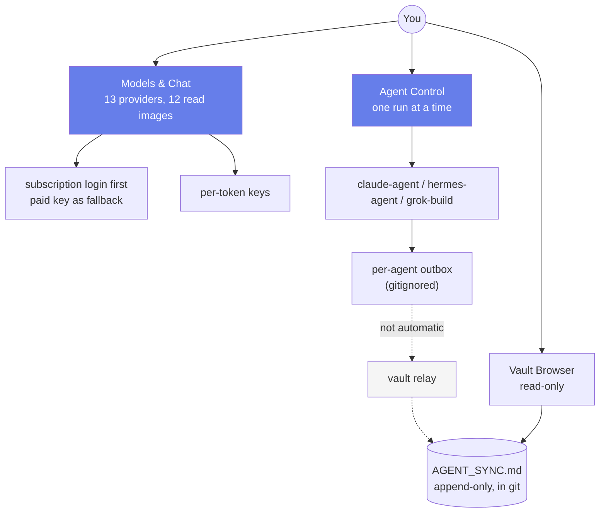

# ValhallaAI

**Multi-provider AI orchestration, self-hosted.** One desktop app to talk to 13 LLM providers, run agents against them, and coordinate those agents through a git-synced markdown vault instead of a database.

**Status: local development, not public.** See [Why local-first](./CONTRIBUTING.md#why-local-first) for the policy and the four-item gate. macOS builds are what exist today; Windows and Linux are designed for and not yet built ([ARCHITECTURE.md §4.1](./ARCHITECTURE.md#41-cross-platform-constraint)).

## What it does

| | |
|---|---|
| **Chat** | 13 providers behind one UI, one picker. Drop, paste, or pick a screenshot and **12 of the 13** read it. |
| **Agents** | Three runtimes, run one at a time. All three prefer a flat-rate subscription login and fall back to a paid key only when there is no login. |
| **Coordination** | A git-synced markdown vault. Each agent appends to its own outbox; a relay folds them into one append-only log. No database. |
| **Extensible** | Add a provider (any OpenAI-compatible endpoint) or an agent (bound to one of the three allowlisted runtimes) from the UI, without editing the source. |
| **Your keys, your machine** | Provider keys load from your own `.env` inside the desktop app — not from a browser tab. Nothing is sent anywhere except the provider you picked. |



**Reading it.** Everything solid is in use today; the one dotted pair is the relay, because folding your outboxes into the shared log is a **separate step you start** rather than something a Run click does. That single fact is the biggest difference between this design and this project's daily reality — it is stated in three places on purpose ([ARCHITECTURE.md §9.3](./ARCHITECTURE.md#93-the-honest-state-of-the-relay)).

## Start here

| Document | What it covers |
|---|---|
| [ARCHITECTURE.md](./ARCHITECTURE.md) | Design of record: system map, component responsibilities, data flow, security model, measured agent performance, and a table of what is proven versus merely built |
| [POSITIONING.md](./POSITIONING.md) | What problem this solves, how it differs from Hermes / LangChain / Open WebUI / LibreChat / Modal, and what is honestly *not* novel |
| [CONTRIBUTING.md](./CONTRIBUTING.md) | Local-first policy, conventions, recipes for adding a provider or an agent, and the known-open-issues list |

## Documents and artefacts

The repo's index. Everything here is either a living document (edited as the system changes) or a frozen artefact (written to be sent, then left alone).

| Path | What it is | Status |
|---|---|---|
| [ARCHITECTURE.md](./ARCHITECTURE.md) | Design of record — system map, components, data flow, security model, measured performance, proven-vs-built table | living |
| [POSITIONING.md](./POSITIONING.md) | Differentiation, who it fits, and the honest risks | living |
| [CONTRIBUTING.md](./CONTRIBUTING.md) | Conventions, recipes, known open issues | living |
| README.md | this file — quick start and index | living |
| [Reports/Image-Attachments-Prompt_09.22.2026.md](./Reports/Image-Attachments-Prompt_09.22.2026.md) | A portable prompt for adding screenshot attachments to any multi-provider chat UI, written from this implementation | **frozen** — already sent, not edited in place |
| [vault/AGENT_SYNC.md](./vault/AGENT_SYNC.md) | The project's agent coordination log | append-only |

Two rules keep this table meaningful. A **report** is an artefact written to be sent — once sent it is frozen, and a superseded report stays where it is with the README saying which one is live rather than being deleted or overwritten. A **session file** (`Sessions/`) is the working record, one per session. Superseded work is never erased; the index is what carries the status.

## Quick start (local dev)

**Prerequisites:** Node 18+, npm, and the Rust toolchain (`rustup`) for the Tauri shell. Docker/OrbStack is needed only for the two container fallbacks.

```bash
npm install
cp env.example .env
# Fill in NAME=value lines only. A label on its own line makes Docker Compose
# reject the whole file. See env.example for the accepted names.

npm run tauri-dev          # dev mode, hot reload
```

**The desktop app is what reads `.env`. A plain browser tab cannot** — it has no filesystem access, so provider keys would silently be missing. Use `npm run tauri-dev`, or a release build.

### Build a real app (recommended after the first run)

```bash
valhallaai build           # release .app + .dmg; opening is then instant
valhallaai                 # launch it
```

With no release build, `valhallaai` falls back to `npm run tauri-dev` and holds the terminal until Ctrl+C. To put the launcher on PATH on a new machine:

```bash
ln -sf "$PWD/scripts/valhallaai" ~/.local/bin/valhallaai
```

## Signing in

The first launch shows a sign-in gate. There is no "skip" — that is deliberate, and it is the only thing standing between a fresh install and the app.

**Google or GitHub, either one.** Both are identity only:

- **What is stored:** a display name, email, avatar and which provider you used — on the profile, in this machine's local storage. Your chats, keys and preferences are separate and belong to the machine, not the account.
- **Nothing syncs.** There is no backend, so there is nothing to authorize against and no data leaves this machine except the OAuth handshake itself.
- **No token is kept.** The access/id token is used to read identity and then discarded — so there is no credential sitting in the app to revoke.
- **Sign-in is not authorization.** The app never calls Google or GitHub again after the handshake.

Two setup notes, both of which cost time if discovered late:

1. **GitHub needs two variables in `.env`** — `GITHUB_CLIENT_ID` and `GITHUB_CLIENT_SECRET`. If either is missing, the GitHub button is disabled and its tooltip says exactly that. Changing them requires an **app restart**: those are read by the Rust process, so a Vite hot reload will not pick them up.
2. **Register the GitHub OAuth App with the callback `http://127.0.0.1/callback` — no port.** GitHub matches the registered path and accepts whatever port the app binds at request time, so one registration covers every run. A port in that field produces `redirect_uri_mismatch`.

Signing out clears the identity fields only. `env.example` documents both providers' variables.

## Running agents

Three runtimes. **One at a time** — the same three buttons exist on **Agent Control** inside the app, and the terminal takes the same argument.

```bash
scripts/run_agent.sh hermes-agent    # host Hermes CLI, one shot, --max-turns 1
scripts/run_agent.sh claude-agent    # subscription first, paid key as fallback
scripts/run_agent.sh grok-build      # Grok CLI subscription, container fallback
```

| Runtime | Where it runs | Auth | Billing |
|---|---|---|---|
| `claude-agent` | host `claude` CLI, else Docker | `claude auth login` (Pro/Max) | subscription; container bills `ANTHROPIC_API_KEY` |
| `hermes-agent` | host `hermes` CLI | `hermes portal` login | subscription |
| `grok-build` | host `grok` CLI, else Docker | `grok login` (grok.com) | subscription; container bills `XAI_API_KEY` |

Each run reads its task from `vault/agent-tasks.json`, does the work, appends one entry to `vault/AGENT_OUTBOX_<agent>.md`, and exits. **Nothing writes `AGENT_SYNC.md` directly** — the relay folds outboxes into it ([ARCHITECTURE.md §9.2](./ARCHITECTURE.md#92-the-full-agent-and-vault-picture)).

**Do not start the agents with `docker compose up`.** `claude-agent` makes one paid call and exits; a restart policy is not what you want on that container (`restart: "no"` is deliberate). Hermes does not run inside its image at all — it needs the macOS virtualenv at `~/.hermes`.

Edits to `vault/agent-tasks.json` take effect on the **next run with no rebuild**, because the task is read at run time. Edits to Rust or Svelte code need `npm run tauri-dev` (or a rebuild) — a Vite hot reload does not pick up a Rust change.

### Why a run is fast now (and was not before)

A `grok-build` run used to take **197 seconds** to answer a question whose answer was already in the prompt: the instruction said "read the coordination log", so the model spent its first turn deciding to `cat` a file the runner had already pasted in. The fix was an instruction that says the context is supplied, plus a fast model variant at low reasoning effort. Measured: **197 s → 41 s end to end**, with the same answer citing the same log entries.

The ladder, the three levers that *don't* work, and the honest note that `claude-agent` was never slow are in [ARCHITECTURE.md §8](./ARCHITECTURE.md#8-agent-run-performance). Overrides: `GROK_AGENT_MODEL`, `GROK_AGENT_EFFORT`, `AGENT_TIMEOUT_SECS`.

## Providers (13)

| Provider | Reads images | Billed how | Key from |
|---|---|---|---|
| Anthropic (API key) | yes | per token | `.env` — `ANTHROPIC_API_KEY` |
| ChatGPT / Codex | yes | per token | `.env` — `OPENAI_API_KEY` |
| **Claude Subscription DirectSDK** | **no — text only** | **flat-rate subscription (the default)** | `claude auth login` |
| Fireworks AI | yes | per token | Settings |
| Google Gemini | yes | per token | `.env` — `GOOGLE_API_KEY` |
| Groq | yes | per token | Settings |
| MiniMax | yes | per token | Settings |
| Nous Portal | yes | flat-rate | local Hermes proxy — no pasted key |
| Ollama | yes | free — runs on this machine | none |
| OpenRouter | yes | per token | `.env` — `OPENROUTER_API_KEY` |
| Perplexity | yes | per token | Settings |
| Qwen Code | yes | per token | Settings |
| xAI Grok | yes | per token | `.env` — `XAI_API_KEY` |

Anything else that speaks the OpenAI dialect can be added from **Settings → Custom Providers** (name + chat-completions URL + model ids). The id is namespaced `custom:<slug>` so it can never shadow a built-in. Why the list has this shape, and what was removed from it, is in [POSITIONING.md §3.2](./POSITIONING.md#32-genuinely-novel-for-this-category-breadth-of-provider-catalog-behind-one-interface). How each one is actually called is in [ARCHITECTURE.md §7](./ARCHITECTURE.md#7-provider-catalog).

## The caveats worth knowing before you rely on it

1. **The default provider cannot read images.** Claude Subscription DirectSDK pipes a text prompt to the `claude` CLI, so there is no field an image can travel in. It is the default because it is flat-rate. **If your work is screenshot-heavy, switch to Google or Nous Portal.** Making this path work means letting the CLI read temp files, i.e. widening what tools it may use — a decision, not a tweak ([ARCHITECTURE.md §6.1](./ARCHITECTURE.md#61-sending-a-chat-message)).
2. **The relay is not running by default, so agent answers stop in their outbox.** `valhallaai relay` starts it. Its fold-and-commit logic is verified; its **push has never run against this repo** and requires `VAULT_REPO` to be set ([ARCHITECTURE.md §9.3](./ARCHITECTURE.md#93-the-honest-state-of-the-relay)).
3. **The Vault Browser never pushes.** The app has no push path anywhere by design. It lists files and reports `git status`; you commit and push from a terminal.
4. **Perplexity's Sonar Chat Completions endpoint retires 2026-09-27.** After that the catalog entry needs a rewrite against Perplexity's newer API ([CONTRIBUTING.md](./CONTRIBUTING.md#known-open-issues)).
5. **macOS-only builds so far.** The `.app` is ad-hoc signed, arm64-only, and expects a checkout to exist on the machine. Not distributable to anyone else yet.

## Project structure

```
ValhallaAI/
├─ ARCHITECTURE.md           Design of record — read first
├─ POSITIONING.md            Why this exists, differentiation, honest non-novelty
├─ CONTRIBUTING.md           Conventions, recipes, known issues
├─ README.md                 this file
├─ env.example               .env template (copy to .env; never commit .env)
├─ index.html                Vite entry point
├─ src/                      Svelte frontend (runs inside the Tauri webview)
│  ├─ App.svelte             sidebar shell + profile card + nav
│  ├─ routes/                Models & Chat, Recent, Projects, Sessions,
│  │                         VaultBrowser, AgentControl, Profile, Settings,
│  │                         Onboarding
│  └─ lib/                   llm-router.ts (the only place that talks to
│                            providers), providers.ts (the only catalog),
│                            provider-keys.ts, sessions.ts, profiles.ts,
│                            custom-providers.ts, custom-agents.ts
├─ src-tauri/src/main.rs     Tauri commands: run_agent, agent_status,
│                            provider_keys, vault_status, vault_file,
│                            google_sign_in, github_sign_in,
│                            github_client_configured + path/config helpers
├─ src-tauri/src/envfile.rs  Reads the allowlisted .env keys
├─ scripts/valhallaai        Launcher: open, build, relay
├─ scripts/run_agent.sh      One-shot runner shared by the UI and the terminal
├─ scripts/vault_relay.sh    Folds outboxes into AGENT_SYNC.md, commits, can push
├─ scripts/vault_relay.Dockerfile
├─ agents/                   claude + grok containers, _shared/task.cjs prompt builder
├─ vault/                    agent-tasks.json, agents-config.json, AGENT_SYNC.md,
│                            AGENT_OUTBOX_*.md (gitignored)
└─ docker-compose.local.yml
```

## Troubleshooting

Every entry here is a real failure that cost time, not a hypothetical.

| Symptom | Cause | Fix |
|---|---|---|
| The window freezes for minutes on **Run** and only force-quit helps | The installed `.app` predates `run_agent` becoming `async` (a *synchronous* Tauri command blocks the webview's event loop for the whole run) | `valhallaai build`, or `npm run tauri-dev`. Confirm `async fn run_agent` is present in `src-tauri/src/main.rs` |
| A run says "no subscription" and then fails with `docker: command not found` | Tauri launches the runner with a GUI `PATH` (`/usr/bin:/bin:/usr/sbin:/sbin`), so `grok`/`claude` look absent | The script now prepends `~/.grok/bin`, `~/.local/bin`, `~/.hermes/bin`, `~/.orbstack/bin` plus `path_helper`. If you hit it again, check the binary is in one of those |
| Chat on **Claude Subscription DirectSDK** fails with *"No `claude` CLI could be run … No such file or directory"* | Same trap, different code path: the app is GUI-launched, so its `PATH` is `/usr/bin:/bin:/usr/sbin:/sbin`, and Claude Code's **native installer** puts the CLI in `~/.local/bin` — not on it. The CLI works in Terminal and is invisible to the app | Fixed: the Rust side now resolves the binary by absolute path (`~/.local/bin`, `~/.claude/local`, `~/.npm-global/bin`, `/opt/homebrew/bin`, `/usr/local/bin`) **and** prepends those to the child's `PATH`. Still failing? Set `CLAUDE_SUBSCRIPTION_DIRECTSDK_COMMAND` to the binary's absolute path in `.env` |
| A `grok-build` run takes ~3 minutes | The prompt invites tool use, or the model default is in play | Check `vault/agent-tasks.json` for the "context is already supplied, do not call tools" line and the `run_grok` flags in `scripts/run_agent.sh` |
| `grok --max-turns 1` records **no answer** | One turn is exhausted deciding what to do | Use `3`. It is a ceiling, not a target |
| `npx tsc --noEmit` is clean but the app is broken | Plain `tsc` silently skips `.svelte` files entirely | `npm run check` (`svelte-check`) — see [CONTRIBUTING.md](./CONTRIBUTING.md#before-claiming-something-works) |
| A screenshot disappears from a message | The provider is Claude Subscription DirectSDK (text-only) | Switch to Google or Nous Portal; the UI warns and disables Send for this case |
| The agent's answer is not in `AGENT_SYNC.md` | Nothing folds outboxes automatically | Read `vault/AGENT_OUTBOX_<agent>.md`, or run `valhallaai relay` |
| Docker Compose rejects `.env` with a syntax error | A label sits on its own line | `NAME=value` lines and `#` comments only |
| An agent's "answer" is a `MODULE_NOT_FOUND` stack trace | Some CLI hook noise was captured as stdout | Fixed by the `redact()` filter in `run_agent.sh`; if a new hook appears, add its pattern there |
| The gate shows a disabled "Sign in with GitHub" | `GITHUB_CLIENT_ID` / `GITHUB_CLIENT_SECRET` are missing or empty in `.env` | Add both, then **restart the app** — Rust reads `.env`, so a Vite reload will not pick them up |
| GitHub sign-in fails with `redirect_uri_mismatch` | The OAuth App's registered callback has a port in it, or a different path | Set it to exactly `http://127.0.0.1/callback` (no port) |
| Google sign-in fails with `access_denied` | The consent screen is still in Testing and your account is not on the test-user list | Add the account under **Audience → Test users**, or publish the app |
| The Profile page shows an **Unverified** email badge | The provider returned an unverified address (an unconfirmed GitHub address, some Workspace setups) | Expected and harmless — the badge is surfaced, not enforced, and sign-in still works |

## What is proven, and what is not

The full table is [ARCHITECTURE.md §12](./ARCHITECTURE.md#12-verification-what-is-proven-and-what-is-merely-built). The short version:

**Proven:** 13 providers counted three ways; 12 read images; a Run click no longer freezes the app; `grok-build` bills the subscription with no `XAI_API_KEY` set; a run is ~5× faster (197 s → 41 s); `cargo test` → 22 passed; the relay folds and commits (verified on a throwaway repo); **Google and GitHub sign-in both round-trip end to end**, GitHub against a live consent screen; the DirectSDK path resolves the `claude` CLI under the app's real (minimal) PATH.

**Not proven, and not claimed:** the relay has never pushed to a remote; there is no daily multi-agent loop in this repo yet; Windows and Linux builds have never been produced; `callNous()` has not been exercised against the live proxy since the provider-count changes; `claude-agent`'s instruction edit is a consistency fix, not a speedup (9 s before, 9 s after).
