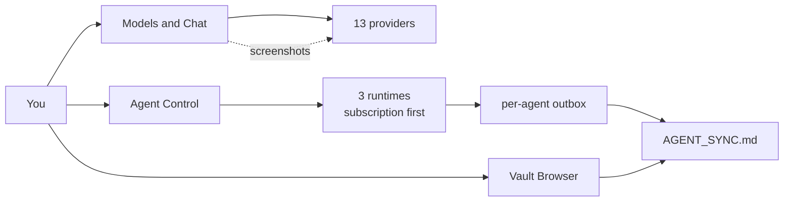

# ValhallaAI

**Multi-provider AI orchestration, self-hosted.** One app to talk to 13 LLM providers, run agents against them, and coordinate those agents through a git-synced markdown vault instead of a database.

**Status:** Local development. Not public yet — see [CONTRIBUTING.md](./CONTRIBUTING.md#why-local-first) for why.

## What it does

| | |
|---|---|
| **Chat** | 13 providers behind one UI. Drop or paste a screenshot and 12 of them read it. |
| **Agents** | Three runtimes, run one at a time. Claude and Hermes run on a subscription login first and fall back to a paid key only when there is no login. |
| **Coordination** | A git-synced markdown vault. Each agent writes its own outbox; a relay folds them into one log. No database. |
| **Extensible** | Add a provider or an agent from Settings, without editing the source. |



The one caveat worth knowing up front: the default chat provider, Claude Subscription DirectSDK, cannot read images. It bills a flat-rate subscription, which is why it is the default, but it sends a text prompt to the `claude` CLI and there is no field an image can travel in. Switch to Google or Nous Portal for screenshots. The reason, and what it would take to change, is in [ARCHITECTURE.md §5](./ARCHITECTURE.md).

## Start here

| Document | What it covers |
|---|---|
| [ARCHITECTURE.md](./ARCHITECTURE.md) | System design, diagrams, data flow, how the pieces fit together |
| [POSITIONING.md](./POSITIONING.md) | What problem this solves, how it differs from Hermes/LangChain/Open WebUI/etc., and what's honestly *not* novel |
| [CONTRIBUTING.md](./CONTRIBUTING.md) | Local-first policy, project conventions, how to add a provider or agent |

## Quick start (local dev)

The desktop app is what reads `.env`. A plain browser tab cannot. `npm run tauri-dev` needs the Rust toolchain (`rustup`).

```bash
npm install
cp env.example .env
# Fill values as NAME=value. No labels on their own line. See env.example.

npm run tauri-dev
```

Run one agent at a time. Do not start the stack with `docker compose up`: `claude-agent` makes one paid call and exits, and a restart policy is not what you want on that container. Hermes does not run inside its image.

```bash
scripts/run_agent.sh hermes-agent    # host Hermes CLI, one shot
scripts/run_agent.sh claude-agent    # subscription first, paid key only as fallback
scripts/run_agent.sh grok-agent      # needs XAI_API_KEY and enabled: true
```

The same three buttons are on **Agent Control** inside the desktop app. **Settings** shows which chat keys came from `.env`. Nous Portal does not use a key in that file; it uses the local Hermes proxy (`hermes proxy start`).

**Claude Subscription DirectSDK** is selected in Models & Chat, not in Agent Control. It uses `claude auth login`, not the paid key, and is working as of 2026-09-22. It is the only subscription-billed Claude path; `Anthropic (API key)` bills `ANTHROPIC_API_KEY`.

`VAULT_REPO` is optional and unused until you want the vault relay to push. The relay's push path has not been run against this repo.

## Launching it

`scripts/valhallaai` is symlinked onto PATH, so the app opens from anywhere:

```bash
valhallaai          # open the app
valhallaai build    # produce a release .app -- after this, opening is instant
valhallaai relay    # start the vault relay (stop: valhallaai relay stop)
```

With no release build yet, `valhallaai` falls back to `npm run tauri-dev` and
holds the terminal until Ctrl+C. Run `valhallaai build` once to get a real
launchable app instead. To set the symlink up on another machine:

```bash
ln -sf "$PWD/scripts/valhallaai" ~/.local/bin/valhallaai
```

## Project structure

```
ValhallaAI/
├─ ARCHITECTURE.md           Design of record — read first
├─ POSITIONING.md            Why this exists, differentiation
├─ CONTRIBUTING.md           Conventions, known issues
├─ env.example               .env template (copy to .env; never commit .env)
├─ src/                      Svelte frontend (Tauri desktop app)
│  ├─ routes/                Models & Chat, Sessions, Vault, Agents, Profile, Settings
│  └─ lib/                   llm-router.ts, providers.ts, provider-keys.ts,
│                           sessions.ts, profiles.ts, custom-providers.ts,
│                           custom-agents.ts
├─ src-tauri/src/main.rs     Tauri commands: run_agent, provider_keys, vault_status
├─ scripts/valhallaai       Launcher symlinked onto PATH
├─ scripts/run_agent.sh      One-shot runner the UI and the terminal share
├─ scripts/vault_relay.sh    Folds agent outboxes into AGENT_SYNC.md
├─ agents/                   Claude and Grok containers; Hermes runs on the host
├─ vault/                    AGENT_SYNC.md and agents-config.json
└─ docker-compose.local.yml
```

## Providers (13)

| Provider | Reads images | Billed how |
|---|---|---|
| Anthropic (API key) | yes | per token |
| ChatGPT / Codex | yes | per token |
| Claude Subscription DirectSDK | no — text only | flat-rate subscription, the default |
| Fireworks AI | yes | per token |
| Google Gemini | yes | per token |
| Groq | yes | per token |
| MiniMax | yes | per token |
| Nous Portal | yes | flat-rate, via the local Hermes proxy |
| Ollama | yes | free — runs on this machine |
| OpenRouter | yes | per token |
| Perplexity | yes | per token |
| Qwen Code | yes | per token |
| xAI Grok | yes | per token |

Why the list is this shape, and what was removed from it, is in [POSITIONING.md §3.2](./POSITIONING.md). How each one is called is in [ARCHITECTURE.md §8](./ARCHITECTURE.md).
